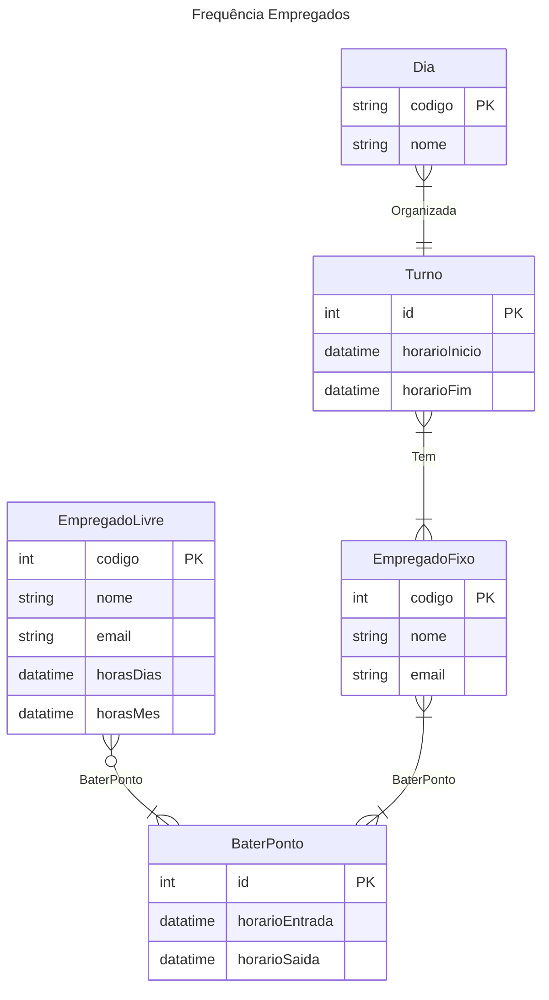

<h1>Tarefa 01 - Conceitos BD e MER</h1>
<h3>
Anderson Azevedo da Silva  
AndersonAzeved  
andersonsilva14.2017@gmail.com  
</h3>

#
#
A. Banco de Dados, é o armazenamento e organização de informações relacionais, de forma eletronicamente, para que aja uma recuperação e modificação eficiente e segura desses dados. 
 Exemplos: 
- Relacional 
- Não-Relacional.

 Já SGBDs, são softwares que tem o objetivo de gerir bases de dados, possibilitando criar, modificar e eliminar essas bases e inserir e eliminar dados.  
Exemplos:
- PostgreSQL
- MySQL
- SQL-Server.

    
#
#
B. Os principais problemas de utilizar Sistemas de Arquivos para armazenar dados são:  
- Fragilidade: hardware ou software são sujeitos a falhas, deixando os sistemas de arquivos vulneráveis, possibilitando uma possível perda de dados.

- Dificuldade de gerenciamento: contando com vários diretórios, pastas e arquivos, gerenciar o armazenamento de dados, pode tornar difícil.

- Escalabilidade limitada: esses tipos de sistemas, podem apresentar dificuldades em lidar com enormes quantidades de dados ou muitos arquivos em uma única pasta, levando o tempo de resposta e processamento serem lentos.

- Falta de recursos de backup: podem não possuir um avançado método de backup, tornando difícil e demorado realizar backups regulares e proteger os dados contra uma possível perda.

- Compartilhamento de arquivos limitado: para que um arquivo seja compartilhado, requer configurações adicionais, como compartilhamento de rede e permissões de acesso, tornando a colaboração e o compartilhamento de dados mais difíceis.

#
#
C. 
- Entidades: São um objeto do mundo real ou conceitos e que possuem existência independente, como exemplos: carro, casa, empresa, entre outras. No diagrama ER, são representadas por um triângulo.  

- Relacionamentos: São as associações entre duas ou mais entidades que possuem significado e importância para o domínio do problema. Existem três tipos de relacionamentos: 
    - UM PARA UM (1:1)
    - UM PARA MUITOS (1:N)
    - MUITOS PARA MUITOS (N:N) 

- Atributos: São as características ou propriedades das entidades, onde essas podem ter um ou mais atributos. Como exemplo, a entidade pessoa possue os atributos nomes, idade, endereço e data de nascimento. 

#
#
D. 
- Cardinalidade: a cardinalidade indica a relação entre duas entidades e quantos objetos de uma entidade estão relacionados a quantos objetos da outra.
- Entidade Subordinada: é uma entidade em que é dependente de outra entidade e representa uma parte ou um aspecto desta última. Esta não pode existir sem a entidade principal.
- Exemplos de notações são Crow’s foot, Chen e UML.

#
#
E. 

