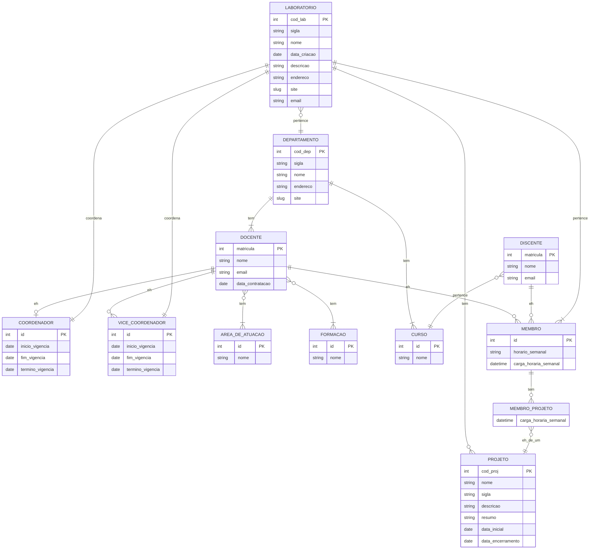

# Tarefa 02 - Modelo Relacional e Regras de Conversão
## Nome: Gabriel Lima /
## Usuário: Lima404 / 
## Email: gabriel.lima.112@ufrn.edu.br

- Q7 a: Descreva o modelo relacional: 

O Modelo Relacional é uma forma de representar dados em um Banco de Dados usando relações. Cada relação tem um nome e um conjunto de atributos. As relações são frequentemente chamadas de tabelas. Elas consistem em atributos e tuplas, onde cada atributo representa uma propriedade dos dados e cada tupla é uma instância desses dados. As relações são conectadas por chaves estrangeiras, permitindo estabelecer relacionamentos entre as tabelas. Esses relacionamentos podem ser um-para-um, um-para-muitos ou muitos-para-muitos.

- Q7 b: Descreva as restrições de integridade do Modelo Relacional.

As restrições de integridade no Modelo Relacional são regras que são aplicadas aos dados armazenados em um Banco de Dados relacional para garantir sua consistência e precisão. Essas restrições ajudam a manter a qualidade e a validade dos dados. Abaixo esta um exemplo de restrições de integridade comumente utilizadas no Modelo Relacional:

- Restrição de Integridade Referencial: Essa restrição garante que, ao estabelecer um relacionamento entre tabelas usando chaves estrangeiras, os valores correspondentes nas colunas relacionadas sejam consistentes. Por exemplo, se uma chave estrangeira em uma tabela está relacionada a uma chave primária em outra tabela, a restrição de integridade referencial garante que não haja valores órfãos ou inconsistências nos dados.

- Q7 c: Descreva as Regras de Conversão entre o Modelo Entidade-Relacionamento e o Modelo Relacional. 

1. Entidades:

Cada entidade no modelo ER é mapeada para uma tabela no modelo relacional.
Os atributos da entidade se tornam colunas na tabela correspondente.
A chave primária da tabela pode ser derivada a partir da chave primária da entidade no modelo ER.

2. Relacionamentos:

Relacionamentos um-para-um: O relacionamento é representado através da inclusão da chave primária de uma entidade como chave estrangeira na tabela da outra entidade.
Relacionamentos um-para-muitos: O lado "um" do relacionamento contém a chave primária da entidade "um" como chave estrangeira na tabela da entidade "muitos".
Relacionamentos muitos-para-muitos: É criada uma tabela intermediária, também conhecida como tabela de junção ou tabela de associação, que contém as chaves primárias das entidades relacionadas.

3. Atributos compostos:

Atributos compostos são representados como colunas individuais na tabela.
Os nomes das colunas podem incluir o nome do atributo composto e o nome do subatributo.

4. Atributos multivalorados:

Atributos multivalorados são representados através da criação de uma nova tabela, onde cada valor multivalorado é armazenado em uma nova linha.

5. Atributos derivados:

Atributos derivados não são representados como colunas nas tabelas, pois podem ser calculados a partir de outros atributos.

- Q7 d: Crie um Diagrama Entidade Relacionamento e depois crie um Esquema Relacional, usando as regras de conversão, para o seguinte projeto: A universidade que preparar um banco de dados para gravar os dados do Laboratórios de Pesquisa (Por exemplo, LABICAN, LABEPI, LABORGEO, etc). Crie um Diagrama do modelo Entidade-Relacionamento para este projeto informando atributos e cardinalidades, atendendo aos seguintes requisitos: 

### Modelo Relacional (MR):

**LABORATORIO**(<u>cod_lab</u> , sigla, nome, data_criacao, descricao, endereco, email, site, **id_cod**, **id_vice_cod**, **cod_dep**)

**DEPARTAMENTO**(<u>cod_dep</u>, sigla, nome, endereco, site)

**DOCENTE**(<u>matricula</u>, nome, email, data_contratacao, **cod_dep**)

**COORDENADOR**(<u>id</u>, inicio_vigencia, termino_vigencia, fim_vigencia, **mat_doc**, **cod_lab**)

**VICE_COORDENADOR**(<u>id</u>, inicio_vigencia, termino_vigencia, fim_vigencia, **mat_doc**, **cod_lab**)

**AREA_DE_ATUACAO**(<u>id</u>, nome)

**FORMACAO**(<u>id</u>, nome)

**DISCENTE**(<u>matricula</u>, nome, email, **id_curso**)

**CURSO**(<u>id</u>, nome, **cod_dep**)

**MEMBRO**(<u>id</u>, horario_semanal, carga_horaria_semanal, **cod_lab**, **mat_doc**, **mat_dic**)

**PROJETO**(<u>cod_proj</u>, nome, sigla, descricao, resumo, data_inicial, data_encerramento, **cod_lab**)

**MEMBRO_PROJETO**(<u>**id_memb**, **cod_prok**</u>, carga_horaria_semanal)

**DOCENTE_FORMACAO**(<u>**id_form**, **mat_doc**</u>)

**DOCENTE_AREA_DE_ATUACAO**(<u>**id_area_at**, **mat_doc**</u>)

### Referências

LABORATORIO(id_cod) → COORDENADOR(id)

LABORATORIO(id_vice_cod) → VICE_COORDENADOR(id)

LABORATORIO(cod_dep) → DEPARTAMENTO(cod_dep)

DEPARTAMENTO(cod_dep) → DEPARTAMENTO(cod_dep)

COORDENADOR(mat_doc) → DOCENTE(matricula)

COORDENADOR(cod_lab) → LABORATORIO(cod_lab)

VICE_COORDENADOR(mat_doc) → DOCENTE(matricula)

VICE_COORDENADOR(cod_lab) → LABORATORIO(cod_lab)

DISCENTE(id_curso) → CURSO(id)

CURSO(cod_dep) → DEPARTAMENTO(cod_dep)

MEMBRO(cod_lab) → LABORATORIO(cod_lab)

MEMBRO(mat_doc) → DOCENTE(matricula)

MEMBRO(mat_dic) → DISCENTE(matricula)

PROJETO(cod_lab) → LABORATORIO(cod_lab)

MEMBRO_PROJETO(cod_proj) → PROJETO(cod_proj)

MEMBRO_PROJETO(cod_proj) → MEMBRO(cod_proj)

DOCENTE_AREA_DE_ATUACAO(id_area_at) → AREA_DE_ATUACAO(id)

DOCENTE_AREA_DE_ATUACAO(mat_doc) → DOCENTE(matricula)

DOCENTE_FORMACAO(id_form) → FORMACAO(id)

DOCENTE_FORMACAO(mat_doc) → DOCENTE(matricula)
