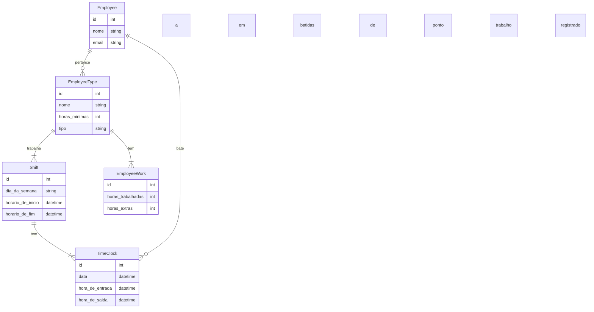

# __Tarefa 01 - Conceitos BD e MER__

* __Nome__: Gabriel José de Aquino Santos.
* __Github__: gbrl08snts
* __Email:__ gabriel.aquino.069@ufrn.edu.br

## __Questão A__

* Um __Banco de Dados__ é uma coleção organizada e estruturada de informaçõe que estão relacionadas e são armazenadas em algum dispositivo. Ele é projetado para
armazenar, gerenciar e recuperar informações de maneira eficiente e segura.

* Um __SGBD (Sistema de Gerenciamento de Banco de Dados)__ é um software (interface) que permite ao usuário criar, consultar, acessar, modificar e excluir dados 
armazenados de maneira eficiente e segura, além disso gerencia o acesso concorrente, a segurança, a integridade e a recuperação de falhas do banco de dados. Alguns 
exemplos dos principais SGBD que existem atualmente: __MySQL__, __PostgreSQL__, __Oracle__, __Microsoft SQL Server__ e __MongoDB__.

## __Questão B__

* __Inconsistência e Redundância de Dados:__ Pode ocorrer a repetição de informação em diferentes arquivos, bem como a cópia dessas informações podem ser divergentes 
com o passar do tempo.

* __Dificuldade de Compartilhamento:__ Os sistemas de arquivos são projetados para uso em uma única máquina ou servidor, o que torna difícil compartilhar dados entre 
vários usuários ou aplicativos.

* __Dificuldade de Escalabilidade:__ Os sistemas de arquivos são limitados em sua capacidade de expansão e gerenciamento de grandes quantidades de dados.

* __Dificuldade de Segurança:__ Os sistemas de arquivos não oferecem recursos avançados de segurança, como criptografia de dados, controle de acesso granular ou 
auditoria de atividades.

* __Dificuldade de Recuperação de Desastres:__ Em caso de falha do sistema ou desastre, os dados armazenados em sistemas de arquivos podem ser perdidos 
permanentemente, a menos que haja um backup adequado.

* __Dificuldade de Integridade dos Dados:__ Os sistemas de arquivos não oferecem recursos avançados de verificação de integridade dos dados, como checksums ou 
assinaturas digitais, o que torna difícil garantir que os dados armazenados permaneçam íntegros ao longo do tempo.

## __Questão C__

* __Entidades:__ As entidades representam objetos ou conceitos do mundo real que são relevantes para o domínio do problema que está sendo modelado. Por exemplo, se 
estivermos modelando um sistema de gerenciamento de biblioteca, as entidades podem incluir "Livros", "Autores", "Usuários" e "Empréstimos". Cada entidade é 
representada por um retângulo contendo o nome da entidade.

* __Atributos:__ Os atributos são as características das entidades que descrevem suas propriedades. Por exemplo, o atributo "Título" pode ser um atributo da entidade 
"Livros", enquanto o atributo "Nome" pode ser um atributo da entidade "Autores". Cada atributo é representado por um oval que é conectado à entidade correspondente.

* __Relacionamentos:__ Os relacionamentos representam as associações entre as entidades. Eles descrevem como as entidades estão relacionadas umas com as outras. Por 
exemplo, pode haver um relacionamento "Empréstimo" que conecte as entidades "Livros" e "Usuários". Cada relacionamento é representado por um losango que é conectado às 
entidades correspondentes.

## __Questão D__

1. __Cardinalidade:__ Representa o número de instâncias de uma entidade que podem estar relacionadas a uma instância de outra entidade.

* __Notação Chen:__ Usa um símbolo numérico dentro de um círculo, colocado próximo ao relacionamento. Por exemplo, um círculo com um "1" indica que apenas uma 
instância da entidade pode estar relacionada com uma instância da outra entidade.

* __Notação Crow's Foot:__ Usa símbolos em forma de "pés de galinha". Por exemplo, um pé de galinha simples indica que apenas uma instância da entidade pode estar 
relacionada com uma instância da outra entidade.

* __Notação Bachman:__ Usa um "X" para indicar a cardinalidade de "um para um", um "M" para indicar a cardinalidade de "muitos para um", e um "N" para indicar a 
cardinalidade de "muitos para muitos".

2. __Entidade Subordinada:__ uma entidade que depende de outra entidade para existir.

* __Notação Chen:__ Usa um triângulo para indicar a entidade subordinada. O triângulo é conectado à entidade principal por meio de uma linha dupla.

* __Notação Crow's Foot:__ Usa um símbolo em forma de "d" para indicar a entidade subordinada. O símbolo "d" é conectado à entidade principal por meio de uma linha 
dupla.

* __Notação Bachman:__ Usa um "S" para indicar a entidade subordinada. O "S" é colocado ao lado da linha que conecta a entidade subordinada à entidade principal.

3. __Atributo Composto:__ um atributo que é composto de vários sub-atributos.

* __Notação Chen:__ Usa uma caixa retangular para indicar o atributo composto. Os sub-atributos são listados dentro da caixa.

* __Notação Crow's Foot:__ Usa uma linha dupla para indicar o atributo composto. Os sub-atributos são listados abaixo da linha.

* __Notação Bachman:__ Usa um "C" para indicar o atributo composto. O "C" é colocado ao lado da linha que conecta o atributo composto à entidade.

## __Questão E__

