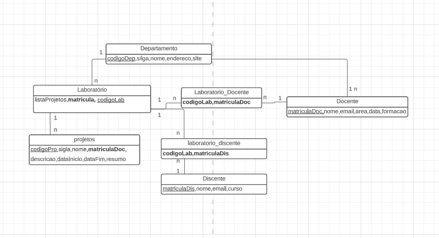

<h1>Tarefa 02 - Modelo Relacional e Regras de Conversão</h1>
<li>Nome: Leonardo Alves</li>
<li>User Git Hub: leonardobezrr</li>
<li>Email: leonardobezerra05@gmail.com</li>
a. <ul>
    O Modelo Relacional é um modelo de dados para representação e manipulação de informações, composto por tabelas, também chamadas de relações, que são formadas por linhas e colunas. Cada tabela representa uma entidade do mundo real e cada linha representa uma instância dessa entidade, enquanto as colunas representam os atributos dessa entidade. Cada atributo tem um nome e um tipo de dado, que pode ser numérico, texto, data, dentre outros. O modelo relacional permite uma representação clara e precisa dos dados e é capaz de lidar com grandes quantidades de informações de forma eficiente.
</ul>
b. <ul>
    <li>Restrição de <b>chave primária</b>, cada tabela no modelo relacional deve ter uma única chave primária que identifica cada linha da tabela de forma única;</li>
    <li>Restrição de <b>chave entrangeira</b>, garante que as relações entre as tabelas sejam mantidas;</li>
    <li>Restrição de <b>unicidade</b>, garantem que nenhum valor em uma determinada coluna de uma tabela seja duplicado;</li>
    <li>Restrição de <b>verificação</b>, usadas para impor limites aos valores que podem ser inseridos em uma coluna de uma tabela;</li>
    <li>Restrição de <b>nulidade</b>, usados para garantir que os valores em uma coluna não possam ser nulos, a não ser que a tabela permita valores nulos;</li>    
</ul>
c.
<ul>
    As regras de conversão entre o modelo entidade-relacionamento e o modelo relacional são as seguintes:
    <ul>
        <li>
        As entidades se tornam tabelas e seus atributos colunas, o nome da entidade é o nome da tabela
        </li>
        <li>
            Cada tabela no modelo relacional deve ter uma chave primária que identifica aquela tabela
        </li>
        <li>
            Os relacionamentos no modelo ER se tornam chaves estrangeiras no modelo relacional e a cardinalidade é representada por elas
        </li>
    </ul>
</ul>
d.

Diagrama de Entidade Relacionamento

    

        
    

    Esquema Relacional
    <ul>
        <li>
            projetos(<u> codigoPro </u>,sigla,nome,<b>matriculaDoc</b>,descricao,dataFim,resumo)
        </li>
        <li>
            laboratorio(<u> codigoLab </u>,listaProjetos,<b>matricula</b>)
        </li>
        <li>
            departamento(<u> codigoDep </u>,sigla,nome,endereco,site)
        </li>
        <li>
            discente(<u> matriculaDis </u>,nome,email,curso)
        </li>
        <li>
            laboratorio_discente(<b>codigoLab,matriculaDis</b>)
        </li>
        <li>
            laboratorio_docente(<b>codigoLab,matriculaDoc</b>)
        </li>
        <li>
            docente(<u> matriculaDoc </u>,nome,email,area,data,formacao) 
        </li>
    </ul>

