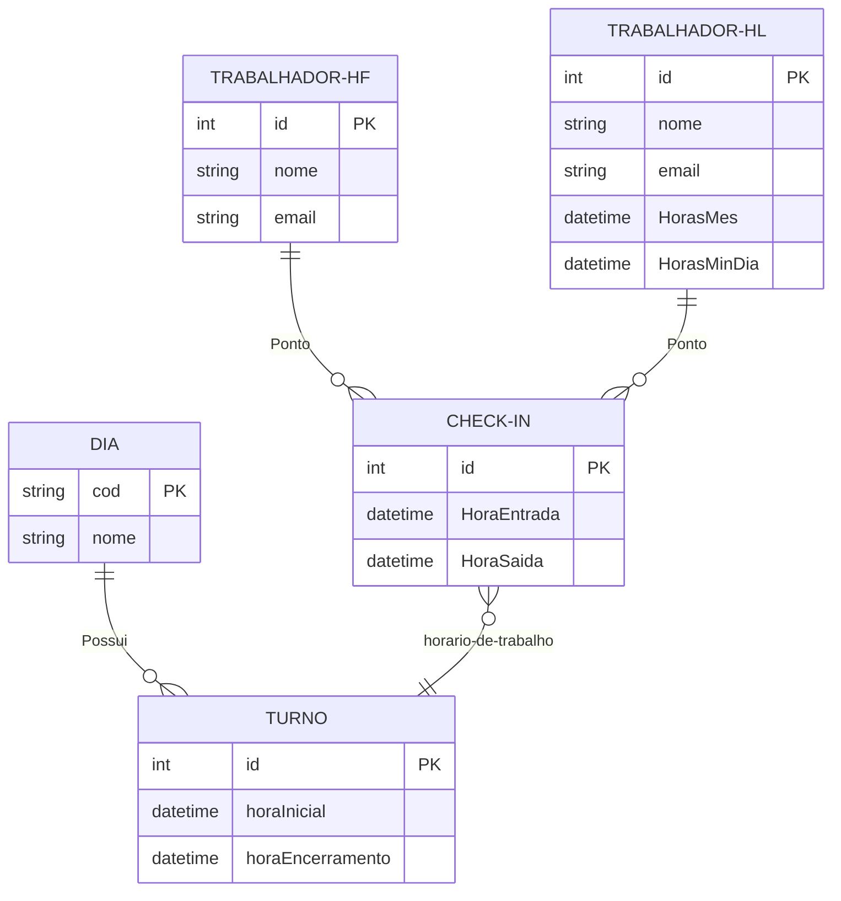

# Tarefa 01

## Descreva o que é um Banco de Dados e o que é um Sistema Gerenciador de Banco de Dados. Cite exemplos de Bancos de Dados e seus SGBDs.

Bancos de dados são agrupamentos de informações que se co-relacionam, que são estruturados de e armazenados de forma que possam ser acessadas, gerenciadas e modificadas. Um sistema Gerenciador de Banco de dados (SGBD) é um software que permite a criação e administração de bancos de dados, oferecendo recursos de criação, modificação e consulta dos dados.

Alguns bancos de dados mais amplamente conhecidos e seu respectivos SGBDs são:

- Oracle: Sendo um dos sistemas de bancos de dados mais famosos atualmente. É um banco de dados relacional que é amplamente utilizado em grandes empresas e é seu SGBD é o Oracle Database

- PostgreSQL: O Postgres é um banco de dados relacionai de código aberto gerenciado pelo SGBD de mesmo nome PostgreSQL. Usa SQL como linguagem de consulta e é o banco de dados padrão do macOS Server, tambem sendo comumente utilizando em aplicações web em diversas linguagens como python e java.

- MongoDB: MongoDB é um software de banco de dados orientado a documentos livre, de código aberto e multiplataforma, escrito na linguagem C++. Classificado como um programa de banco de dados NoSQL, que é uma opção popular para aplicativos web e móveis, gerenciado pelo SGBD MongoDB.

## Quais os principais problemas de utilizar Sistemas de Arquivos para armazenagem de dados.

O uso de arquivos para armazenamento de dados pode apresentar diversas falhas, principalmente com grandes volumes de dados, dentre esses problemas estão podem se destacar:

- A impossibilidade de acesso simultâneo aos dados
- A inconsistência dos dados, ja que como os arquivos são manipulados diretamente pelos usuários, é fácil que ocorra inconsistência de dados, podendo haver duplicações e dados não atualizados.
- Segurança, os arquivos não oferecem as mesmas camadas de segurança que um banco de dados pode oferecer, deixando informações importante suscetíveis a roubos e ataques cyberneticos.

## O modelo de dados entidade-relacionamento foi desenvolvido para facilitar o projeto de banco de dados, permitindo especificação de um esquema que representa a estrutura lógica geral de um banco de dados. Descreva os três elementos básicos de um Modelo Entidade Relacionamento (MER).

O modelo Entidade Relacionamento representa dados em forma de objetos que podem se relacionar e tem atributos próprios:

1 - Entidades: São os objetos, que são agrupamentos de informação(atributos) que servem para representar algum conceito ou objeto do mundo real, como por exemplo um cliente.

2 - Atributos: Os atributos que são caracteristicas e propriedades que compôem uma entidade, essas informações são agrupadas em um objeto de forma que faça sentido aquela entidade. Seguindo o exemplo da entidade cliente, os atrubutos dessa entidade poderiam ser nome, endereço, e e-mail.

3 - Relacionamentos: Como o nome diz, os relacionamentos são as conexões que diferentes entidades podem ter entre si, seguindo o exemplo do cliente, pode existir uma entidade COMPRA, que tem de estar relacionada a um cliente, e tambem está relacionada a um produto.

## Pesquise sobre as várias notações possíveis para Diagramas ER, cite alguns exemplos de notações diferentes para o mesmo conceito (ex: Cardinalidade, Entidade Subordinada, etc).

### Modelos de dados conceitual

Citarei algumas dos diferentes tipo de Notações para diagramas ER:

- Notação de Peter Chen: é a notação mais antiga e mais utilizada. Nesse modelo, as entidades são representadas por retângulos, os relacionamentos por losangos e os atributos por circulos(elipses).

- Notação de Martin: é uma notação que utiliza símbolos mais simples. Nessa notação, as entidades são representadas por retângulos, os relacionamentos por linhas e os atributos por elipses.

- Notação de Barker: é uma notação que foi desenvolvida a partir da notação de Chen. Nessa notação, as entidades são representadas por retângulos, os relacionamentos por losangos e os atributos por elipses. Essa notação utiliza diferentes tipos de linhas para representar a cardinalidade dos relacionamentos.

- Notação de Merise: Nessa notação, as entidades são representadas por retângulos, os relacionamentos por losangos e os atributos por elipses. Além disso, essa notação utiliza diferentes tipos de linhas para representar a cardinalidade dos relacionamentos.

Tratando de representações diferentes para o mesmo conceito irei citar o conceito de cardinalidade:

- Cardinalidade: na notação de Chen, a cardinalidade é representada por uma linha com um número de cada lado do losango que representa o relacionamento. Na notação de Barker, a cardinalidade é representada por diferentes tipos de linhas. Na notação de Merise, a cardinalidade é representada por uma linha com uma seta apontando para a entidade com a cardinalidade máxima.

## Construa um Diagrama ER para projetar uma base de dados de um Sistema de Controle de Freqüência de Empregados de uma organização. A base de dados não deve conter redundância de dados. O modelo ER deve ser representado com um diagrama usando Mermaid.js. O modelo deve apresentar, ao menos, entidades, relacionamentos, atributos, identificadores e restrições de cardinalidade. O modelo deve ser feito no nível conceitual, sem incluir chaves estrangeiras.

