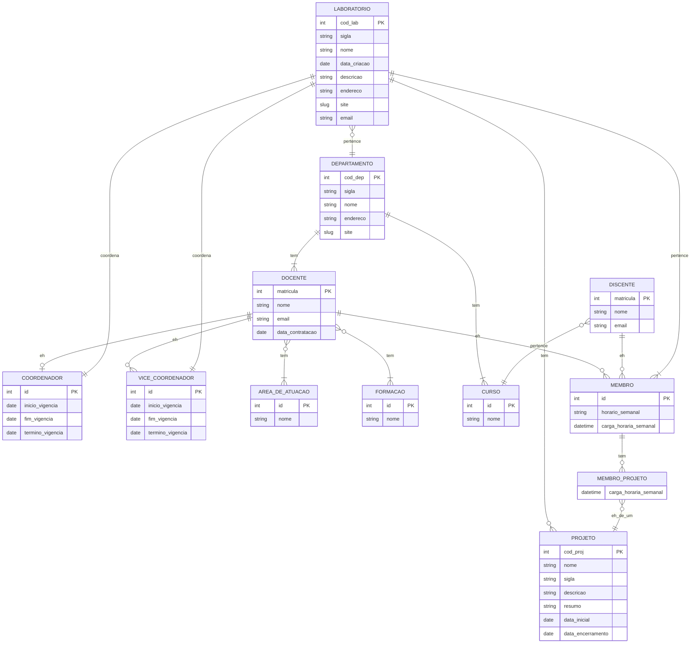

# Tarefa 02 - Modelo Relacional e Regras de Conversão

**Nome:** Lucas Mateus da Silva

**Github:** https://github.com/mts-lucas

**Email:** lmateus1067@outlook.com

##

# a) Descreva o Modelo Relacional.

O Modelo Relacional representa os dados num Banco de Dados como uma coleção de relações e seus relacionamentos. Cada relação contém um nome e um conjunto de atributos com seus respectivos nomes. Informalmente, as relações do Modelo Relacional são também chamadas de tabelas pela maioria dos desenvolvedores. Essas tabelas são conhecidas como relações e são compostas por atributos e tuplas. Cada atributo representa uma propriedade dos dados armazenados e cada tupla representa uma instância desses dados.
As relações são interconectadas por meio de chaves estrangeiras, que permitem estabelecer relacionamentos entre as tabelas. Esses relacionamentos podem ser de um-para-um, um-para-muitos ou muitos-para-muitos.

## b) Descreva as restrições de integridade do Modelo Relacional

**Restrições de integridade de domínio:** Essas restrições definem os valores válidos para um determinado atributo em uma tabela. Toda tupla tem um conjunto de atributos que a identifica de maneira única na relação.

**Integridade de Entidade:** Nenhum valor de chave primária poderá ser NULO.

**Integridade Referencial:** Essas restrições garantem que as referências entre tabelas sejam mantidas quando ocorrerem atualizações ou exclusões de registros. Por exemplo, se um registro em uma tabela referenciada for excluído, todos os registros em outras tabelas que fazem referência a ele também devem ser excluídos ou atualizados para refletir essa exclusão.

## c) Descreva as Regras de Conversão entre o Modelo Entidade-Relacionamento e o Modelo Relacional.

**Regra 1: Entidades Regulares**

- 1.1. Para cada entidade regular E no esquema E-R, criamos uma relação R que inclui os atributos simples de E
- 1.2. Para cada atributo composto de E incluímos somente os seus atributos simples
- 1.3. Escolhemos uma das chaves candidatas de E para ser a chave primária de R

**Regra 2: Entidades Fracas**

- 2.1. Para cada entidade fraca W, com entidade forte E, no esquema E-R, criamos uma relação R e incluímos todos os atributos simples de W como atributos de R
- 2.2. Incluímos como atributos da chave estrangeira de R os atributos que compõem a chave primária da entidade forte E
- 2.3. A chave primária de R é a combinação da chave primária da entidade forte E e a chave da entidade fraca W

**Regra 3: Relacionamentos 1:1 == (1,1) : (1,1)**

- 3.1. Identificamos as relações S e T que correspondem às entidades que participam do relacionamento
- 3.2. Escolhemos uma das relações, digamos S, e incluímos como chave estrangeira em S a chave primária de T. É melhor escolher para desempenhar o papel de S, a entidade que tenha participação total no relacionamento
- 3.3. Incluímos todos os atributos simples do relacionamento 1:1 como atributos de S

**Regra 4: Relacionamentos 1:N que não envolvem entidades fracas**

- 4.1. Identificamos a relação S que representa a entidade que participa do lado N do relacionamento
- 4.2. Incluímos como chave estrangeira em S, a chave primária da relação T que representa a outra entidade (lado 1) que participa do relacionamento
- 4.3. Incluímos qualquer atributo simples do relacionamento 1:N em S

**Regra 5: Relacionamento N:M**

- 5.1. Criamos uma nova relação S para representar o relacionamento
- 5.2. Incluímos como chave estrangeira em S as chaves primárias das relações que participam do relacionamento. A combinação destas chaves formará a chave primária da relação S
- 5.3. Incluímos qualquer atributo do relacionamento N:M em S
  Nota: Podemos mapear um relacionamento 1:1 ou 1:N de maneira similar ao M:N. Isto é usado quando existem poucas instâncias do relacionamento, evitando valores nulos nas chaves estrangeiras

**Regra 6: Atributos Multivalorados**

- 6.1. Criamos uma nova relação R que inclui o atributo multivalorado A mais a chave primária K da relação que representa a entidade (ou relacionamento) que tem A como atributo
- 6.2. A chave primária de R é a combinação de A e K
- 6.3. Se o atributo multivalorado é composto => incluir seus componentes atômicos

**Regra 7: Especialização / Generalização**

- 7.1. Converta cada especialização com m subclasses {S1,S2,...,Sm} e superclasse C, cujos atributos são {k, a1,..., an} onde k é a chave primária, em esquemas de relações usando uma das seguintes opções:

- A) Criar uma relação L para C com os atributos Atrib(L) = {k,a1, ... , an} e chave primária k. Criar também uma relação Li para cada subclasse Si, 1 ≤ i ≤ m, com os seguintes atributos: Atrib(Li) = {k} { atributos de Si}, k será a chave primária
- B) Criar uma relação Li para cada subclasse Si, 1 ≤ i ≤ m, com os atributos Atrib(Li) = {atributos de Si} {k,a1, ... ,an} e chave primária (Li) = k
- C) Criar uma única relação L com atributos Atrib(L) = {k,a1,...,an} { atributos de S1} ... {atributos de Sm} {t} e chave primária k
  t é um atributo de tipo que indica a subclasse a qual a tupla pertence (opção usada para especialização cujas subclasses são disjuntas)
- D) Criar uma única relação L com atributos Atrib(L) = {k,a1,...,an} { atributos de S1 } ... { atributos de Sm } {t1,t2,...,tm} e chave primária k
  Cada ti , 1 ≤ i ≤ m, é um atributo booleano que indica se uma tupla pertence a uma subclasse Si (opção usada para especialização cujas subclasses são sobrepostas)

## Crie um Diagrama Entidade Relacionamento e depois crie um Esquema Relacional...

apesar de Membro e Projeto terem uma relaçaõ N:M coloquei logo a entidade que faz o intermédio, pois não há como colocar atributos em relacionamentos usando o mermaid. Então interprete essa entidade como um relacionamento N:M tanto que no modelo relacional a tratei como tal.

### Modelo Relacional (MR):

**LABORATORIO**(<u>cod_lab</u> , sigla, nome, data_criacao, descricao, endereco, email, site, **id_cod**, **id_vice_cod**, **cod_dep**)

**DEPARTAMENTO**(<u>cod_dep</u>, sigla, nome, endereco, site)

**DOCENTE**(<u>matricula</u>, nome, email, data_contratacao, **cod_dep**)

**COORDENADOR**(<u>id</u>, inicio_vigencia, termino_vigencia, fim_vigencia, **mat_doc**, **cod_lab**)

**VICE_COORDENADOR**(<u>id</u>, inicio_vigencia, termino_vigencia, fim_vigencia, **mat_doc**, **cod_lab**)

**AREA_DE_ATUACAO**(<u>id</u>, nome)

**FORMACAO**(<u>id</u>, nome)

**DISCENTE**(<u>matricula</u>, nome, email, **id_curso**)

**CURSO**(<u>id</u>, nome, **cod_dep**)

**MEMBRO**(<u>id</u>, horario_semanal, carga_horaria_semanal, **cod_lab**, **mat_doc**, **mat_dic**)

**PROJETO**(<u>cod_proj</u>, nome, sigla, descricao, resumo, data_inicial, data_encerramento, **cod_lab**)

**MEMBRO_PROJETO**(<u>**id_memb**, **cod_prok**</u>, carga_horaria_semanal)

**DOCENTE_FORMACAO**(<u>**id_form**, **mat_doc**</u>)

**DOCENTE_AREA_DE_ATUACAO**(<u>**id_area_at**, **mat_doc**</u>)

### Referências

LABORATORIO(id_cod) → COORDENADOR(id)

LABORATORIO(id_vice_cod) → VICE_COORDENADOR(id)

LABORATORIO(cod_dep) → DEPARTAMENTO(cod_dep)

DEPARTAMENTO(cod_dep) → DEPARTAMENTO(cod_dep)

COORDENADOR(mat_doc) → DOCENTE(matricula)

COORDENADOR(cod_lab) → LABORATORIO(cod_lab)

VICE_COORDENADOR(mat_doc) → DOCENTE(matricula)

VICE_COORDENADOR(cod_lab) → LABORATORIO(cod_lab)

DISCENTE(id_curso) → CURSO(id)

CURSO(cod_dep) → DEPARTAMENTO(cod_dep)

MEMBRO(cod_lab) → LABORATORIO(cod_lab)

MEMBRO(mat_doc) → DOCENTE(matricula)

MEMBRO(mat_dic) → DISCENTE(matricula)

PROJETO(cod_lab) → LABORATORIO(cod_lab)

MEMBRO_PROJETO(cod_proj) → PROJETO(cod_proj)

MEMBRO_PROJETO(cod_proj) → MEMBRO(cod_proj)

DOCENTE_AREA_DE_ATUACAO(id_area_at) → AREA_DE_ATUACAO(id)

DOCENTE_AREA_DE_ATUACAO(mat_doc) → DOCENTE(matricula)

DOCENTE_FORMACAO(id_form) → FORMACAO(id)

DOCENTE_FORMACAO(mat_doc) → DOCENTE(matricula)

