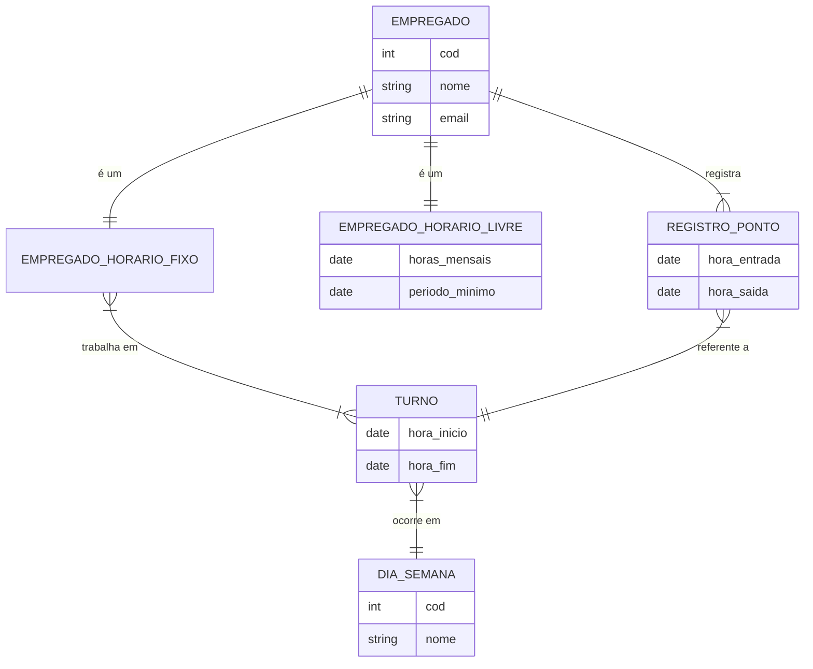

# Tarefa 01 - Conceitos BD e MER

**Nome:** Diana Rodrigues da Silva

**Usuário GitHub:** dianaRodriguess

**email:** diana.rodrigues.131@ufrn.edu.br

## Letra A

**Banco de dados:** Um Banco de Dados é uma coleção organizada e persistente de dados relacionados, armazenados de forma integrada e compartilhada, que representa informações sobre entidades e seus relacionamentos em um domínio específico. Os dados são estruturados para facilitar o acesso, gerenciamento e atualização.

**SGBD:** Um SGBD (ou DBMS, em inglês) é um software que gerencia bancos de dados, fornecendo ferramentas para:

1. Definir a estrutura do banco (DDL - Data Definition Language).
2. Manipular os dados (DML - Data Manipulation Language).
3. Controlar acesso, segurança, concorrência e recuperação.
4. Garantir integridade e consistência dos dados.

**Exemplos:**

Banco de Dados		SGBD Correspondente
--------------		-------------------
Oracle Database		Oracle Database
MySQL				MySQL (Oracle)
PostgreSQL			PostgreSQL
Microsoft SQL Server	SQL Server (Microsoft)
MongoDB				MongoDB (NoSQL)
SQLite				SQLite

## Letra B

1. **Redundância e Inconsistência** 
   - Dados duplicados em diferentes arquivos levam a desperdício de espaço e inconsistência (dados divergentes). 

2. **Dificuldade de Acesso** 
   - Consultas complexas exigem programas específicos, sem padronização. 

3. **Isolamento dos Dados** 
   - Dados espalhados em vários arquivos dificultam a integração. 

4. **Problemas de Concorrência** 
   - Múltiplos usuários acessando os mesmos dados podem causar conflitos. 

5. **Falta de Segurança** 
   - Controle de acesso limitado, sem mecanismos sofisticados de permissão.  

6. **Falta de Independência de Dados** 
   - Alterações na estrutura dos arquivos exigem modificações em todos os programas que os usam. 

7. **Problemas de Integridade** 
   - Dificuldade em garantir que os dados obedeçam a regras de negócio (ex.: salário não pode ser negativo). 

---

## Letra C

**Entidades:**

- Representam objetos ou conceitos do mundo real (ex.: Aluno, Curso, Funcionário).
- São descritas por **atributos** (ex.: Aluno tem matrícula, nome, idade).

**Relacionamentos:**

- Indicam associações entre entidades (ex.: Aluno *se matricula* em Curso).
- Podem ser **binários** (entre duas entidades), **ternários** (três entidades) ou **recursivos** (uma entidade se relaciona consigo mesma).

**Atributos:**

- Propriedades que descrevem entidades ou relacionamentos.
	- Tipos comuns:
		- **Simples** (não divisível, ex.: CPF).
		- **Composto** (subdividido, ex.: Endereço (rua, cidade, CEP).
		- **Multivalorados** (vários valores, ex.: telefones de um cliente).

## Letra D

#### Algumas possíveis notações são: 

- **Notação Chen:**
- **Notação Crow's Foot:**
- **Notação IDEF1X:**
- **Notação UML:**

#### Exemplos de notações diferentes para o mesmo conceito:

- **Cardinalidade:**

	- **Notação Chen:** 1:1, 1:N, M:N
	- **Notação Crow's Foot:** 1, -, |
	- **Notação IDEF1X:** 1, 0..1, 0..N, 1..N
	- **Notação UML:** 1, 0..1, 0.., 1..

- **Entidade Subordinada:**

	- **Notação Chen:** Retângulo com _linha dupla_
	- **Notação Crow's Foot:** Retângulo com _linha pontilhada_
	- **Notação IDEF1X:** Retângulo com _linha pontilhada_
	- **Notação UML:** Classe com _estereótipo «weak entity»_
	
## Letra E

#### Código Mermaid

- i. 
```mermaid
    EMPREGADO

    EMPREGADO {
        int cod
        string nome 
        string email
    }    
```

- ii.
```mermaid
    EMPREGADO
    EMPREGADO_HORARIO_LIVRE

    EMPREGADO {
        int cod
        string nome 
        string email
    }
    
    EMPREGADO_HORARIO_LIVRE {
        date horas_mensais
        date periodo_minimo
    }
```
- iii.

```mermaid
	EMPREGADO ||--|{ REGISTRO_PONTO : registra
    EMPREGADO ||--|| EMPREGADO_HORARIO_LIVRE : "é um"
    EMPREGADO ||--|| EMPREGADO_HORARIO_FIXO : "é um"
    EMPREGADO_HORARIO_FIXO }|--|{ TURNO : "trabalha em"
    TURNO }|--|| DIA_SEMANA : "ocorre em"

    EMPREGADO {
        int emp_cod
        string nome 
        string email
    }
    
    EMPREGADO_HORARIO_LIVRE {
        date horas_mensais
        date periodo_minimo
    }
    
    EMPREGADO_HORARIO_FIXO {
    }
    
    DIA_SEMANA {
        string dia_cod
        string nome
    }
    
    TURNO {
        date hora_inicio
        date hora_fim
    }
```

- iv.


