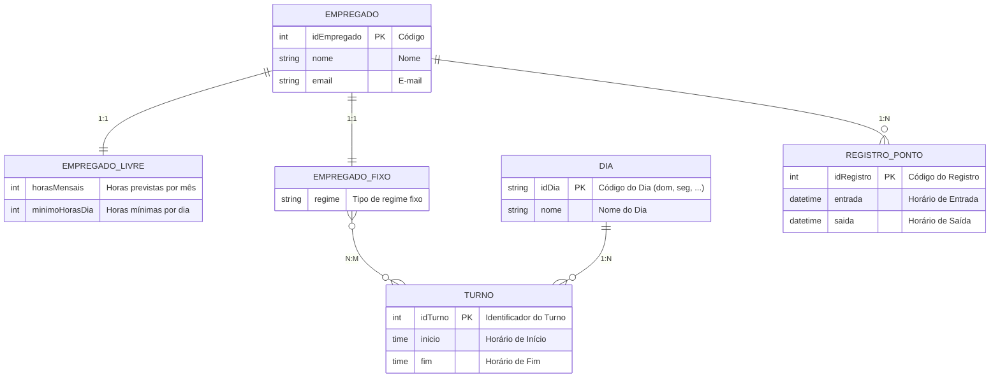

# Tarefa 01 - Conceitos BD e MER

**Nome:** Arthur De Medeiros Dantas  

**Usuário do GitHub:** THUR165  

**E-mail:** arthur.dantas.017@ufrn.edu.br  

---

## Seção A: Banco de Dados e SGBD

Um **Banco de Dados (BD)** é um conjunto estruturado de informações organizadas de forma a permitir fácil acesso, manipulação e atualização. Ele é utilizado para centralizar dados e garantir consistência nas operações.  

Um **Sistema Gerenciador de Banco de Dados (SGBD)** é o software responsável por criar, manipular, controlar acesso e manter a integridade do banco de dados.  

**Exemplos:**  
- Banco de Dados: Microsoft SQL Server Database, Firebase Database, Neo4j Database, Cassandra Database.  
- SGBDs correspondentes: SQL Server, Firebase, Neo4j, Apache Cassandra.  

---

## Seção B: Problemas ao utilizar Sistemas de Arquivos para armazenar dados  

1. **Falta de padronização** – cada arquivo pode ter formato diferente.  
2. **Manutenção difícil** – qualquer alteração exige modificações manuais em vários arquivos.  
3. **Acesso ineficiente** – consultas complexas são complicadas de implementar.  
4. **Ausência de integridade** – não há restrições para evitar erros como duplicação de dados.  
5. **Confiabilidade baixa** – perda ou corrupção de arquivos compromete os dados.  
6. **Controle de concorrência inexistente** – múltiplos usuários acessando ao mesmo tempo podem causar conflitos.  

---

## Seção C: Modelo Entidade-Relacionamento (MER)  

O **MER** é usado no projeto de banco de dados para representar, de forma conceitual, os elementos de um sistema. Seus três elementos básicos são:  

1. **Entidades** – objetos ou conceitos que podem ser identificados no mundo real. Exemplo: *Aluno*, *Curso*.  
2. **Atributos** – informações que descrevem as entidades ou relacionamentos. Exemplo: *nome*, *data de nascimento*, *carga horária*.  
3. **Relacionamentos** – ligações entre entidades, representando interações. Exemplo: *Aluno matricula-se em Curso*.  

---

## Seção D: Notações em Diagramas ER  

Várias notações gráficas existem para representar os mesmos conceitos em diagramas ER.  

**Exemplos:**  

- **Cardinalidade:**  
  - Notação de Pé de Galinha: usa “pés” para representar 1:N, N:M.  
  - Notação de Chen: indica cardinalidade com números próximos às entidades.  
  - UML: utiliza intervalos (ex.: `0..*`, `1..1`).  

- **Especialização/Generalização:**  
  - Chen: usa triângulo para indicar herança.  
  - UML: seta vazada apontando para a superclasse.  

- **Atributos:**  
  - Chen: elipses conectadas à entidade.  
  - UML: listados dentro da caixa da entidade.  

---
## Seção E: Diagrama ER – Sistema de Controle de Frequência de Empregados (com Cardinalidade)

Abaixo está o **Modelo Entidade-Relacionamento (conceitual)** para o Sistema de Controle de Frequência de Empregados.  
O modelo diferencia os tipos de empregados (livre e fixo), organiza turnos semanais e registra os pontos batidos.  

### Entidades principais
- **EMPREGADO** (idEmpregado, nome, email)  
- **EMPREGADO_LIVRE** (horasMensais, minimoHorasDia)  
- **EMPREGADO_FIXO** (regime)  
- **DIA** (idDia, nome)  
- **TURNO** (idTurno, inicio, fim)  
- **REGISTRO_PONTO** (idRegistro, entrada, saída)  

### Relacionamentos e Cardinalidades
1. **EMPREGADO – EMPREGADO_LIVRE**  
   - Um empregado pode ser do tipo livre, e cada registro de EMPREGADO_LIVRE está ligado a exatamente um empregado.  
   - **Cardinalidade:** 1:1  

2. **EMPREGADO – EMPREGADO_FIXO**  
   - Um empregado pode ser do tipo fixo, e cada registro de EMPREGADO_FIXO está ligado a exatamente um empregado.  
   - **Cardinalidade:** 1:1  

3. **EMPREGADO – REGISTRO_PONTO**  
   - Um empregado pode registrar vários pontos ao longo do tempo.  
   - Cada REGISTRO_PONTO pertence a apenas um empregado.  
   - **Cardinalidade:** 1:N  

4. **EMPREGADO_FIXO – TURNO**  
   - Um empregado fixo pode ter vários turnos atribuídos na sua escala.  
   - Um turno pode estar associado a vários empregados fixos diferentes.  
   - **Cardinalidade:** N:M  

5. **DIA – TURNO**  
   - Um dia pode conter vários turnos.  
   - Cada turno está vinculado a exatamente um dia.  
   - **Cardinalidade:** 1:N  

---

### Diagrama em Mermaid.js

