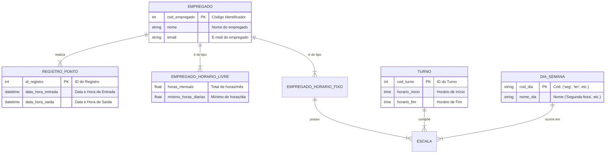

# Tarefa 01 - Conceitos BD e MER

- **Nome:** Ismael Gomes da Silva
- **Usuário GitHub:** <Ismael-back>
- **E-mail:** ismael.silva.713@ufrn.edu.br

---
### O que são Branches e Pull Requests?

**Branches (Ramificações):**
* Uma branch no Git é uma linha de desenvolvimento independente. Imagine a linha principal do projeto (chamada `main`) como o tronco de uma árvore. Quando você cria uma branch, é como se estivesse criando um novo galho a partir desse tronco.
* Nesse "galho", você pode adicionar, modificar e remover código sem afetar o tronco principal. Isso é fundamental para trabalhar em novas funcionalidades ou corrigir bugs de forma isolada e segura.

**Pull Requests (PRs):**
* Um Pull Request é um mecanismo para propor que as alterações feitas em sua branch (o "galho") sejam incorporadas (mescladas) de volta à branch principal (o "tronco").
* Não é uma ação automática; é um pedido formal. Ele abre uma interface no GitHub onde você e sua equipe podem revisar as alterações, discutir o código, solicitar ajustes e, finalmente, se tudo estiver aprovado, o administrador do repositório pode aceitar o PR e realizar a fusão do código.

---
### O que é um Banco de Dados e um SGBD?

**Banco de Dados (BD):**
* É uma coleção de dados estruturados e organizados, que se relacionam entre si, representando informações do mundo real. Pense nele como um arquivo digital gigante e inteligente, onde os dados são guardados de forma lógica e consistente.
* **Exemplo de Banco de Dados:** O banco de dados de uma universidade, que contém tabelas de `Alunos`, `Disciplinas` e `Matrículas`.

**Sistema Gerenciador de Banco de Dados (SGBD):**
* É o **software** que funciona como uma interface entre o usuário (ou uma aplicação) e o banco de dados. Ele é responsável por criar, ler, atualizar e apagar os dados (operações de CRUD), além de garantir a segurança, integridade e o controle de acesso concorrente.
* **Exemplos de SGBDs:** PostgreSQL, MySQL, SQL Server, Oracle.
* **Analogia:** Se o Banco de Dados é uma biblioteca cheia de livros organizados (os dados), o SGBD é todo o sistema de bibliotecários e fichários que permite que você encontre, pegue emprestado e devolva um livro de forma segura e eficiente.

---
### Quais os principais problemas de utilizar Sistemas de Arquivos?

Utilizar sistemas de arquivos tradicionais (como pastas e arquivos .txt ou .csv) para armazenar dados de uma aplicação gera diversos problemas que os SGBDs vieram para resolver:

* **Redundância e Inconsistência:** A mesma informação pode ser duplicada em vários arquivos. Alterar em um local e não em outro cria inconsistência nos dados.
* **Dificuldade de Acesso:** É preciso desenvolver programas específicos para cada nova consulta ou relatório que se deseja extrair. Não há uma linguagem padrão como o SQL para buscar dados de forma flexível.
* **Isolamento de Dados:** Os dados frequentemente ficam espalhados em múltiplos arquivos com formatos diferentes, o que torna muito difícil a tarefa de relacioná-los e obter informações consolidadas.
* **Problemas de Integridade:** É complexo garantir que os dados obedeçam a certas regras de negócio (ex: "o CPF de um cliente deve ser único" ou "o estoque de um produto não pode ser negativo"). Essas regras precisariam ser implementadas em todos os programas que acessam os arquivos.
* **Problemas de Concorrência:** O acesso simultâneo de múltiplos usuários ao mesmo arquivo pode levar à sobreposição de alterações e corrupção dos dados. Os SGBDs possuem mecanismos robustos para controlar a concorrência.
* **Problemas de Segurança:** É difícil definir permissões de acesso específicas e granulares (ex: um usuário pode ver os dados de um produto, mas não pode alterar seu preço).

---
### Descreva os três elementos básicos de um Modelo Entidade Relacionamento (MER).

Os três componentes fundamentais do MER são:

* **Entidade:** Representa um objeto do mundo real sobre o qual se deseja armazenar informações. Uma entidade pode ser algo concreto (como `ALUNO`, `CARRO`, `PRODUTO`) ou algo abstrato (como `MATRÍCULA`, `EMPRÉSTIMO`, `VENDA`). Em diagramas, é comumente representada por um retângulo. Cada ocorrência de uma entidade é única (ex: o aluno João da Silva é uma ocorrência da entidade `ALUNO`).

* **Atributo:** É uma propriedade ou característica que descreve uma entidade. Por exemplo, a entidade `ALUNO` pode ter os atributos: `cpf`, `nome`, `data_nascimento` e `email`. Os atributos ajudam a detalhar e a identificar as ocorrências de uma entidade.

* **Relacionamento:** Representa uma associação ou interação que existe entre duas ou mais entidades. Descreve como as entidades se conectam. Por exemplo, um `ALUNO` **se inscreve em** uma `TURMA`. A expressão "se inscreve em" define o relacionamento entre essas duas entidades. Em diagramas (na notação de Chen), é representado por um losango.

---
### Pesquise sobre as várias notações possíveis para Diagramas ER.

Existem diversas notações gráficas para representar um Modelo Entidade-Relacionamento. Embora representem os mesmos conceitos, elas utilizam símbolos diferentes. As mais conhecidas são a notação de Chen, a de Crow's Foot (Pé de Galinha) e a UML.

**Conceito: Cardinalidade (Um para Muitos)**
*Exemplo: Uma entidade `MÃE` pode ter `MUITOS` `FILHOS`.*

* **Notação de Chen:** Utiliza um losango para o relacionamento e números (`1`, `N` ou `M`) nas linhas de conexão para indicar a cardinalidade.
    `[MÃE] --(1)-- <tem> --(N)-- [FILHO]`
* **Notação Crow's Foot (Pé de Galinha):** É muito popular em ferramentas de modelagem. O lado "um" é representado por uma barra vertical (`|`) e o lado "muitos" por um símbolo que parece um pé de galinha (`<`).
    `MÃE |< FILHO`
* **Notação UML:** Usada em diagramas de classes, representa a multiplicidade nas pontas da linha de associação. `1` significa "um" e `*` significa "muitos".
    `MÃE 1 -- * FILHO`

**Conceito: Entidade Subordinada (Entidade Fraca)**
*Exemplo: A entidade `ITEM_DE_PEDIDO` só existe e só é identificada se estiver vinculada a um `PEDIDO`.*

* **Notação de Chen:** Representa a entidade fraca com um retângulo de linha dupla e o relacionamento de identificação com um losango de linha dupla.
* **Notação Crow's Foot:** A chave primária da entidade fraca é parcialmente ou totalmente composta pela chave da entidade forte, e o relacionamento que as une é chamado de "relacionamento de identificação".

---
### Diagrama ER para o Sistema de Controle de Freqüência

Abaixo está o diagrama Entidade-Relacionamento para o sistema proposto, modelado em nível conceitual e utilizando a sintaxe do Mermaid.js. O modelo lida com a especialização dos tipos de empregados e os diferentes regimes de trabalho.

