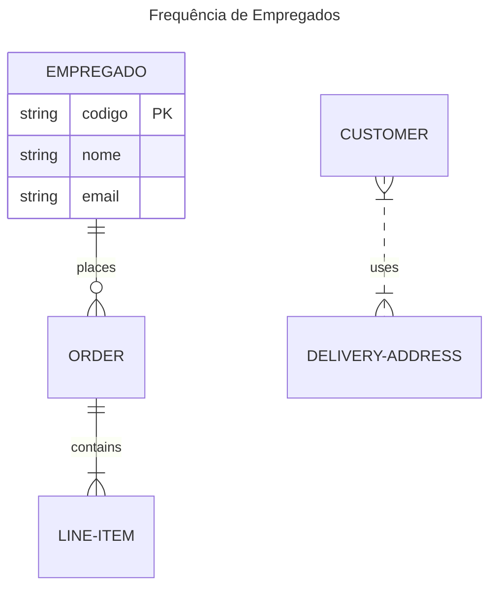

# Tarefa 01 - Conceitos BD e MER
### Moisés Lucena de Oliveira 
### MoisesLuc 
### moisesbrats98@gmail.com
---
* a. Banco de dados refere-se a um armazém de informações sobre um determinado contexto, e para gerenciá-los usa-se os SGBDs, que possibilitam o controle sobre as operações ocorridas com os dados, como manipulação e recuperação. Como exemplos temos um sistema de controle de estoque de um supermecado, manuseado através do MySQL.
---
* b. Dentre os principais problemas podemos citar a inconsistência na gravação e recuperação dos dados, que podiam possuir cópias nos inúmeros arquivos; isolamento desses dados em arquivos que poderiam estar espalhados de forma irregular e em formatos diferentes; maior dificuldade na adição ou modificação das restrições impostas nos valores armazenados e problemas de segurança acarretados pela dificuldade de gerenciar permissões em um sistema de arquivos.
---
* c. Os três elementos principais de um MER consistem em: uma **entidade**, que descreve um objeto ou uma instância desse objeto no sistema, e pode ser tanto concreta (pessoa, livro, alimento) ou abstrata (compra, transação); os **atributos** da entidade, que descrevem as propriedades dela e podem ser herdadas e por fim os **relacionamentos** que conectam as entidades entre si.
---
* d. Em projetos ER existem diversas notações que podem diferenciar a depender do método utilizado, como Chen, UML e Crow's foot, dentre outros. Em um relacionamento M:N entre alunos e disciplinas, por exemplo, o método de **Chen** descreve as duas entidades em retângulos e estabelece o relacionamento "matricula-se" em um losango; com o método **Crow's Foot** é criado uma tabela associativa que contém atributos relacionados ao relacionamento, como a data da matrícula, por exemplo; e em UML, é criado uma classe associativa chamada "Matrícula" com a data da matrícula.
---
* e. 
