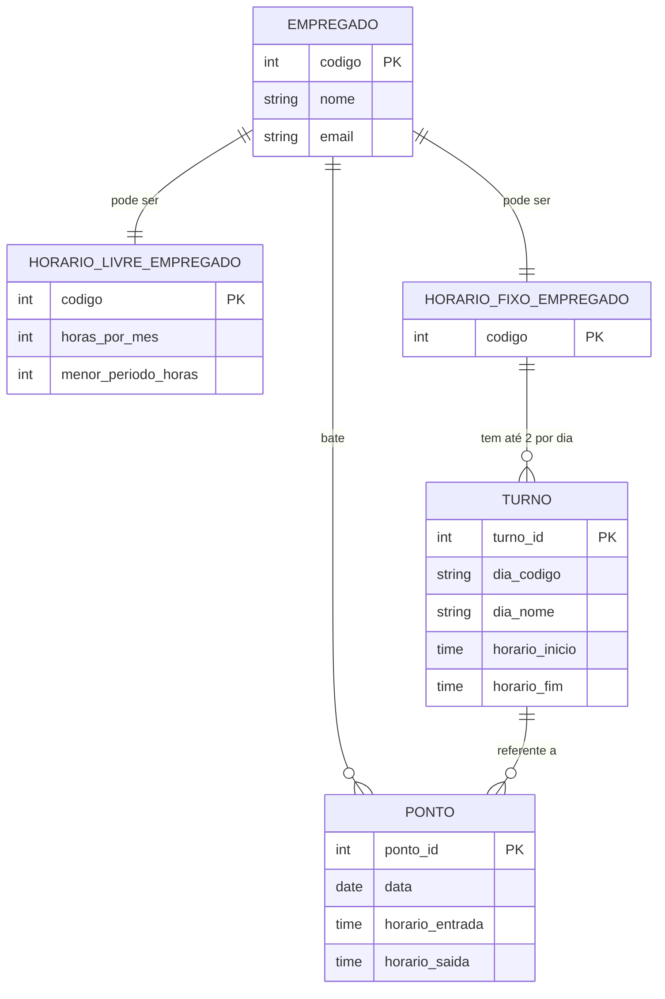

# Tarefa 01 - Conceitos BD e MER

**Nome:** Nathan Lopes  
**GitHub:** [@coderlupus](https://github.com/coderlupus)  
**E-mail:** natelopes18@gmail.com

### a. O que é um Banco de Dados e o que é um Sistema Gerenciador de Banco de Dados (SGBD)

- **Banco de Dados (BD)**: coleção organizada de dados relacionados, representando informações de um domínio específico. É utilizado para armazenar, recuperar, modificar e gerenciar informações de forma eficiente.
- **Sistema Gerenciador de Banco de Dados (SGBD)**: software que permite definir, construir, manipular, consultar, garantir integridade, segurança, concorrência, recuperação de falhas, etc., operando sobre um ou mais bancos de dados. Exemplos de SGBDs: Oracle, MySQL, PostgreSQL, Microsoft SQL Server.

### Exemplos de Bancos de Dados e seus SGBDs

- Banco de Dados Relacional: MySQL, PostgreSQL, Oracle, SQL Server.
- Banco de Dados Não-Relacional (NoSQL): MongoDB, Cassandra, etc.

## b. Problemas de Usar Sistemas de Arquivos para Armazenamento de Dados

- Redundância de dados (mesmo dado armazenado em vários arquivos) → desperdício de espaço e possibilidade de inconsistência. :contentReference[oaicite:4]{index=4}  
- Integridade comprometida: ausência de mecanismos automáticos para garantir que os dados estejam coerentes entre diferentes arquivos. :contentReference[oaicite:5]{index=5}  
- Dificuldade de acesso concorrente: ao mesmo tempo vários processos gravando/lendo em arquivos pode causar corrupção ou conflitos.  
- Consultas complexas lentas ou impossíveis de implementar eficientemente.  
- Pouca ou nenhuma segurança, controle de acesso, auditoria, recuperação de falhas.

## c. Elementos Básicos de um Modelo Entidade-Relacionamento (MER)

| Elemento | Definição |
|---|---|
| **Entidade** | Algo do mundo real que possui existência independente (ex: Aluno, Curso, Departamento). Representa objetos que queremos modelar. |
| **Atributo** | Características ou propriedades de uma entidade (por exemplo: nome, idade, endereço). Podem ser simples, compostos, multivalorados, derivados, chave, etc. |
| **Relacionamento** | Associação entre duas ou mais entidades, expressando como elas interagem. Envolve cardinalidade (ex: 1:1, 1:N, N:M), participação (total ou parcial), etc. |

## d. Exemplos de Notações Diferentes em Diagramas ER

| Conceito | Notações possíveis / variações |
|---|---|
| **Cardinalidade** | Notação “pé-de-galinha” (crow’s foot) para 1:N, N:M; ou uso de pares (min, max), ex: (0,1), (1,N) ao lado da linha de relacionamento. |
| **Entidade forte / entidade fraca** | Entidade forte representada normalmente por retângulo simples; entidade fraca por retângulo duplo ou com bordas duplas. |
| **Atributos especiais** | Atributo chave pode estar sublinhado; multivalorado pode ser representado com elipse dupla; atributo derivado com traço ou anotação especial. |
| **Participação** | Participação total vs parcial: pode usar linhas contínuas vs tracejadas, ou indicar mínimo (0 ou 1) e máximo (N) nas cardinalidades. |

## e. Diagrama mermaid

