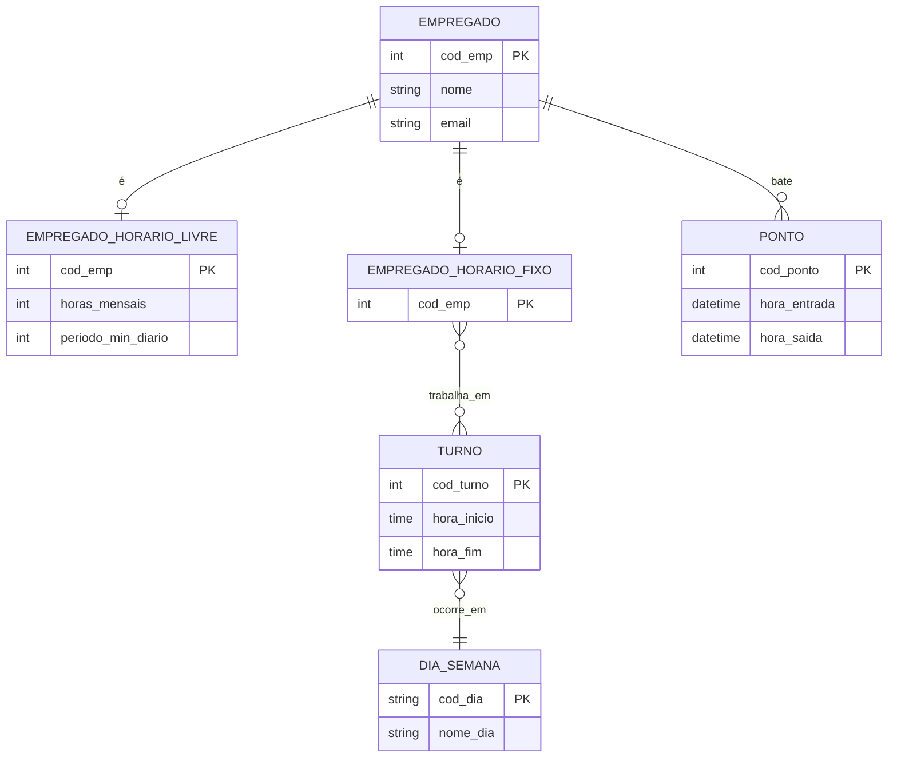

Tarefa 01 - Conceitos BD e MER
Aluno: José Salustiano Neto Júnior
Usuário GitHub: jsalustianoo
Email: jose.salustiano.166@ufrn.edu.br

***  Alternativa "a" ***

    Um Banco de Dados (BD) é um conjunto de dados interligados, organizados de maneira estruturada, que atendem a um objetivo específico. Ele foi desenvolvido para estruturar e guardar dados de forma que possam ser acessados, gerenciados e atualizados de maneira eficaz.

    Já um SGBD, sigla para: Sistema Gerenciador de Banco de Dados. É um software que permite que os usuários criem, gerenciem e interajam com um banco de dados. Ele atua como uma interface entre o banco de dados e as aplicações, garantindo a integridade, segurança e consistência dos dados.

    E como exemplos: 
        MySQL: Um SGBD de código aberto, geralmente associado ao banco de dados MySQL 
        Oracle Database: Um SGBD comercial, associado ao banco de dados Oracle.

***  Alternativa "b" ***

    Utilizar sistemas de arquivos para armazenar dados pode gerar vários problemas, como:

    - Redundância de dados: As mesmas informações podem estar presentes em vários arquivos, ocupando mais espaço e levando a inconsistências.
    - Inconsistência de dados: A duplicação de dados pode causar discrepâncias, uma vez que uma alteração pode ser feita emm um arquivo e no outro não.
    - Dificuldade de acesso: A recuperação de dados é mais complexa, pois não há uma linguagem de consulta padrão para todos os arquivos.
    - Problemas de integridade e segurança: É difícil garantir a integridade dos dados e aplicar restrições de acesso (segurança) de forma centralizada.
    - Anomalias de atualização: Podem ocorrer problemas ao inserir, excluir ou atualizar dados, exigindo que o programador manipule múltiplos arquivos, o que aumenta a chance de erros.

***  Alternativa "c" ***

    - Entidade: Uma Entidade representa um objeto ou conceito do mundo real sobre o qual queremos armazenar informações.
    Exemplos: Em um sistema de controle de veículos, as entidades seriam Carro, Proprietário e Marca.

    - Atributo: Um Atributo é uma propriedade ou característica que descreve uma entidade.
    Exemplos: Para a entidade Carro, os atributos seriam a placa, a cor, o ano e o modelo. Para a entidade Proprietário, os atributos seriam o nome, o CPF e o endereço.

    - Relacionamento: Um Relacionamento é a associação ou a conexão entre duas ou mais entidades.
    Exemplos: O relacionamento possui pode conectar a entidade Proprietário à entidade Carro, indicando que um proprietário tem um ou mais carros. Outro exemplo é o relacionamento fabricado_por que conectaria a entidade Carro à entidade Marca.

***  Alternativa "d" ***

    As três notações mais comuns para diagrama ER são: a Notação de Chen, a Notação "Pé de Galinha" (Crow's Foot) e a Notação UML. Cada uma delas conta com seus próprios símbolos e convenções. 

    - Notação de Chen: É a notação original. Entidades são representadas por retângulos, atributos por elipses e relacionamentos por losangos. A cardinalidade é expressa com números sobre as linhas de conexão (por exemplo, 1, N, M).
    - Notação "Pé de Galinha" (Crow's Foot): É muito popular por sua simplicidade visual. Entidades são retângulos e relacionamentos são representados por linhas. As extremidades das linhas de conexão usam símbolos para indicar a cardinalidade: um círculo significa zero, uma linha significa um e um "pé de galinha" significa muitos.
    - Notação UML (Unified Modeling Language): Embora seja usada em modelagem orientada a objetos, também se aplica a diagramas ER. A cardinalidade é indicada por números ou símbolos de intervalo ao lado de cada entidade na linha de relacionamento.

    Exemplo de Cardinalidade: Para o conceito de cardinalidade, a representação muda bastante entre as notações:
    - Notação de Chen: Um relacionamento "Empregado trabalha_em Departamento" seria representado com os números "1" e "N" sobre as linhas. Isso indica que um empregado trabalha em apenas um departamento (1) e um departamento tem N empregados.
    - Notação Pé de Galinha: O mesmo relacionamento seria representado visualmente nas extremidades da linha de conexão. No lado de "Empregado", um símbolo de linha (para "um") e, no lado de "Departamento", um "pé de galinha" (para "muitos"), indicando que um departamento tem muitos empregados.
    - Notação UML: A cardinalidade é expressa por uma notação de intervalo ao lado da entidade. Por exemplo, a cardinalidade de "Empregado trabalha_em Departamento" seria mostrada como 1..1 ao lado da entidade Departamento (um empregado trabalha em um e apenas um departamento) e 1..* (um ou mais) ao lado da entidade Empregado (um departamento tem um ou mais empregados).

***  Alternativa "e" ***

