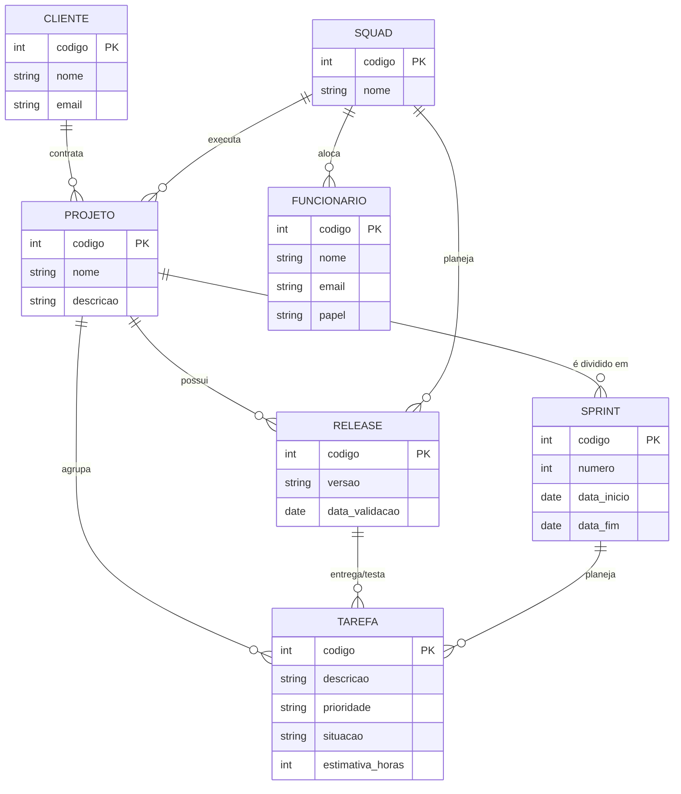

# Tarefa 02 - MER e Projeto de Banco de Dados Relacional

**Aluno:** Andriel Pereira Nogueira  
**Usuário GitHub:** @Andriel-Nogueira  
**Disciplina:** Banco de Dados  
**Issue Relacionada:** #418

---

## Questão 01: Elementos Básicos do MER

O Modelo Entidade-Relacionamento (MER) é estruturado sobre três elementos básicos primordiais:

1. **Entidades:** Representam objetos, conceitos ou coisas do mundo real sobre as quais se deseja armazenar dados.
   * *Exemplo:* `CLIENTE`, `SQUAD`, `TAREFA`.
2. **Atributos:** São as características ou propriedades que descrevem e qualificam cada entidade. Podem ser simples, compostos, multivalorados ou identificadores (chaves).
   * *Exemplo:* A entidade `CLIENTE` possui os atributos `nome`, `email` e `cnpj`.
3. **Relacionamentos:** Definem as associações e interações lógicas existentes entre duas ou mais entidades, descrevendo como elas se conectam no domínio do negócio.
   * *Exemplo:* A entidade `SQUAD` **resolve** a entidade `TAREFA`.

---

## Questão 02: Notações para Diagramas ER

Existem diversas notações gráficas para a modelagem de Diagramas Entidade-Relacionamento (DER). As mais difundidas incluem:

* **Notação de Chen (Original):** Utiliza retângulos para Entidades, losangos para Relacionamentos, elipses/ovais para Atributos e linhas com números/letras ($1:N$, $N:M$) para expressar as cardinalidades.
* **Notação Pé de Galinha (Crow's Foot):** Largamente utilizada na indústria de software (e adotada pelo Mermaid.js). Representa entidades por caixas, relacionamentos por linhas de conexão e a cardinalidade através de símbolos nas pontas das linhas (ex.: três linhas bifurcadas lembrando um pé de galinha para representação de "muitos", e um traço perpendicular para representar "um").
* **Notação UML (Diagrama de Classes para ER):** Utiliza retângulos divididos em seções (Nome da Classe, Atributos) e linhas com multiplicidade numérica explícita (ex.: `1..*`, `0..1`).
* **Notação IDEF1X:** Padrão do governo americano para modelagem de dados, diferencia entidades dependentes (cantos arredondados) de independentes (cantos retos) e usa círculos com traços para cardinalidades.

### Comparação Prática de Notações:

| Conceito | Notação de Chen | Notação Pé de Galinha (Crow's Foot) | Notação UML |
| :--- | :--- | :--- | :--- |
| **Cardinalidade "Muitos"** | Usa a letra $N$ ou $M$ no relacionamento | Símbolo de "Pé de Galinha" ($\succ$) | `*` ou `1..*` |
| **Cardinalidade "Um"** | Usa o número $1$ | Traço perpendicular ($|$) | `1` ou `0..1` |
| **Entidade Fraca / Subordinada** | Retângulo duplo | Linha tracejada no relacionamento | Classe dependente de composição |

---

## Questão 03: Diagrama ER Conceitual (Mermaid.js)

Abaixo está a representação conceitual do ecossistema de desenvolvimento de software da empresa, modelado usando a sintaxe Pé de Galinha do Mermaid.js:

---

## Questão 04: Mapeamento para o Modelo Relacional

Abaixo está a conversão do Modelo Conceitual para o Modelo Relacional com suas respectivas chaves primárias (PK) e chaves estrangeiras (FK):

1. **CLIENTE** (**id_cliente**, nome, email)
   * **PK:** `id_cliente`

2. **SQUAD** (**id_squad**, nome)
   * **PK:** `id_squad`

3. **FUNCIONARIO** (**id_funcionario**, nome, email, papel, *id_squad*)
   * **PK:** `id_funcionario`
   * **FK:** `id_squad` referência **SQUAD(id_squad)**

4. **PROJETO** (**id_projeto**, nome, descricao, *id_cliente*, *id_squad*)
   * **PK:** `id_projeto`
   * **FK:** `id_cliente` referência **CLIENTE(id_cliente)**
   * **FK:** `id_squad` referência **SQUAD(id_squad)**

5. **SPRINT** (**id_sprint**, numero, data_inicio, data_fim, *id_projeto*)
   * **PK:** `id_sprint`
   * **FK:** `id_projeto` referência **PROJETO(id_projeto)**

6. **RELEASE** (**id_release**, versao, data_validacao, *id_projeto*, *id_squad*)
   * **PK:** `id_release`
   * **FK:** `id_projeto` referência **PROJETO(id_projeto)**
   * **FK:** `id_squad` referência **SQUAD(id_squad)**

7. **TAREFA** (**id_tarefa**, descricao, prioridade, situacao, estimativa_horas, *id_projeto*, *id_sprint*, *id_release*)
   * **PK:** `id_tarefa`
   * **FK:** `id_projeto` referência **PROJETO(id_projeto)**
   * **FK:** `id_sprint` referência **SPRINT(id_sprint)**
   * **FK:** `id_release` referência **RELEASE(id_release)**

---

## Questão 05: Restrições de Integridade Referencial

As regras de integridade referencial e de domínio que devem ser asseguradas no banco de dados incluem:

1. **Integridade de Tarefas e Projetos:** Toda `TAREFA` cadastrada deve estar obrigatoriamente vinculada a um `PROJETO` existente. Não é permitido criar tarefas sem projeto associado.
2. **Integridade de Projetos e Clientes:** Um `PROJETO` não pode existir sem estar associado a um `CLIENTE` válido previamente cadastrado.
3. **Integridade de Exclusão de Clientes:** Caso um `CLIENTE` seja removido do banco de dados, o SGBD deve impedir a exclusão caso existam projetos associados (*RESTRICT/NO ACTION*) ou realizar a exclusão/arquivamento em cascata conforme as regras operacionais.
4. **Integridade de Alocação de Funcionários:** Todo `FUNCIONARIO` deve estar alocado a uma `SQUAD` existente.
5. **Integridade de Escopo da Release:** Uma `RELEASE` só pode agrupar tarefas que pertençam ao mesmo `PROJETO` associado a essa release.
6. **Liderança em Squads:** Toda `SQUAD` deve conter obrigatoriamente ao menos um `FUNCIONARIO` cujo atributo `papel` seja definido como **"Líder Técnico"**.
7. **Consistência de Datas:** A data inicial de uma `SPRINT` deve ser obrigatoriamente anterior à sua data final.