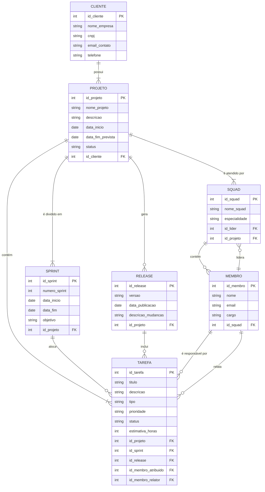

## Q1.
**Enunciado:** Descreva o que é um Banco de Dados e o que é um Sistema Gerenciador de Banco de Dados. Cite exemplos de Bancos de Dados e seus SGBDs.

### Resposta
Banco de Dados: Um banco de dados é uma coleção organizada de dados relacionados, armazenados em algum dispositivo.

Sistema Gerenciador de Banco de Dados: Um SGBD é o software responsável por intermediar o acesso entre os usuários (ou aplicações) e o banco de dados. Ele fornece recursos para definir, criar, consultar e atualizar os dados, além de garantir a segurança, o controle de acesso concorrente e a integridade das informações.

## Q2.
**Enunciado:** Quais os principais problemas de utilizar Sistemas de Arquivos para armazenagem de dados?

### Resposta

#### Inconsistência e redundância de dados:
- A mesma informação inserida em diferentes arquivos;
- Se um dado for atualizado, as demais copias não seram alteradas.
#### Dificuldade de Acesso e Consulta:
- Para buscar dados específicos em um sistema de arquivos é necessário escrever programas ou scripts customizados para cada tipo de consulta;;
- Filtrar, cruzar e relacionar dados distribuídos em múltiplos arquivos exige um esforço computacional alto e implementação manual complexa.
#### Isolamento e Fragmentação dos Dados:
- Os dados ficam espalhados em formatos distintos, estruturados de maneiras diferentes e sob estruturas de pastas independentes.
#### Problemas de Integridade dos Dados:
- É extremamente difícl impor regras de validção no sistema de arquivos;
- Qualquer validação precisa ser feita diretamente no codigo.
#### Problemas de Atomicidade:
- Se uma operação que manipula vários arquivos for interrompida, alguns arquivos vão ser modificados e outros não, deixando o sistema em um estado corrompido;
- Em caso de falha, deve-se garantir que o banco volte ao estado anterior da realização das operações. Difícil fazer isso em um sistema de arquivos.
#### Anomalias no Acesso Concorrente:
- Varios acessos a um mesmo arquivo podem acabar gerando incosistência nos dados;
- Os dados podem sofrer acessos de diferentes programas e supervizionar isso é difícil.
#### Segurança:
- Não é possível aplicar restrições no nível do dado (por exemplo, permitir que um funcionário veja a coluna "Nome", mas não a coluna "Salário" dentro do mesmo documento).

## Q3.
**Enunciado:** Explique as propriedades **ACID**: atomicidade, consistência, isolamento e durabilidade. Para cada propriedade, descreva um exemplo prático no contexto de uma transferência bancária e explique o que aconteceria se o SGBD não garantisse essa propriedade.

### Resposta

#### Atomicidade:
Cada transação é tratada como uma unica unidade, ou todas as operações que a envolvem são executadas com sucesso ou nenhum é aplicada ("Tudo ou nada").

**Exemplo:** O dinheiro é debitado da Conta A (o valor é descontado), mas o sistema falha antes de creditar na Conta B. Sem a Atomocidade para fazer o rollback (desfazer o débito), o dinheiro simplesmente "some" do sistema. A Conta A perdeu o valor e a Conta B nunca o recebeu.

#### Consistência:
Assegura que uma transação leve o banco de um estado válido para outro estado válido, respeitando todas as regras, restrições e integridades estruturais antes e depois da execução.

**Exemplo:** O cliente tenta transferir R$ 500, mas só possui R$ 200. Sem a consistência, o sistema aceitaria a transação, gravaria um saldo de -R$ 300 e deixaria o banco de dados em um estado inválido, quebrando as regras e invariantes definidas no sistema.

#### Isolamento:
Determina que transações concorrentes ocorram de forma isolada umas das outras. O resultado de uma transação executada simultaneamente deve ser o mesmo se fossem rodadas de forma sequencial. Nenhuma transação em andamento pode interferir ou ver dados intermediários não confirmados de outra transação.

**Exemplo:** O saldo inicial do cliente seja R$ 100, e duas transferências de R$ 50 tentam ler esse saldo exatamente ao mesmo tempo. Se a propriedade do isolamento não for garantida, o sistema pode acabar debitando o valor da primeira transferência e salvar o saldo como R$ 50 e a mesma coisa acontecer para a segunda deixando o saldo final em R$ 50 e não R$ 0 como o esperado, pois uma tranferência interferiu na leitura da outra.

#### Durabilidade:
Significa que, uma vez que uma transação é confirmada (committed), os dados gravados permanecem salvos de maneira permanente no sistema, mesmo em casos de falhas de energia, quedas de sistema ou erros inesperados.

**Exemplo:** Um cliente realiza uma transferência e logo após isso o sistema cai. Se a propriedade de durabilidade não fosse garantida, a transação poderia ser perdida.

## Q4.
**Enunciado:** Para cada cenário abaixo, indique qual(is) propriedade(s) ACID está(ão) em jogo e **justifique** sua resposta:

   a) Queda de energia no meio de uma transferência deixou o valor debitado da conta de origem, mas não creditado na conta de destino.

   b) Dois atendentes debitam, ao mesmo tempo, o mesmo saldo de uma conta.

   c) O sistema confirma a operação, mas após reiniciar o servidor o dado foi perdido.

   d) Uma transferência que levaria o saldo abaixo do limite permitido é rejeitada pelo banco.

### Resposta

**a)** **Atomicidade**, é possivel ver que a transação não foi realizada o que se configura como sendo um caso onde a atomicidade entraria em ação, pois ela garante que caso uma transação que é considerada unitaria não seja completa o banco retorne para o ponto antes da transação ser iniciada ("Tudo ou nada").

**b)** **Isolamento**, é possivel analisar que se trata de um caso de isolamento, pois essa propriedade garante que transações concorrentes sejam realizadas sem interferirem uma com a outra de tal maneria que o resultado final é igual ao resultado de uma execução sequencial.

**c)** **Durabilidade**, claramente um caso de durabilidade, pois está garante que transações confirmadas, ficaram salvas em memória não volátil e sobrevivam a falhas do sistema ou reinicializações.

**d)** **Consistência**, a consistência garante que as regras negócio e estruturas sejam seguidas, portanto essa propriedade não permitiria que uma transação que violaria uma regra de negócio fosse executada, pois istó levaria o sistema de um estado válido onde essas regras são respeitadas para um inválido onde não são.

## Q5.
**Enunciado:** Um SGBD trata dos seguintes aspectos: **recuperação, integridade, redundância e inconsistência**. Explique cada um deles e descreva como o SGBD os gerencia.

### Resposta

#### 1. Recuperação (Recovery)

* **Conceito:** Refere-se à capacidade do SGBD de restaurar o banco de dados a um estado consistente e correto após a ocorrência de falhas sejam elas de hardware (queda de energia, falha de disco), de software (erros no sistema operacional) ou de sistema (interrupção abrupta de transações).
* **Como o SGBD gerencia:** 
  * **Log de Transações (WAL - *Write-Ahead Logging*):** Antes de modificar qualquer dado no disco, o SGBD registra todas as operações planejadas em um arquivo de log permanente.
  * **Operações de *UNDO* e *REDO*:** Durante a reinicialização após uma falha, o sistema analisa o log. Ele desfaz (*UNDO*) o efeito de transações que foram interrompidas sem concluir e refaz (*REDO*) as transações que já haviam sido finalizadas (*commit*), mas cujos dados atualizados ainda não tinham sido gravados fisicamente no disco.
  * **Pontos de Verificação (*Checkpoints*):** Periodicamente, o SGBD força a gravação no disco de todas as alterações pendentes na memória, encurtando o tempo e a quantidade de dados que precisam ser analisados e restaurados durante o processo de recuperação

#### 2. Integridade (Integrity)

* **Conceito:** Trata-se do cumprimento de regras de negócio e restrições para garantir que os dados armazenados sejam válidos, precisos e confiáveis. Impede a inserção de informações incorretas ou sem sentido no sistema.
* **Como o SGBD gerencia:**
  * **Restrições de Integridade (*Constraints*):** O SGBD valida automaticamente os dados na entrada através de regras declaradas no esquema:
    * *Chave Primária (`PRIMARY KEY`):* garante que cada registro seja único.
    * *Chave Estrangeira (`FOREIGN KEY`):* mantém a integridade referencial entre tabelas relacionadas.
    * *Campos `NOT NULL` e `CHECK`:* impedem valores nulos indesejados ou impõem condições específicas (ex: `idade >= 18`).

#### 3. Redundância (Redundancy)

* **Conceito:** É a duplicação desnecessária e repetida dos mesmos dados em múltiplos locais dentro do banco de dados. A redundância não controlada consome espaço em disco inutilmente e facilita o surgimento de divergências entre as cópias do mesmo dado.
* **Como o SGBD gerencia:**
  * **Normalização de Dados:** Aplicação de técnicas e regras estruturais (Formas Normais) durante a modelagem do banco de dados para dividir tabelas complexas em tabelas menores e interconectadas por chaves, eliminando a duplicação de atributos.
  * **Redundância Controlada:** Em cenários específicos de alto desempenho onde a duplicação é consciente e necessária (como em *Data Warehouses* ou views materializadas), o próprio SGBD se encarrega de sincronizar e atualizar automaticamente as cópias para que permaneçam iguais

#### 4. Inconsistência (Inconsistency)

* **Conceito:** Ocorre quando cópias do mesmo dado contêm valores diferentes entre si, gerando uma contradição no sistema. É a consequência direta de falhas ao gerenciar a redundância ou de modificações simultâneas não controladas por múltiplos usuários.
* **Como o SGBD gerencia:**
  * **Controle de Concorrência:** O SGBD utiliza mecanismos como bloqueios de dados (*Locks*), ordenação por *timestamps* ou controle de concorrência multiversão (MVCC) para coordenar transações simultâneas e evitar problemas como leituras sujas (*dirty reads*) ou atualizações perdidas (*lost updates*).
  * **Propriedade de Isolamento:** Garante que a execução de transações concorrentes produza o mesmo resultado que produziria se elas fossem executadas sequencialmente, mantendo todos os dados sempre uniformes e alinhados.

## Q6.
**Enunciado:** Considere o cenário de uma **empresa de desenvolvimento de software** que atende outras empresas como clientes. A empresa organiza seu trabalho em **squads** (equipes) compostas por desenvolvedores, testadores, líder técnico, supervisor e gerente de produto. Cada squad resolve **tarefas** (issues) e planeja **releases**, testes e o cronograma de **sprints** (iterações) dos projetos de cada cliente.

Sem utilizar SQL, elabore um **mini-projeto conceitual** do banco de dados dessa empresa, deixando claro:

   a) As principais **entidades** envolvidas (clientes, squads, membros, tarefas, projetos, sprints, releases).

   b) Os principais **atributos** de cada entidade.

   c) Os **relacionamentos** entre as entidades (com a cardinalidade, ex.: "um cliente pode ter vários projetos").
   
   d) Em linguagem natural, as **regras de integridade** (restrições) que o banco de dados deveria garantir, ex.: "apenas um líder por squad", "toda tarefa precisa estar vinculada a um projeto".

### Resposta

#### Diagrama

#### Documentação

#### Relacionamentos e Cardinalidades

| Entidade Origem | Entidade Destino | Cardinalidade | Descrição |
| :--- | :--- | :---: | :--- |
| **Cliente** | **Projeto** | `1 : N` | Um cliente pode ter **vários** projetos vinculados, mas cada projeto pertence a apenas **um** cliente. |
| **Projeto** | **Squad** | `1 : N` | Cada squad é responsável por apenas **um** projeto por vez. Um projeto pode ser atendido por **uma ou várias** squads. |
| **Squad** | **Membro** | `0 : N` | Uma squad contém **zero ou vários** membros. Um membro pode estar alocado em **uma** squad ou em **nenhuma** (disponível / *bench*). |
| **Membro** | **Squad (Liderança)** | `0 : 1` | Um membro pode atuar como líder de no máximo **uma** squad, e cada squad possui exatamente **um** líder técnico. |
| **Projeto** | **Sprint** | `1 : N` | Um projeto é dividido em **uma ou várias** sprints. Cada sprint pertence a apenas **um** projeto. |
| **Projeto** | **Release** | `1 : N` | Um projeto pode gerar **várias** releases. Cada release pertence a **um** único projeto. |
| **Projeto** | **Tarefa** | `1 : N` | Um projeto contém **várias** tarefas. Toda tarefa está associada a exatamente **um** projeto. |
| **Sprint** | **Tarefa** | `0 : N` | Uma sprint abriga **zero ou várias** tarefas. Uma tarefa pode não estar alocada em nenhuma sprint (Backlog) ou pertencer a **uma** sprint por vez. |
| **Release** | **Tarefa** | `0 : N` | Uma release reúne **zero ou várias** tarefas finalizadas. Uma tarefa pode não ter release associada ou pertencer a **uma** release. |
| **Membro** | **Tarefa (Atribuído)** | `0 : N` | Um membro pode ser responsável por **várias** tarefas, e uma tarefa pode ter **um** responsável ou **nenhum** (não atribuída). |
| **Membro** | **Tarefa (Relator)** | `1 : N` | Um membro pode cadastrar **várias** tarefas. Toda tarefa possui obrigatoriamente **um** relator que a criou. |

---

#### Regras de Integridade (Restrições)

* **Exclusividade e Escopo da Squad**:
  * Uma squad é responsável por apenas **um único projeto** por vez.
  * O líder atribuído a uma squad (`id_lider`) deve ser um profissional cadastrado com o cargo equivalente a "Líder Técnico".
* **Alocação Opcional de Membros**:
  * Um membro **pode existir no sistema sem estar vinculado a uma squad** (permitindo cadastro de profissionais em transição, consultores ou alocados em reserva técnica).
* **Vínculo Obrigatório de Projeto**:
  * Toda tarefa deve pertencer obrigatoriamente a um Projeto existente (`id_projeto` NOT NULL).
* **Coerência de Escopo Cruzado**:
  * Uma tarefa só pode ser associada a uma **Sprint** ou **Release** pertencente ao **mesmo Projeto** vinculado à própria tarefa.
* **Consistência de Datas**:
  * A `data_fim` de uma Sprint deve ser obrigatoriamente posterior à sua `data_inicio`.
  * A `data_fim_prevista` do Projeto deve ser posterior à sua `data_inicio`.
* **Unicidade de Identificadores**:
  * Os campos de identificação de negócio como `cnpj` (Cliente) e `email` (Membro) devem ser **únicos** em toda a base de dados.