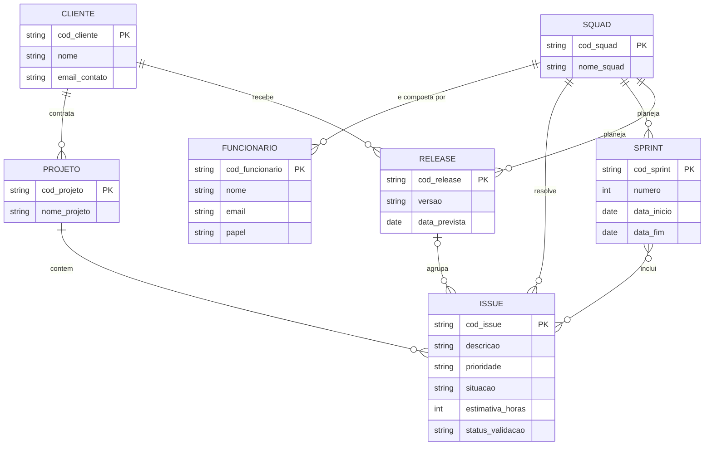

## Q1. O modelo de dados entidade-relacionamento foi desenvolvido para facilitar o projeto de banco de dados, permitindo especificação de um esquema que representa a estrutura lógica geral de um banco de dados. Descreva os três elementos básicos de um Modelo Entidade Relacionamento (MER).
 
O MER é composto por três elementos fundamentais:
 
1. **Entidades**
   Representam objetos ou conceitos do mundo real sobre os quais se deseja armazenar informações (ex.: Cliente, Funcionário, Projeto). Cada entidade dá origem a um conjunto de ocorrências (instâncias) com as mesmas características. No diagrama, geralmente são representadas por retângulos.
2. **Atributos**
   Descrevem as propriedades ou características de uma entidade (ou de um relacionamento). Podem ser simples, compostos, multivalorados, derivados ou identificadores (chave). Exemplo: a entidade *Cliente* pode ter os atributos `código`, `nome` e `email`.
3. **Relacionamentos**
   Representam as associações (interações) entre duas ou mais entidades. Todo relacionamento possui uma **cardinalidade**, que indica quantas ocorrências de uma entidade podem se associar a quantas ocorrências de outra (1:1, 1:N, N:M), e uma **participação** (total ou parcial), que indica se toda ocorrência da entidade participa obrigatoriamente do relacionamento.
   
---

## Q2. Pesquise sobre as várias notações possíveis para Diagramas ER e cite alguns exemplos de notações diferentes para o mesmo conceito (ex.: cardinalidade, entidade subordinada, etc.).
 
Existem diversas notações para representar o Modelo ER, sendo as mais conhecidas: **Notação de Chen**, **Notação de Crow's Foot (Pé de Galinha)**, **Notação de Bachman**, **Notação Min-Max (ISO)** e **UML (para diagramas de classe usados como ER)**. Elas divergem principalmente na forma de representar cardinalidade, entidades fracas/subordinadas e atributos.
 
### Exemplo 1 — Cardinalidade "um para muitos" (1:N)
 
| Notação | Representação |
|---|---|
| Chen | Losango com o relacionamento rotulado e os números "1" e "N" escritos nas linhas que ligam às entidades |
| Crow's Foot (Pé de Galinha) | Uma linha reta (lado "1") e uma linha terminando em "pé de galinha" ‑ um garfo de três pontas (lado "N") |
| Min-Max (ISO) | Pares `(0,1)` ou `(1,1)` e `(0,N)` ou `(1,N)` escritos próximos a cada entidade |
| UML | Multiplicidades escritas como `1` e `0..*` ou `1..*` nas extremidades da associação |
 
### Exemplo 2 — Entidade fraca / subordinada
 
| Notação | Representação |
|---|---|
| Chen | Retângulo de borda dupla para a entidade fraca e losango de borda dupla para o relacionamento identificador |
| Crow's Foot | Entidade desenhada com cantos arredondados ou com um símbolo diferenciado; a linha de conexão costuma ter um traço adicional indicando dependência de existência |
| UML | Um losango vazado (agregação) ou preenchido (composição) na extremidade da entidade "forte", indicando que a entidade dependente não existe sem ela |
 
### Exemplo 3 — Atributos
 
| Notação | Representação |
|---|---|
| Chen | Elipses ligadas por linhas à entidade; elipse tracejada para atributo derivado; elipse com contorno duplo para atributo multivalorado |
| Crow's Foot | Atributos listados dentro do próprio retângulo da entidade (como colunas de uma tabela), sem elipses separadas |
| UML | Atributos listados em um compartimento específico da caixa de classe, com tipo de dado explícito (ex.: `nome : String`) |

---

## Q3. Construa um Diagrama ER para projetar a base de dados de uma **empresa de desenvolvimento de software** com outras empresas como clientes. A base de dados não deve conter redundância de dados. O modelo ER deve ser representado com um diagrama usando **Mermaid.js**. O modelo deve apresentar, ao menos, entidades, relacionamentos, atributos, identificadores e restrições de cardinalidade. O modelo deve ser feito no nível conceitual, **sem incluir chaves estrangeiras**.
 
**Premissas de modelagem (nível conceitual, sem chaves estrangeiras):**
 
- Um **Cliente** contrata um ou mais **Projetos**; cada Projeto pertence a exatamente um Cliente.
- Um **Funcionário** pertence a exatamente uma **Squad**; uma Squad é composta por vários Funcionários.
- Uma **Squad** resolve várias **Issues** (tarefas); cada Issue é resolvida por uma única Squad.
- Cada **Issue** pertence a exatamente um **Projeto**; um Projeto possui várias Issues.
- Uma **Squad** planeja várias **Sprints** (iterações); cada Sprint pertence a uma única Squad.
- Uma **Sprint** inclui várias **Issues**, e uma Issue pode ser trabalhada em várias Sprints ao longo do tempo (relação N:M).
- Uma **Squad** planeja **Releases** para os **Clientes**; cada Release é planejada por uma única Squad e destinada a um único Cliente.
- Uma **Release** agrupa várias **Issues**, porém cada **Issue** pertence a, no máximo, uma única Release (relação **1:N**). Como uma Issue pode ainda não ter sido incluída em nenhuma Release (ex.: está em backlog ou em sprint, mas ainda não liberada), a participação da Issue nesse relacionamento é **opcional**.
- O status do teste de validação é um atributo da **Issue** (`status_validacao`), já que é a tarefa individual que é validada.

 
**Legenda de cardinalidade:**
`||` = exatamente um · `o{` = zero ou muitos · `o|` = zero ou um · `}o--o{` = muitos para muitos
 
> **Observação sobre a relação RELEASE–ISSUE:** o símbolo `o|` do lado de RELEASE indica que, para cada ISSUE, existe **zero ou uma** Release associada (relação 1:N com participação opcional da Issue) — ou seja, uma Issue pode ainda não estar vinculada a nenhuma Release, mas nunca a mais de uma.
 
---
 
## Q4. Mapeamento para o Modelo Relacional
 
A partir do diagrama ER, cada entidade forte vira uma relação (tabela). Relacionamentos 1:N migram a chave primária do lado "1" como chave estrangeira para o lado "N". Relacionamentos N:M geram uma tabela associativa própria.
 
### Tabela `CLIENTE`
| Atributo | Tipo | Restrição |
|---|---|---|
| cod_cliente | string | **PK** |
| nome | string | |
| email_contato | string | |
 
### Tabela `SQUAD`
| Atributo | Tipo | Restrição |
|---|---|---|
| cod_squad | string | **PK** |
| nome_squad | string | |
 
### Tabela `FUNCIONARIO`
| Atributo | Tipo | Restrição |
|---|---|---|
| cod_funcionario | string | **PK** |
| nome | string | |
| email | string | |
| papel | string | |
| cod_squad | string | **FK** → SQUAD.cod_squad |
 
### Tabela `PROJETO`
| Atributo | Tipo | Restrição |
|---|---|---|
| cod_projeto | string | **PK** |
| nome_projeto | string | |
| cod_cliente | string | **FK** → CLIENTE.cod_cliente |
 
### Tabela `ISSUE`
| Atributo | Tipo | Restrição |
|---|---|---|
| cod_issue | string | **PK** |
| descricao | string | |
| prioridade | string | |
| situacao | string | |
| estimativa_horas | int | |
| status_validacao | string | |
| cod_projeto | string | **FK** → PROJETO.cod_projeto |
| cod_squad | string | **FK** → SQUAD.cod_squad |
| cod_release | string | **FK** (opcional/nulo) → RELEASE.cod_release |
 
### Tabela `SPRINT`
| Atributo | Tipo | Restrição |
|---|---|---|
| cod_sprint | string | **PK** |
| numero | int | |
| data_inicio | date | |
| data_fim | date | |
| cod_squad | string | **FK** → SQUAD.cod_squad |
 
### Tabela `RELEASE`
| Atributo | Tipo | Restrição |
|---|---|---|
| cod_release | string | **PK** |
| versao | string | |
| data_prevista | date | |
| cod_squad | string | **FK** → SQUAD.cod_squad |
| cod_cliente | string | **FK** → CLIENTE.cod_cliente |
 
### Tabela associativa `SPRINT_ISSUE` (resolve o N:M Sprint × Issue)
| Atributo | Tipo | Restrição |
|---|---|---|
| cod_sprint | string | **PK, FK** → SPRINT.cod_sprint |
| cod_issue | string | **PK, FK** → ISSUE.cod_issue |
 
---
 
