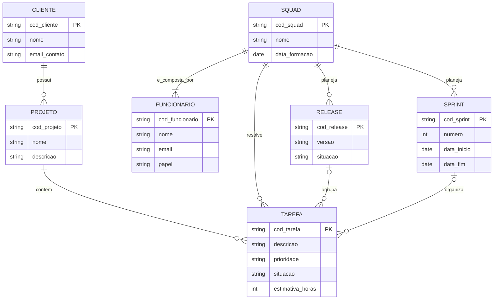

# Tarefa 02 - MER e Projeto de Banco de Dados Relacional

## Q1. Descreva os três elementos básicos de um Modelo Entidade Relacionamento (MER).

O Modelo Entidade-Relacionamento é construído a partir de três elementos básicos:

**1. Entidade**
Representa um objeto ou conceito do mundo real sobre o qual queremos armazenar dados, e que tem existência própria e independente (ex.: Cliente, Funcionário, Projeto). É representada graficamente por um retângulo. Cada entidade dá origem a um conjunto de ocorrências (instâncias) — por exemplo, cada cliente cadastrado é uma instância da entidade Cliente.

**2. Atributo**
É uma propriedade ou característica que descreve uma entidade ou um relacionamento (ex.: nome, email, data de nascimento). Atributos podem ser simples ou compostos, monovalorados ou multivalorados, e podem ser derivados de outros dados. Um ou mais atributos formam o **identificador** (chave primária) da entidade, ou seja, o conjunto mínimo de atributos capaz de distinguir uma ocorrência das demais.

**3. Relacionamento**
É uma associação entre duas ou mais entidades, representando como elas se relacionam no domínio do problema (ex.: "Cliente possui Projeto"). Todo relacionamento possui uma **cardinalidade**, que define quantas ocorrências de uma entidade podem se associar a quantas ocorrências de outra entidade (1:1, 1:N ou N:M).

---

## Q2. Notações possíveis para Diagramas ER

Existem várias notações usadas para representar diagramas ER, e cada uma representa os mesmos conceitos (entidade, atributo, relacionamento, cardinalidade, entidade fraca/subordinada) de formas visuais diferentes. As principais são:

- **Notação de Chen** (a notação clássica, proposta por Peter Chen em 1976)
- **Notação Pé de Galinha** (*Crow's Foot*), muito usada em ferramentas modernas de modelagem
- **Notação UML** (adaptação do diagrama de classes da UML para modelagem de dados)
- **Notação de Bachman**
- **Notação IDEF1X**

### Exemplos de diferenças entre notações

**Cardinalidade (ex.: "um Cliente possui vários Projetos")**

| Notação | Como representa a cardinalidade "1:N" |
|---|---|
| Chen | Números ou letras (1, N) escritos ao lado da linha que liga a entidade ao losango de relacionamento |
| Pé de Galinha (Crow's Foot) | Símbolos gráficos nas pontas da linha: um traço (⊣) para "um" e um "pé de galinha" (三 aberto) para "muitos"; um círculo indica opcionalidade (zero) |
| UML | Multiplicidade escrita como texto nas pontas da associação, ex.: `1` e `0..*` ou `1..*` |
| IDEF1X | Também usa pé de galinha, mas diferencia relacionamento identificador (linha sólida) de não identificador (linha tracejada) |

**Entidade fraca/subordinada (ex.: uma entidade que depende de outra para existir, como "Dependente" que só existe vinculado a um "Funcionário")**

| Notação | Como representa a entidade fraca |
|---|---|
| Chen | Retângulo de borda dupla para a entidade fraca, e losango de borda dupla para o relacionamento identificador |
| Pé de Galinha | Geralmente um retângulo com cantos arredondados (entidade fraca) versus cantos retos (entidade forte) |
| UML | Um relacionamento de composição (losango preenchido) na ponta da entidade "todo", indicando que a entidade "parte" não existe sem ela |
| IDEF1X | Retângulo de cantos arredondados para entidade dependente, ligado por relacionamento identificador (linha sólida) |

**Relacionamento em si (o "verbo" que liga as entidades)**

| Notação | Como representa o relacionamento |
|---|---|
| Chen | Losango, com o nome do relacionamento escrito dentro |
| Pé de Galinha / IDEF1X | Não usa losango — o relacionamento é representado apenas pela própria linha que liga as entidades, com o nome escrito ao lado |
| UML | Uma linha de associação entre as classes, com o nome do relacionamento escrito próximo à linha |

---

## Q3. Diagrama ER da empresa de desenvolvimento de software

**Premissas assumidas** (para eliminar ambiguidades do enunciado e evitar redundância de dados):

- Cada funcionário pertence a exatamente uma squad por vez (não há funcionário em múltiplas squads simultaneamente).
- A tarefa está ligada ao projeto (que já identifica o cliente) — não existe um vínculo direto Tarefa–Cliente, pois isso seria redundante (o cliente já é obtido através do projeto).
- Cada squad é responsável por resolver suas tarefas, planejar suas próprias sprints e releases.
- Uma tarefa pode, opcionalmente, estar associada a uma sprint (quando planejada para execução) e a uma release (quando incluída em um pacote de entrega).
- Uma release agrupa tarefas; o "teste de validação" citado no enunciado é tratado como o atributo `situacao` da release (ex.: planejada, em teste, validada, lançada), já que não foram pedidos atributos específicos de uma entidade "Teste".

**Leitura das cardinalidades:**
- Um Cliente possui zero ou muitos Projetos; cada Projeto pertence a exatamente um Cliente.
- Um Projeto contém zero ou muitas Tarefas; cada Tarefa pertence a exatamente um Projeto.
- Uma Squad é composta por uma ou muitas Funcionários; cada Funcionário pertence a exatamente uma Squad.
- Uma Squad resolve zero ou muitas Tarefas; cada Tarefa é resolvida por exatamente uma Squad.
- Uma Squad planeja zero ou muitas Sprints e zero ou muitas Releases; cada Sprint e cada Release pertence a exatamente uma Squad.
- Uma Release agrupa zero ou muitas Tarefas; cada Tarefa pertence a, no máximo, uma Release (opcional).
- Uma Sprint organiza zero ou muitas Tarefas; cada Tarefa está em, no máximo, uma Sprint (opcional).

---

## Q4. Mapeamento para o Modelo Relacional

| Relação (Tabela) | Atributos | Chave Primária (PK) | Chaves Estrangeiras (FK) |
|---|---|---|---|
| **CLIENTE** | cod_cliente, nome, email_contato | cod_cliente | — |
| **PROJETO** | cod_projeto, nome, descricao, cod_cliente | cod_projeto | cod_cliente → CLIENTE |
| **SQUAD** | cod_squad, nome, data_formacao | cod_squad | — |
| **FUNCIONARIO** | cod_funcionario, nome, email, papel, cod_squad | cod_funcionario | cod_squad → SQUAD |
| **SPRINT** | cod_sprint, numero, data_inicio, data_fim, cod_squad | cod_sprint | cod_squad → SQUAD |
| **RELEASE** | cod_release, versao, situacao, cod_squad | cod_release | cod_squad → SQUAD |
| **TAREFA** | cod_tarefa, descricao, prioridade, situacao, estimativa_horas, cod_projeto, cod_squad, cod_release, cod_sprint | cod_tarefa | cod_projeto → PROJETO; cod_squad → SQUAD; cod_release → RELEASE (aceita nulo); cod_sprint → SPRINT (aceita nulo) |

Como todos os relacionamentos do modelo são do tipo 1:N (nenhum N:M), o mapeamento não gera nenhuma tabela associativa: a chave estrangeira é sempre colocada na relação do lado "muitos". A tabela TAREFA concentra quatro chaves estrangeiras porque ela é o lado "muitos" em quatro relacionamentos distintos (com PROJETO, SQUAD, RELEASE e SPRINT), sendo as duas últimas opcionais (aceitam nulo).

---

## Q5. Restrições de integridade referencial do esquema

- Todo projeto só pode existir vinculado a um cliente já existente.
- Toda tarefa só pode existir vinculada a um projeto já existente.
- Toda tarefa só pode existir vinculada a uma squad já existente, responsável por resolvê-la.
- Todo funcionário só pode existir vinculado a uma squad já existente.
- Toda sprint só pode existir vinculada a uma squad já existente.
- Toda release só pode existir vinculada a uma squad já existente.
- Se uma tarefa estiver vinculada a uma release, essa release deve existir e pertencer à mesma squad responsável pela tarefa (não é permitido uma tarefa estar numa release de outra squad).
- Se uma tarefa estiver vinculada a uma sprint, essa sprint deve existir e pertencer à mesma squad responsável pela tarefa.
- Não é permitido excluir um cliente que ainda possua projetos vinculados.
- Não é permitido excluir um projeto que ainda possua tarefas vinculadas.
- Não é permitido excluir uma squad que ainda possua funcionários, tarefas, sprints ou releases vinculados.
- Toda squad deve possuir, entre seus funcionários, exatamente um líder técnico, um supervisor e um gerente de produto, além de ao menos um desenvolvedor e um testador.
- O papel de um funcionário deve pertencer obrigatoriamente a um dos valores válidos: desenvolvedor, testador, líder técnico, supervisor ou gerente de produto.
