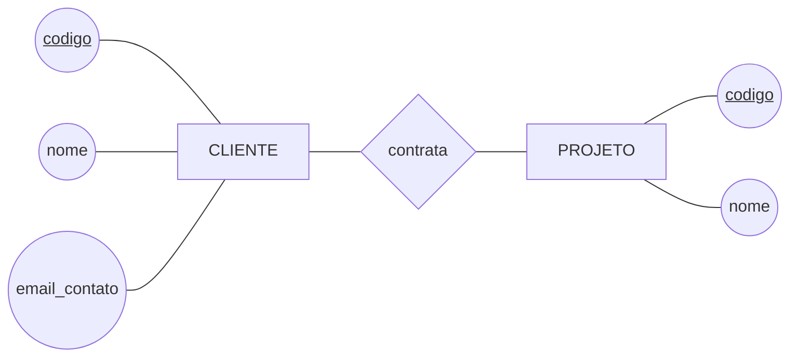
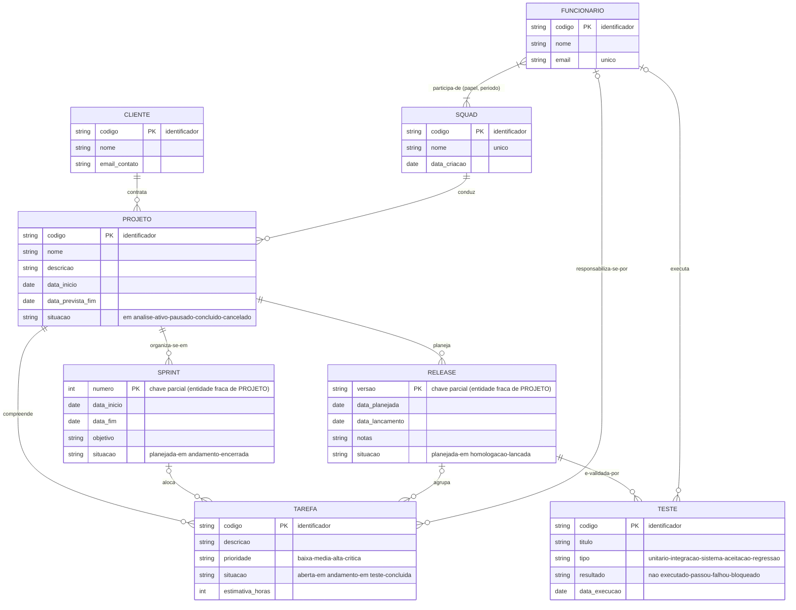
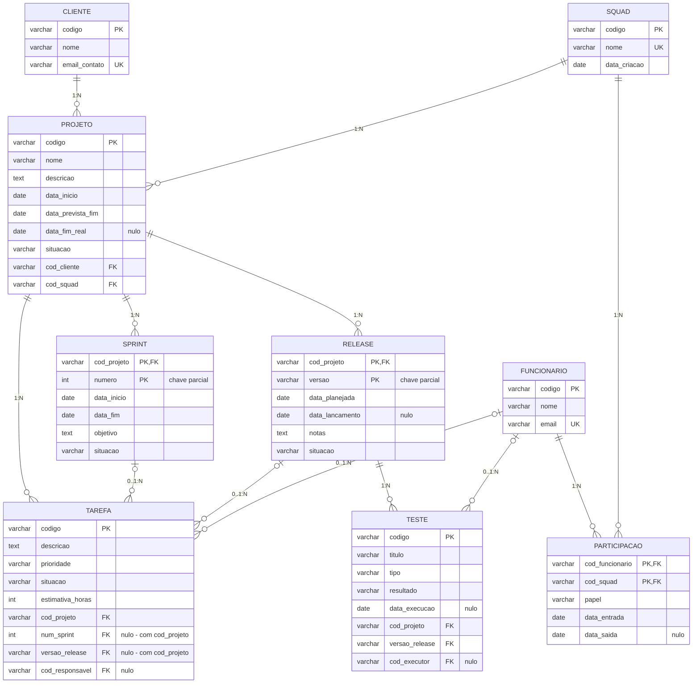

# Tarefa 02 - MER e Projeto de Banco de Dados Relacional

**Aluno (GitHub):** GabrielUchoa17
**Disciplina:** Banco de Dados - BSI
**Issue relacionada:** #398

---

## Sumário

- [Q1. Elementos básicos do MER](#q1-elementos-básicos-do-modelo-entidade-relacionamento)
- [Q2. Notações para Diagramas ER](#q2-notações-para-diagramas-er)
- [Q3. Diagrama ER da empresa de desenvolvimento de software](#q3-diagrama-er--empresa-de-desenvolvimento-de-software)
- [Q4. Mapeamento para o Modelo Relacional](#q4-mapeamento-para-o-modelo-relacional)
- [Q5. Restrições de integridade referencial](#q5-restrições-de-integridade-referencial)

---

## Q1. Elementos básicos do Modelo Entidade-Relacionamento

O Modelo Entidade-Relacionamento (MER), proposto por **Peter Chen (1976)**, descreve o
minimundo em nível **conceitual** — independente de SGBD, de estruturas físicas e de
implementação. Ele se apoia em **três elementos básicos**: *entidades*, *relacionamentos* e
*atributos*.

### 1. Entidades (e conjuntos de entidades)

Uma **entidade** é um objeto do mundo real, concreto ou abstrato, que possui existência
própria e pode ser distinguido dos demais (um cliente específico, um projeto específico).
Um **conjunto de entidades** (*entity set*) agrupa todas as entidades que compartilham as
mesmas propriedades — é isso que efetivamente se desenha no diagrama e que, no mapeamento,
tende a virar uma tabela.

Variações importantes:

- **Entidade forte:** possui um identificador próprio e existe independentemente de
  qualquer outra (ex.: `CLIENTE`).
- **Entidade fraca (ou subordinada):** não possui identificador próprio suficiente e
  depende da existência de uma entidade proprietária. Identifica-se pela combinação da
  chave da proprietária com sua **chave parcial** (ex.: `SPRINT`, identificada pelo
  projeto ao qual pertence somado ao seu número).

### 2. Relacionamentos (e conjuntos de relacionamentos)

Um **relacionamento** é uma associação entre duas ou mais entidades (ex.: o cliente *X*
**contrata** o projeto *Y*). O **conjunto de relacionamentos** reúne todas as associações
do mesmo tipo.

Características que qualificam um relacionamento:

- **Grau:** número de conjuntos de entidades participantes — binário (2, o caso mais
  comum), ternário (3) ou n-ário. Um relacionamento também pode ser **recursivo**
  (*auto-relacionamento*), quando a mesma entidade participa em dois papéis diferentes
  (ex.: funcionário *supervisiona* funcionário).
- **Razão de cardinalidade:** quantas entidades de um lado podem se associar a entidades do
  outro — **1:1**, **1:N** ou **N:M**.
- **Participação (cardinalidade mínima):** **total/obrigatória** (toda entidade do conjunto
  precisa participar — dependência existencial) ou **parcial/opcional** (pode não
  participar).
- **Papéis:** o nome da função que cada entidade exerce na associação, essencial nos
  relacionamentos recursivos.
- Um relacionamento também pode ter **atributos próprios** (ex.: o `papel` que um
  funcionário exerce em uma squad pertence à associação *Funcionário × Squad*, não a
  nenhuma das duas entidades isoladamente).

### 3. Atributos

Um **atributo** é uma propriedade que descreve uma entidade ou um relacionamento (nome,
e-mail, prioridade). O conjunto de valores permitidos para um atributo é o seu **domínio**.

Classificação dos atributos:

| Tipo | Descrição | Exemplo |
|---|---|---|
| **Simples (atômico)** | Não é decomponível | `email` |
| **Composto** | Divisível em subpartes com significado próprio | `endereco` → logradouro, número, cidade, CEP |
| **Monovalorado** | Um único valor por entidade | `data_nascimento` |
| **Multivalorado** | Vários valores para a mesma entidade | `telefone` (vários por cliente) |
| **Derivado** | Calculado a partir de outros atributos | `idade`, derivada de `data_nascimento` |
| **Armazenado** | Guardado fisicamente, base para os derivados | `data_nascimento` |
| **Identificador (chave)** | Distingue univocamente cada entidade | `codigo` do cliente |
| **Chave parcial** | Identifica a entidade fraca dentro da proprietária | `numero` da sprint |

O **identificador (chave)** merece destaque: é o atributo — ou o **conjunto de atributos
(chave composta)** — cujo valor é único para cada entidade do conjunto. Quando há mais de
um candidato, escolhe-se um como **chave primária**.

> **Resumo:** *entidades* respondem "sobre o que guardamos dados", *atributos* respondem
> "o que sabemos sobre cada coisa" e *relacionamentos* respondem "como essas coisas se
> associam entre si".

---

## Q2. Notações para Diagramas ER

Não existe uma notação única para Diagramas ER. As mais difundidas são:

| Notação | Origem / uso típico | Como representa |
|---|---|---|
| **Chen** | Peter Chen (1976); ensino e modelagem conceitual | Entidade = retângulo, relacionamento = **losango**, atributo = **elipse** ligada por linha |
| **Pé de Galinha** (*Crow's Foot* / Martin / IE) | Ferramentas CASE, ERwin, Lucidchart, Mermaid | Entidade = retângulo com atributos **listados dentro**; cardinalidade em **símbolos na ponta da linha** |
| **Barker** | Oracle Designer | Entidade = retângulo arredondado; linha **tracejada** = opcional, **contínua** = obrigatória |
| **IDEF1X** | Padrão do governo dos EUA / modelagem de dados | Entidade dependente = retângulo **arredondado**; usa bolinhas e chaves de identificação |
| **Min-Max (ISO)** | Academia europeia | Rotula cada ponta com o par **(mín, máx)**, ex.: `(1,n)` |
| **UML — Diagrama de Classes** | Engenharia de software / ORM | Classe = retângulo com 3 divisões; cardinalidade escrita como **multiplicidade** (`1`, `0..1`, `1..*`, `*`) |
| **Bachman** | Notação histórica | Setas simples/duplas indicando o lado "muitos" |

### Exemplos: mesmo conceito, notações diferentes

**a) Cardinalidade "um cliente contrata muitos projetos" (1:N)**

| Notação | Representação |
|---|---|
| Chen | `CLIENTE ──1── ⟨contrata⟩ ──N── PROJETO` (rótulos `1` e `N` sobre as linhas) |
| Min-Max | `CLIENTE (0,n) ── contrata ── (1,1) PROJETO` |
| Pé de Galinha | `CLIENTE ‖———<€ PROJETO` (traço duplo de um lado, "pé de galinha" do outro) |
| UML | `CLIENTE 1 ────── 0..* PROJETO` |
| Mermaid | `CLIENTE \|\|--o{ PROJETO : contrata` |

> Atenção a uma **divergência conceitual clássica**: em Chen, o rótulo indica a
> cardinalidade **máxima do lado oposto** (*look-across*); na notação Min-Max, o par
> `(mín,máx)` descreve a participação da entidade **daquele lado** (*look-here*). Por isso
> `1` em Chen e `(1,1)` em Min-Max podem aparecer em pontas opostas da mesma linha.

**b) Obrigatoriedade / opcionalidade (participação)**

| Notação | Participação total (obrigatória) | Participação parcial (opcional) |
|---|---|---|
| Chen | Linha **dupla** entre entidade e losango | Linha simples |
| Min-Max | `(1,n)` — mínimo 1 | `(0,n)` — mínimo 0 |
| Pé de Galinha | Traço perpendicular `\|` junto à entidade | Círculo `o` junto à entidade |
| Barker | Linha **contínua** | Linha **tracejada** |
| UML | `1..*` | `0..*` |

**c) Entidade fraca / subordinada (dependente)**

| Notação | Representação |
|---|---|
| Chen | Entidade em **retângulo duplo** e relacionamento identificador em **losango duplo**; chave parcial **sublinhada tracejada** |
| IDEF1X | Entidade dependente com **cantos arredondados** |
| Pé de Galinha | Relacionamento **identificador** com linha **contínua**; a chave da entidade dona entra na PK composta |
| UML | Composição (**losango preenchido**) no lado do "todo" |

**d) Atributos**

| Notação | Representação |
|---|---|
| Chen | **Elipses** ligadas por linha (multivalorado = elipse dupla; derivado = elipse tracejada; identificador = **sublinhado**) |
| Pé de Galinha / IDEF1X / UML | **Listados dentro do retângulo**, com marcadores `PK`, `FK`, `UK` |

### Ilustração: notação de Chen (fragmento)

Legenda do fragmento: retângulos = entidades, losango = relacionamento, elipses =
atributos, sublinhado = identificador. O mesmo fragmento aparece a seguir, na Q3, em
notação **pé de galinha** (a que o Mermaid `erDiagram` implementa nativamente).

---

## Q3. Diagrama ER — Empresa de desenvolvimento de software

### Minimundo considerado

Uma empresa presta serviços de desenvolvimento de software para **empresas clientes**. Os
**funcionários** se organizam em **squads**, cada um com um **papel** definido dentro da
equipe. Uma squad conduz os **projetos** de seus clientes; cada projeto se organiza em
**sprints**, compreende **tarefas** e planeja **releases**, que passam por **testes** de
validação.

### Diagrama ER (notação pé de galinha, nível conceitual)

> Conforme o enunciado, o diagrama está no **nível conceitual**: são exibidos apenas
> atributos próprios e **identificadores** (`PK`); **nenhuma chave estrangeira** foi
> incluída — as associações aparecem como relacionamentos, não como colunas.

### Leitura das restrições de cardinalidade

| Relacionamento | Cardinalidade | Leitura |
|---|---|---|
| `CLIENTE` — contrata — `PROJETO` | 1 : N | Um cliente contrata **zero ou vários** projetos; todo projeto pertence a **exatamente um** cliente (participação total do projeto). |
| `SQUAD` — conduz — `PROJETO` | 1 : N | Uma squad conduz **zero ou vários** projetos; todo projeto é conduzido por **exatamente uma** squad. |
| `FUNCIONARIO` — participa-de — `SQUAD` | N : M | Um funcionário participa de **uma ou mais** squads; toda squad é formada por **um ou mais** funcionários. |
| `PROJETO` — organiza-se-em — `SPRINT` | 1 : N | Um projeto tem **zero ou várias** sprints; toda sprint pertence a **exatamente um** projeto (**dependência existencial**). |
| `PROJETO` — compreende — `TAREFA` | 1 : N | Um projeto reúne **zero ou várias** tarefas; toda tarefa pertence a **exatamente um** projeto. |
| `PROJETO` — planeja — `RELEASE` | 1 : N | Um projeto planeja **zero ou várias** releases; toda release pertence a **exatamente um** projeto (**dependência existencial**). |
| `SPRINT` — aloca — `TAREFA` | 1 : N opcional | Uma sprint aloca **zero ou várias** tarefas; uma tarefa está em **no máximo uma** sprint (pode ficar no *backlog*). |
| `RELEASE` — agrupa — `TAREFA` | 1 : N opcional | Uma release agrupa **zero ou várias** tarefas; uma tarefa é entregue em **no máximo uma** release. |
| `RELEASE` — é-validada-por — `TESTE` | 1 : N | Uma release passa por **zero ou vários** testes; todo teste valida **exatamente uma** release. |
| `FUNCIONARIO` — responsabiliza-se-por — `TAREFA` | 1 : N opcional | Um funcionário pode ser responsável por **várias** tarefas; uma tarefa tem **no máximo um** responsável. |
| `FUNCIONARIO` — executa — `TESTE` | 1 : N opcional | Um funcionário executa **vários** testes; um teste é executado por **no máximo um** funcionário. |

### Atributo de relacionamento

O **papel** exercido na equipe (`desenvolvedor`, `testador`, `líder técnico`, `supervisor`,
`gerente de produto`) **não é atributo de `FUNCIONARIO` nem de `SQUAD`**: ele só faz
sentido no contexto da associação entre os dois, pois o mesmo funcionário pode exercer
papéis diferentes em squads diferentes. Por isso `papel` — junto de `data_entrada` e
`data_saida` — é **atributo do relacionamento `participa-de` (N:M)**.

Como a notação pé de galinha do Mermaid não permite anexar atributos a uma linha de
relacionamento, esses atributos aparecem no **rótulo** do relacionamento. Na Q4 eles passam
a compor a relação associativa `PARTICIPACAO`.

### Entidades fracas (subordinadas)

`SPRINT` e `RELEASE` são **entidades fracas**: não possuem identificador próprio suficiente.

- Uma sprint é o "número 3 **do projeto X**" — `numero` é apenas a **chave parcial**.
- Uma release é a "versão 1.4.0 **do projeto X**" — `versao` é a **chave parcial**.

A identificação completa só ocorre pela combinação com o identificador de `PROJETO`, por
meio do **relacionamento identificador**. Isso se materializa como **chave primária
composta** no mapeamento relacional da Q4.

### Decisões de projeto para evitar redundância

O enunciado exige que **não haja redundância de dados**. As decisões abaixo garantem que
cada fato seja armazenado **uma única vez**:

1. **A squad que resolve uma tarefa não é armazenada na tarefa.** O enunciado diz que a
   squad resolve tarefas e que as tarefas pertencem a projetos de um cliente. Como cada
   projeto é conduzido por **exatamente uma** squad, a squad responsável por uma tarefa é
   **derivável** pelo caminho `TAREFA → PROJETO → SQUAD`. Um vínculo direto
   `SQUAD—TAREFA` duplicaria o dado e permitiria contradição (tarefa apontando para uma
   squad diferente da squad do seu projeto).

2. **O cliente não é armazenado na tarefa, na sprint nem na release.** Ele é obtido por
   `PROJETO → CLIENTE`. Do mesmo modo, "a squad planeja releases *para seus clientes*" é
   atendido por `RELEASE → PROJETO → CLIENTE`.

3. **`TESTE` se liga a `RELEASE`, e não também a `PROJETO`.** O projeto do teste vem de
   `TESTE → RELEASE → PROJETO`.

4. **O papel foi retirado de `FUNCIONARIO`** e colocado no relacionamento, como explicado
   acima — evitando repetir ou contradizer o papel quando o funcionário atua em mais de uma
   squad.

5. **Nenhum atributo derivado é armazenado** (ex.: total de horas estimadas de uma sprint,
   quantidade de tarefas concluídas de uma release): todos são obtidos por agregação.

---

## Q4. Mapeamento para o Modelo Relacional

### Regras de mapeamento aplicadas

| # | Regra | Onde foi aplicada |
|---|---|---|
| 1 | **Entidade forte** → relação com os atributos simples; identificador vira **chave primária**. | `CLIENTE`, `FUNCIONARIO`, `SQUAD`, `PROJETO`, `TAREFA`, `TESTE` |
| 2 | **Entidade fraca** → relação cuja **PK é composta** pela PK da entidade proprietária + a chave parcial; a parte herdada é também **FK**. | `SPRINT`, `RELEASE` |
| 3 | **Relacionamento 1:N** → a **FK** vai para o lado **N**. | `PROJETO.cod_cliente`, `PROJETO.cod_squad`, `TAREFA.cod_projeto`, `TESTE`→`RELEASE` |
| 4 | **Relacionamento 1:N opcional** → a FK vai para o lado N e **aceita NULL**. | `TAREFA.num_sprint`, `TAREFA.versao_release`, `TAREFA.cod_responsavel`, `TESTE.cod_executor` |
| 5 | **Relacionamento N:M** → nova relação (associativa) com PK composta pelas PKs dos dois lados. | `PARTICIPACAO` |
| 6 | **Atributos do relacionamento** → colunas da relação gerada pelo relacionamento. | `PARTICIPACAO.papel`, `.data_entrada`, `.data_saida` |

### Esquema relacional resultante

Legenda: **negrito** = chave primária · *itálico* = chave estrangeira · `(N)` = aceita nulo.

1. **CLIENTE**(**codigo**, nome, email_contato)
2. **FUNCIONARIO**(**codigo**, nome, email)
3. **SQUAD**(**codigo**, nome, data_criacao)
4. **PARTICIPACAO**(***cod_funcionario***, ***cod_squad***, papel, data_entrada, data_saida `(N)`)
5. **PROJETO**(**codigo**, nome, descricao, data_inicio, data_prevista_fim, data_fim_real `(N)`, situacao, *cod_cliente*, *cod_squad*)
6. **SPRINT**(***cod_projeto***, **numero**, data_inicio, data_fim, objetivo, situacao)
7. **RELEASE**(***cod_projeto***, **versao**, data_planejada, data_lancamento `(N)`, notas `(N)`, situacao)
8. **TAREFA**(**codigo**, descricao, prioridade, situacao, estimativa_horas, *cod_projeto*, *num_sprint* `(N)`, *versao_release* `(N)`, *cod_responsavel* `(N)`)
9. **TESTE**(**codigo**, titulo, tipo, resultado, data_execucao `(N)`, *cod_projeto*, *versao_release*, *cod_executor* `(N)`)

### Detalhamento das relações

#### 1. `CLIENTE`

| Atributo | Tipo | Chave | Nulo? | Observação |
|---|---|---|---|---|
| `codigo` | VARCHAR | **PK** | não | Identificador do cliente |
| `nome` | VARCHAR | — | não | |
| `email_contato` | VARCHAR | — | não | `UNIQUE` |

#### 2. `FUNCIONARIO`

| Atributo | Tipo | Chave | Nulo? | Observação |
|---|---|---|---|---|
| `codigo` | VARCHAR | **PK** | não | |
| `nome` | VARCHAR | — | não | |
| `email` | VARCHAR | — | não | `UNIQUE` (chave candidata) |

> O **papel** *não* aparece aqui: ele pertence ao relacionamento com a squad (ver
> `PARTICIPACAO`).

#### 3. `SQUAD`

| Atributo | Tipo | Chave | Nulo? | Observação |
|---|---|---|---|---|
| `codigo` | VARCHAR | **PK** | não | |
| `nome` | VARCHAR | — | não | `UNIQUE` |
| `data_criacao` | DATE | — | não | |

#### 4. `PARTICIPACAO` — relação associativa (N:M entre `FUNCIONARIO` e `SQUAD`)

| Atributo | Tipo | Chave | Nulo? | Referencia |
|---|---|---|---|---|
| `cod_funcionario` | VARCHAR | **PK** / FK | não | `FUNCIONARIO(codigo)` |
| `cod_squad` | VARCHAR | **PK** / FK | não | `SQUAD(codigo)` |
| `papel` | VARCHAR | — | não | `desenvolvedor`, `testador`, `lider_tecnico`, `supervisor`, `gerente_produto` |
| `data_entrada` | DATE | — | não | |
| `data_saida` | DATE | — | **sim** | Nulo enquanto o vínculo estiver ativo |

- **PK composta:** (`cod_funcionario`, `cod_squad`)

#### 5. `PROJETO`

| Atributo | Tipo | Chave | Nulo? | Referencia |
|---|---|---|---|---|
| `codigo` | VARCHAR | **PK** | não | |
| `nome` | VARCHAR | — | não | |
| `descricao` | TEXT | — | sim | |
| `data_inicio` | DATE | — | não | |
| `data_prevista_fim` | DATE | — | sim | |
| `data_fim_real` | DATE | — | sim | |
| `situacao` | VARCHAR | — | não | domínio fechado |
| `cod_cliente` | VARCHAR | FK | não | `CLIENTE(codigo)` |
| `cod_squad` | VARCHAR | FK | não | `SQUAD(codigo)` |

#### 6. `SPRINT` — entidade fraca de `PROJETO`

| Atributo | Tipo | Chave | Nulo? | Referencia |
|---|---|---|---|---|
| `cod_projeto` | VARCHAR | **PK** / FK | não | `PROJETO(codigo)` |
| `numero` | INT | **PK** | não | Chave parcial |
| `data_inicio` | DATE | — | não | |
| `data_fim` | DATE | — | não | |
| `objetivo` | TEXT | — | sim | |
| `situacao` | VARCHAR | — | não | |

- **PK composta:** (`cod_projeto`, `numero`) — a sprint só existe dentro de um projeto.

#### 7. `RELEASE` — entidade fraca de `PROJETO`

| Atributo | Tipo | Chave | Nulo? | Referencia |
|---|---|---|---|---|
| `cod_projeto` | VARCHAR | **PK** / FK | não | `PROJETO(codigo)` |
| `versao` | VARCHAR | **PK** | não | Chave parcial (ex.: `1.4.0`) |
| `data_planejada` | DATE | — | não | |
| `data_lancamento` | DATE | — | sim | Preenchida ao lançar |
| `notas` | TEXT | — | sim | |
| `situacao` | VARCHAR | — | não | |

- **PK composta:** (`cod_projeto`, `versao`) — a versão é única **dentro do projeto**.

#### 8. `TAREFA`

| Atributo | Tipo | Chave | Nulo? | Referencia |
|---|---|---|---|---|
| `codigo` | VARCHAR | **PK** | não | |
| `descricao` | TEXT | — | não | |
| `prioridade` | VARCHAR | — | não | domínio fechado |
| `situacao` | VARCHAR | — | não | domínio fechado |
| `estimativa_horas` | INT | — | sim | |
| `cod_projeto` | VARCHAR | FK | **não** | `PROJETO(codigo)` |
| `num_sprint` | INT | FK¹ | sim | — |
| `versao_release` | VARCHAR | FK² | sim | — |
| `cod_responsavel` | VARCHAR | FK | sim | `FUNCIONARIO(codigo)` |

- **FK¹ composta:** (`cod_projeto`, `num_sprint`) → `SPRINT(cod_projeto, numero)`
- **FK² composta:** (`cod_projeto`, `versao_release`) → `RELEASE(cod_projeto, versao)`

> **Por que reaproveitar `cod_projeto` nas duas FKs compostas?** Porque assim o próprio
> esquema **impede estruturalmente** que uma tarefa seja alocada a uma sprint ou a uma
> release de **outro** projeto — a mesma coluna serve para identificar o projeto da tarefa,
> da sprint e da release. Isso evita tanto a redundância de guardar o projeto duas vezes
> quanto a possibilidade de contradição.

#### 9. `TESTE`

| Atributo | Tipo | Chave | Nulo? | Referencia |
|---|---|---|---|---|
| `codigo` | VARCHAR | **PK** | não | |
| `titulo` | VARCHAR | — | não | |
| `tipo` | VARCHAR | — | não | domínio fechado |
| `resultado` | VARCHAR | — | não | domínio fechado |
| `data_execucao` | DATE | — | sim | Nulo enquanto não executado |
| `cod_projeto` | VARCHAR | FK³ | não | — |
| `versao_release` | VARCHAR | FK³ | não | — |
| `cod_executor` | VARCHAR | FK | sim | `FUNCIONARIO(codigo)` |

- **FK³ composta:** (`cod_projeto`, `versao_release`) → `RELEASE(cod_projeto, versao)`

### Diagrama do esquema lógico (já com chaves estrangeiras)

---

## Q5. Restrições de integridade referencial

A **integridade referencial** exige que todo valor de uma chave estrangeira ou **seja nulo**
(quando o vínculo for opcional) **ou corresponda a um valor existente** na chave primária da
relação referenciada. Em outras palavras: **não pode haver referência a algo que não
existe**.

### A. Restrições de existência (dependência direta)

1. **Todo projeto pertence a um cliente existente.** Não é possível cadastrar um projeto
   cujo `cod_cliente` não corresponda a um cliente já registrado.
2. **Todo projeto é conduzido por uma squad existente.** O `cod_squad` do projeto precisa
   apontar para uma squad cadastrada, e esse vínculo é obrigatório.
3. **Uma tarefa só pode existir vinculada a um projeto existente.** O `cod_projeto` da
   tarefa é obrigatório e deve referenciar um projeto já cadastrado — não existe tarefa
   "solta", sem projeto.
4. **Toda sprint pertence a um projeto existente**, e **toda release pertence a um projeto
   existente**. Por serem entidades fracas, elas sequer podem ser identificadas sem o
   projeto: excluído o projeto, suas sprints e releases deixam de fazer sentido.
5. **Todo teste valida uma release existente.** Um teste não pode referenciar uma release
   inexistente ou já removida.
6. **Toda participação liga um funcionário existente a uma squad existente.** Os dois lados
   da relação associativa `PARTICIPACAO` são obrigatórios.

### B. Restrições de vínculos opcionais (FK que aceita nulo)

7. **A sprint de uma tarefa é opcional, mas, se informada, deve existir.** Uma tarefa pode
   estar no *backlog* (`num_sprint` nulo); se tiver sprint, essa sprint precisa estar
   cadastrada.
8. **A release de uma tarefa é opcional, mas, se informada, deve existir.** Uma tarefa
   ainda não entregue não aponta para release alguma.
9. **O responsável por uma tarefa é opcional, mas, se informado, deve ser um funcionário
   existente.** O mesmo vale para o **executor de um teste**.

### C. Coerência entre caminhos (integridade referencial composta)

10. **A sprint de uma tarefa deve pertencer ao mesmo projeto da tarefa.** Isso é garantido
    estruturalmente porque a chave estrangeira é o par (`cod_projeto`, `num_sprint`)
    referenciando `SPRINT(cod_projeto, numero)`: como `cod_projeto` é a mesma coluna usada
    para ligar a tarefa ao projeto, é **impossível** apontar para a sprint de outro projeto.
11. **A release de uma tarefa deve pertencer ao mesmo projeto da tarefa** — garantida pelo
    mesmo mecanismo, com o par (`cod_projeto`, `versao_release`).
12. **O teste, a release que ele valida e o projeto dessa release formam um caminho
    coerente**, pois a FK do teste também é o par (`cod_projeto`, `versao_release`).

### D. Políticas de exclusão e atualização

| Referência | `ON DELETE` | `ON UPDATE` | Justificativa |
|---|---|---|---|
| `PROJETO.cod_cliente` → `CLIENTE` | **RESTRICT** | CASCADE | Não se apaga um cliente que ainda tem projetos; primeiro trata-se o histórico. |
| `PROJETO.cod_squad` → `SQUAD` | **RESTRICT** | CASCADE | Uma squad com projetos ativos não pode ser removida. |
| `SPRINT.cod_projeto` → `PROJETO` | **CASCADE** | CASCADE | Entidade fraca: sem o projeto, a sprint não existe. |
| `RELEASE.cod_projeto` → `PROJETO` | **CASCADE** | CASCADE | Entidade fraca: sem o projeto, a release não existe. |
| `TAREFA.cod_projeto` → `PROJETO` | **CASCADE** | CASCADE | Toda tarefa depende existencialmente do projeto. |
| `TAREFA (cod_projeto, num_sprint)` → `SPRINT` | **SET NULL** | CASCADE | Apagada a sprint, a tarefa volta ao *backlog* em vez de sumir. |
| `TAREFA (cod_projeto, versao_release)` → `RELEASE` | **SET NULL** | CASCADE | A tarefa continua existindo mesmo se a release for cancelada. |
| `TAREFA.cod_responsavel` → `FUNCIONARIO` | **SET NULL** | CASCADE | Se o funcionário sai, a tarefa fica sem responsável, não é apagada. |
| `TESTE (cod_projeto, versao_release)` → `RELEASE` | **CASCADE** | CASCADE | O teste existe para validar aquela release. |
| `TESTE.cod_executor` → `FUNCIONARIO` | **SET NULL** | CASCADE | Preserva o registro do teste mesmo sem o executor. |
| `PARTICIPACAO.cod_funcionario` → `FUNCIONARIO` | **CASCADE** | CASCADE | Removido o funcionário, seus vínculos de equipe caem junto. |
| `PARTICIPACAO.cod_squad` → `SQUAD` | **CASCADE** | CASCADE | Removida a squad, seus vínculos caem junto. |

> Observação prática: em um sistema real, prefere-se **inativar** (`ativo = falso`) em vez
> de excluir clientes, funcionários e squads, justamente para preservar o histórico sem
> esbarrar nas restrições `RESTRICT`.

### E. Restrições semânticas além das chaves estrangeiras

Estas regras **não são expressáveis apenas com chaves estrangeiras** — exigem `CHECK`,
`UNIQUE`, *assertions* ou *triggers*:

13. **Toda squad deve possuir exatamente um líder técnico ativo.** Não pode haver squad sem
    líder, nem dois líderes simultâneos na mesma squad (unicidade parcial sobre
    `PARTICIPACAO` onde `papel = 'lider_tecnico'` e `data_saida` é nula).
14. **Uma squad ativa deve ter ao menos um desenvolvedor e ao menos um testador.**
15. **Um funcionário não pode ter dois vínculos ativos no mesmo squad** — garantido pela PK
    composta de `PARTICIPACAO`.
16. **O responsável por uma tarefa deve participar da squad que conduz o projeto da
    tarefa.** É uma restrição de caminho: `TAREFA → PROJETO → SQUAD → PARTICIPACAO →
    FUNCIONARIO`.
17. **O executor de um teste deve ter papel de testador ou de líder técnico** na squad
    responsável pelo projeto da release testada.
18. **A versão de uma release é única dentro do projeto** — garantida pela PK composta
    (`cod_projeto`, `versao`); o mesmo número de versão pode se repetir em projetos
    diferentes.
19. **O número de uma sprint é único dentro do projeto** — garantido pela PK composta
    (`cod_projeto`, `numero`).
20. **Coerência de datas:** `data_inicio ≤ data_fim` em sprints; `data_inicio ≤
    data_prevista_fim` em projetos; `data_planejada ≤ data_lancamento` em releases;
    `data_entrada ≤ data_saida` em `PARTICIPACAO`.
21. **As sprints de um mesmo projeto não devem ter períodos sobrepostos.**
22. **Uma tarefa só pode ter situação "concluída"** se possuir responsável definido.
23. **Uma release só pode passar à situação "lançada"** se todas as tarefas a ela associadas
    estiverem concluídas e se todos os seus testes de aceitação e de regressão tiverem
    resultado "passou"; nesse momento `data_lancamento` passa a ser obrigatória.
24. **Domínios fechados:** `papel`, `prioridade`, `situacao`, `tipo` e `resultado` só
    aceitam valores da lista pré-definida (`CHECK ... IN (...)`).
25. **Unicidade de chaves candidatas:** `FUNCIONARIO.email`, `CLIENTE.email_contato` e
    `SQUAD.nome` são únicos.
26. **Nenhum atributo obrigatório aceita nulo:** identificadores, nomes, situações e as
    chaves estrangeiras marcadas como obrigatórias.

---

## Referências

- ELMASRI, R.; NAVATHE, S. B. *Sistemas de Banco de Dados*. 7. ed. Pearson.
- SILBERSCHATZ, A.; KORTH, H. F.; SUDARSHAN, S. *Sistema de Banco de Dados*. 6. ed. Elsevier.
- CHEN, P. P. *The Entity-Relationship Model — Toward a Unified View of Data*. ACM TODS, 1976.
- HEUSER, C. A. *Projeto de Banco de Dados*. 6. ed. Bookman.
- Mermaid — Entity Relationship Diagrams: <https://mermaid.js.org/syntax/entityRelationshipDiagram.html>
- Guia Básico de Markdown: <https://docs.pipz.com/central-de-ajuda/learning-center/guia-basico-de-markdown>
