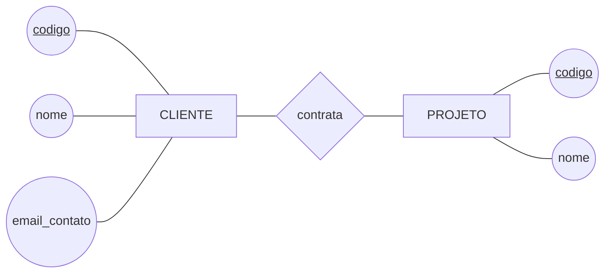

# Tarefa 02 - MER e Projeto de Banco de Dados Relacional

**Aluno (GitHub):** GabrielUchoa17
**Disciplina:** Banco de Dados - BSI
**Issue relacionada:** #398

---

## Sumário

- [Q1. Elementos básicos do MER](#q1-elementos-básicos-do-modelo-entidade-relacionamento)
- [Q2. Notações para Diagramas ER](#q2-notações-para-diagramas-er)
- [Q3. Diagrama ER da empresa de desenvolvimento de software](#q3-diagrama-er--empresa-de-desenvolvimento-de-software)
- [Q4. Mapeamento para o Modelo Relacional](#q4-mapeamento-para-o-modelo-relacional)
- [Q5. Restrições de integridade referencial](#q5-restrições-de-integridade-referencial)

---

## Q1. Elementos básicos do Modelo Entidade-Relacionamento

O Modelo Entidade-Relacionamento (MER), proposto por **Peter Chen (1976)**, descreve o
minimundo em nível **conceitual** — independente de SGBD, de estruturas físicas e de
implementação. Ele se apoia em **três elementos básicos**: *entidades*, *relacionamentos* e
*atributos*.

### 1. Entidades (e conjuntos de entidades)

Uma **entidade** é um objeto do mundo real, concreto ou abstrato, que possui existência
própria e pode ser distinguido dos demais (um cliente específico, um projeto específico).
Um **conjunto de entidades** (*entity set*) agrupa todas as entidades que compartilham as
mesmas propriedades — é isso que efetivamente se desenha no diagrama e que, no mapeamento,
tende a virar uma tabela.

Variações importantes:

- **Entidade forte:** possui um identificador próprio e existe independentemente de
  qualquer outra (ex.: `CLIENTE`).
- **Entidade fraca (ou subordinada):** não possui identificador próprio suficiente e
  depende da existência de uma entidade proprietária. Identifica-se pela combinação da
  chave da proprietária com sua **chave parcial** (ex.: `SPRINT`, identificada pelo
  projeto ao qual pertence somado ao seu número).

### 2. Relacionamentos (e conjuntos de relacionamentos)

Um **relacionamento** é uma associação entre duas ou mais entidades (ex.: o cliente *X*
**contrata** o projeto *Y*). O **conjunto de relacionamentos** reúne todas as associações
do mesmo tipo.

Características que qualificam um relacionamento:

- **Grau:** número de conjuntos de entidades participantes — binário (2, o caso mais
  comum), ternário (3) ou n-ário. Um relacionamento também pode ser **recursivo**
  (*auto-relacionamento*), quando a mesma entidade participa em dois papéis diferentes
  (ex.: funcionário *supervisiona* funcionário).
- **Razão de cardinalidade:** quantas entidades de um lado podem se associar a entidades do
  outro — **1:1**, **1:N** ou **N:M**.
- **Participação (cardinalidade mínima):** **total/obrigatória** (toda entidade do conjunto
  precisa participar — dependência existencial) ou **parcial/opcional** (pode não
  participar).
- **Papéis:** o nome da função que cada entidade exerce na associação, essencial nos
  relacionamentos recursivos.
- Um relacionamento também pode ter **atributos próprios** (ex.: o `papel` que um
  funcionário exerce em uma squad pertence à associação *Funcionário × Squad*, não a
  nenhuma das duas entidades isoladamente).

### 3. Atributos

Um **atributo** é uma propriedade que descreve uma entidade ou um relacionamento (nome,
e-mail, prioridade). O conjunto de valores permitidos para um atributo é o seu **domínio**.

Classificação dos atributos:

| Tipo | Descrição | Exemplo |
|---|---|---|
| **Simples (atômico)** | Não é decomponível | `email` |
| **Composto** | Divisível em subpartes com significado próprio | `endereco` → logradouro, número, cidade, CEP |
| **Monovalorado** | Um único valor por entidade | `data_nascimento` |
| **Multivalorado** | Vários valores para a mesma entidade | `telefone` (vários por cliente) |
| **Derivado** | Calculado a partir de outros atributos | `idade`, derivada de `data_nascimento` |
| **Armazenado** | Guardado fisicamente, base para os derivados | `data_nascimento` |
| **Identificador (chave)** | Distingue univocamente cada entidade | `codigo` do cliente |
| **Chave parcial** | Identifica a entidade fraca dentro da proprietária | `numero` da sprint |

O **identificador (chave)** merece destaque: é o atributo — ou o **conjunto de atributos
(chave composta)** — cujo valor é único para cada entidade do conjunto. Quando há mais de
um candidato, escolhe-se um como **chave primária**.

> **Resumo:** *entidades* respondem "sobre o que guardamos dados", *atributos* respondem
> "o que sabemos sobre cada coisa" e *relacionamentos* respondem "como essas coisas se
> associam entre si".

---

## Q2. Notações para Diagramas ER

Não existe uma notação única para Diagramas ER. As mais difundidas são:

| Notação | Origem / uso típico | Como representa |
|---|---|---|
| **Chen** | Peter Chen (1976); ensino e modelagem conceitual | Entidade = retângulo, relacionamento = **losango**, atributo = **elipse** ligada por linha |
| **Pé de Galinha** (*Crow's Foot* / Martin / IE) | Ferramentas CASE, ERwin, Lucidchart, Mermaid | Entidade = retângulo com atributos **listados dentro**; cardinalidade em **símbolos na ponta da linha** |
| **Barker** | Oracle Designer | Entidade = retângulo arredondado; linha **tracejada** = opcional, **contínua** = obrigatória |
| **IDEF1X** | Padrão do governo dos EUA / modelagem de dados | Entidade dependente = retângulo **arredondado**; usa bolinhas e chaves de identificação |
| **Min-Max (ISO)** | Academia europeia | Rotula cada ponta com o par **(mín, máx)**, ex.: `(1,n)` |
| **UML — Diagrama de Classes** | Engenharia de software / ORM | Classe = retângulo com 3 divisões; cardinalidade escrita como **multiplicidade** (`1`, `0..1`, `1..*`, `*`) |
| **Bachman** | Notação histórica | Setas simples/duplas indicando o lado "muitos" |

### Exemplos: mesmo conceito, notações diferentes

**a) Cardinalidade "um cliente contrata muitos projetos" (1:N)**

| Notação | Representação |
|---|---|
| Chen | `CLIENTE ──1── ⟨contrata⟩ ──N── PROJETO` (rótulos `1` e `N` sobre as linhas) |
| Min-Max | `CLIENTE (0,n) ── contrata ── (1,1) PROJETO` |
| Pé de Galinha | `CLIENTE ‖———<€ PROJETO` (traço duplo de um lado, "pé de galinha" do outro) |
| UML | `CLIENTE 1 ────── 0..* PROJETO` |
| Mermaid | `CLIENTE \|\|--o{ PROJETO : contrata` |

> Atenção a uma **divergência conceitual clássica**: em Chen, o rótulo indica a
> cardinalidade **máxima do lado oposto** (*look-across*); na notação Min-Max, o par
> `(mín,máx)` descreve a participação da entidade **daquele lado** (*look-here*). Por isso
> `1` em Chen e `(1,1)` em Min-Max podem aparecer em pontas opostas da mesma linha.

**b) Obrigatoriedade / opcionalidade (participação)**

| Notação | Participação total (obrigatória) | Participação parcial (opcional) |
|---|---|---|
| Chen | Linha **dupla** entre entidade e losango | Linha simples |
| Min-Max | `(1,n)` — mínimo 1 | `(0,n)` — mínimo 0 |
| Pé de Galinha | Traço perpendicular `\|` junto à entidade | Círculo `o` junto à entidade |
| Barker | Linha **contínua** | Linha **tracejada** |
| UML | `1..*` | `0..*` |

**c) Entidade fraca / subordinada (dependente)**

| Notação | Representação |
|---|---|
| Chen | Entidade em **retângulo duplo** e relacionamento identificador em **losango duplo**; chave parcial **sublinhada tracejada** |
| IDEF1X | Entidade dependente com **cantos arredondados** |
| Pé de Galinha | Relacionamento **identificador** com linha **contínua**; a chave da entidade dona entra na PK composta |
| UML | Composição (**losango preenchido**) no lado do "todo" |

**d) Atributos**

| Notação | Representação |
|---|---|
| Chen | **Elipses** ligadas por linha (multivalorado = elipse dupla; derivado = elipse tracejada; identificador = **sublinhado**) |
| Pé de Galinha / IDEF1X / UML | **Listados dentro do retângulo**, com marcadores `PK`, `FK`, `UK` |

### Ilustração: notação de Chen (fragmento)

Legenda do fragmento: retângulos = entidades, losango = relacionamento, elipses =
atributos, sublinhado = identificador. O mesmo fragmento aparece a seguir, na Q3, em
notação **pé de galinha** (a que o Mermaid `erDiagram` implementa nativamente).

---
