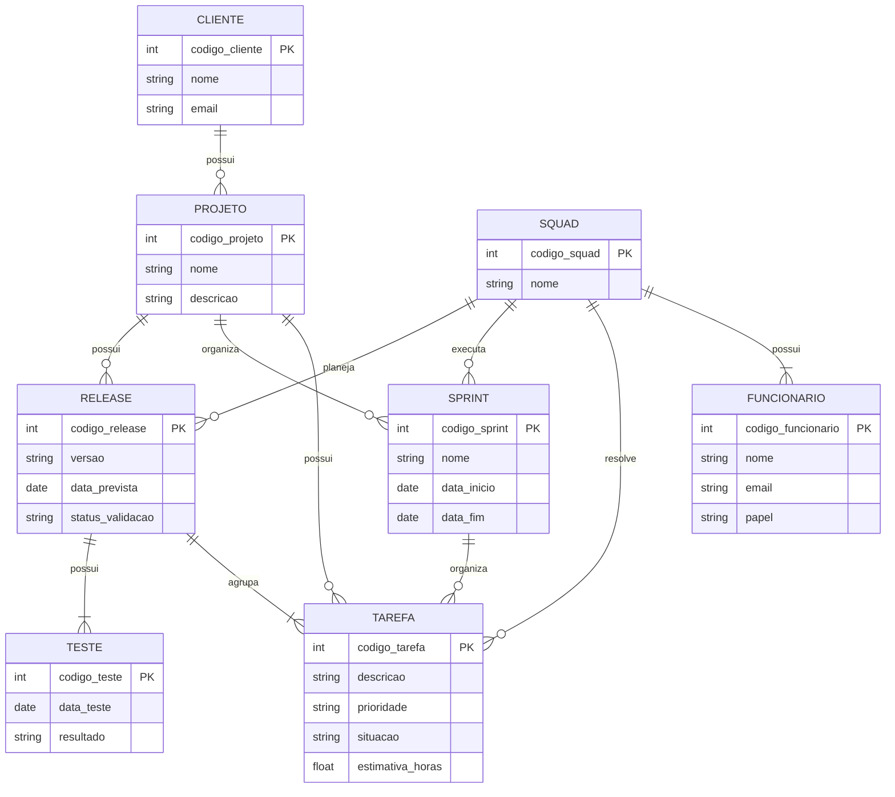

# Tarefa 02 - MER e Projeto de Banco de Dados Relacional

## Q1. Elementos básicos do Modelo Entidade-Relacionamento

O Modelo Entidade-Relacionamento (MER) é utilizado para representar, de forma conceitual, a estrutura de um banco de dados. Seus três elementos básicos são entidades, atributos e relacionamentos.

### Entidades

Entidades representam objetos, pessoas, conceitos ou elementos do mundo real que são relevantes para o sistema e sobre os quais se deseja armazenar informações.

No cenário de uma empresa de desenvolvimento de software, exemplos de entidades são CLIENTE, FUNCIONARIO, SQUAD, PROJETO, TAREFA, SPRINT e RELEASE.

### Atributos

Atributos são as características que descrevem uma entidade. Cada entidade possui atributos que representam as informações que devem ser armazenadas sobre ela.

Por exemplo, a entidade CLIENTE pode possuir os atributos código, nome e e-mail.

### Relacionamentos

Relacionamentos representam as associações existentes entre as entidades.

Por exemplo, um CLIENTE possui PROJETOS. Nesse caso, existe um relacionamento entre as entidades CLIENTE e PROJETO.

Os relacionamentos também podem possuir restrições de cardinalidade, indicando quantas ocorrências de uma entidade podem estar associadas a ocorrências de outra entidade.

## Q2. Notações para Diagramas Entidade-Relacionamento

Existem diferentes notações utilizadas para representar Diagramas Entidade-Relacionamento. Apesar das diferenças visuais, essas notações representam conceitos semelhantes, como entidades, atributos, relacionamentos e cardinalidades.

### Notação de Chen

A notação de Chen é uma das formas tradicionais de representação de modelos Entidade-Relacionamento.

Nessa notação:

- Entidades são representadas por retângulos;
- Relacionamentos são representados por losangos;
- Atributos são representados por elipses;
- A cardinalidade é indicada junto aos relacionamentos.

Por exemplo, considerando um CLIENTE que possui PROJETOS, teríamos uma entidade CLIENTE relacionada à entidade PROJETO por meio do relacionamento POSSUI.

### Notação Crow's Foot

A notação Crow's Foot utiliza símbolos nas extremidades dos relacionamentos para representar a cardinalidade. O símbolo semelhante a um "pé de galinha" representa a possibilidade de várias ocorrências.

Por exemplo, a relação:

CLIENTE ||--o{ PROJETO

indica que um cliente pode possuir zero ou vários projetos, enquanto cada projeto está associado a exatamente um cliente.

### Notação UML

A UML também pode representar associações entre elementos utilizando multiplicidades. Alguns exemplos são:

- `1` → exatamente um;
- `0..1` → zero ou um;
- `0..*` → zero ou muitos;
- `1..*` → um ou muitos.

Assim, a relação:

CLIENTE "1" — "0..*" PROJETO

possui o mesmo significado conceitual de um cliente que pode estar associado a vários projetos.

### Comparação

O mesmo conceito pode ser representado visualmente de maneiras diferentes dependendo da notação utilizada. Por exemplo, o relacionamento entre CLIENTE e PROJETO pode ser representado por um losango na notação de Chen, por símbolos de cardinalidade na notação Crow's Foot ou por multiplicidades na UML.

O Mermaid utiliza a notação Crow's Foot para seus Diagramas Entidade-Relacionamento e permite representar entidades, atributos e cardinalidades diretamente no código do diagrama.## Q2. Notações para Diagramas Entidade-Relacionamento

Existem diferentes notações utilizadas para representar Diagramas Entidade-Relacionamento. Apesar das diferenças visuais, essas notações representam conceitos semelhantes, como entidades, atributos, relacionamentos e cardinalidades.

### Notação de Chen

A notação de Chen é uma das formas tradicionais de representação de modelos Entidade-Relacionamento.

Nessa notação:

- Entidades são representadas por retângulos;
- Relacionamentos são representados por losangos;
- Atributos são representados por elipses;
- A cardinalidade é indicada junto aos relacionamentos.

Por exemplo, considerando um CLIENTE que possui PROJETOS, teríamos uma entidade CLIENTE relacionada à entidade PROJETO por meio do relacionamento POSSUI.

### Notação Crow's Foot

A notação Crow's Foot utiliza símbolos nas extremidades dos relacionamentos para representar a cardinalidade. O símbolo semelhante a um "pé de galinha" representa a possibilidade de várias ocorrências.

Por exemplo, a relação:

CLIENTE ||--o{ PROJETO

indica que um cliente pode possuir zero ou vários projetos, enquanto cada projeto está associado a exatamente um cliente.

### Notação UML

A UML também pode representar associações entre elementos utilizando multiplicidades. Alguns exemplos são:

- `1` → exatamente um;
- `0..1` → zero ou um;
- `0..*` → zero ou muitos;
- `1..*` → um ou muitos.

Assim, a relação:

CLIENTE "1" — "0..*" PROJETO

possui o mesmo significado conceitual de um cliente que pode estar associado a vários projetos.

### Comparação

O mesmo conceito pode ser representado visualmente de maneiras diferentes dependendo da notação utilizada. Por exemplo, o relacionamento entre CLIENTE e PROJETO pode ser representado por um losango na notação de Chen, por símbolos de cardinalidade na notação Crow's Foot ou por multiplicidades na UML.

O Mermaid utiliza a notação Crow's Foot para seus Diagramas Entidade-Relacionamento e permite representar entidades, atributos e cardinalidades diretamente no código do diagrama.

## Q3. Diagrama Entidade-Relacionamento

O diagrama abaixo representa o modelo conceitual de uma empresa de desenvolvimento de software. Foram consideradas as entidades, seus atributos, identificadores, relacionamentos e respectivas cardinalidades.

As chaves estrangeiras não foram incluídas como atributos, pois o diagrama está sendo representado em nível conceitual. Os relacionamentos já representam as associações entre as entidades.

## Q4. Projeto do Banco de Dados Relacional

A partir do modelo conceitual apresentado na questão anterior, o banco de dados relacional pode ser representado pelas seguintes tabelas.

### CLIENTE

**CLIENTE**
- `codigo_cliente` — chave primária (PK)
- `nome`
- `email`

### PROJETO

**PROJETO**
- `codigo_projeto` — chave primária (PK)
- `nome`
- `descricao`
- `codigo_cliente` — chave estrangeira (FK) → CLIENTE(`codigo_cliente`)

### SQUAD

**SQUAD**
- `codigo_squad` — chave primária (PK)
- `nome`

### FUNCIONARIO

**FUNCIONARIO**
- `codigo_funcionario` — chave primária (PK)
- `nome`
- `email`
- `papel`
- `codigo_squad` — chave estrangeira (FK) → SQUAD(`codigo_squad`)

### TAREFA

**TAREFA**
- `codigo_tarefa` — chave primária (PK)
- `descricao`
- `prioridade`
- `situacao`
- `estimativa_horas`
- `codigo_projeto` — chave estrangeira (FK) → PROJETO(`codigo_projeto`)
- `codigo_squad` — chave estrangeira (FK) → SQUAD(`codigo_squad`)
- `codigo_sprint` — chave estrangeira (FK) → SPRINT(`codigo_sprint`)
- `codigo_release` — chave estrangeira (FK) → RELEASE(`codigo_release`)

### SPRINT

**SPRINT**
- `codigo_sprint` — chave primária (PK)
- `nome`
- `data_inicio`
- `data_fim`
- `codigo_projeto` — chave estrangeira (FK) → PROJETO(`codigo_projeto`)
- `codigo_squad` — chave estrangeira (FK) → SQUAD(`codigo_squad`)

### RELEASE

**RELEASE**
- `codigo_release` — chave primária (PK)
- `versao`
- `data_prevista`
- `status_validacao`
- `codigo_projeto` — chave estrangeira (FK) → PROJETO(`codigo_projeto`)
- `codigo_squad` — chave estrangeira (FK) → SQUAD(`codigo_squad`)

### TESTE

**TESTE**
- `codigo_teste` — chave primária (PK)
- `data_teste`
- `resultado`
- `codigo_release` — chave estrangeira (FK) → RELEASE(`codigo_release`)