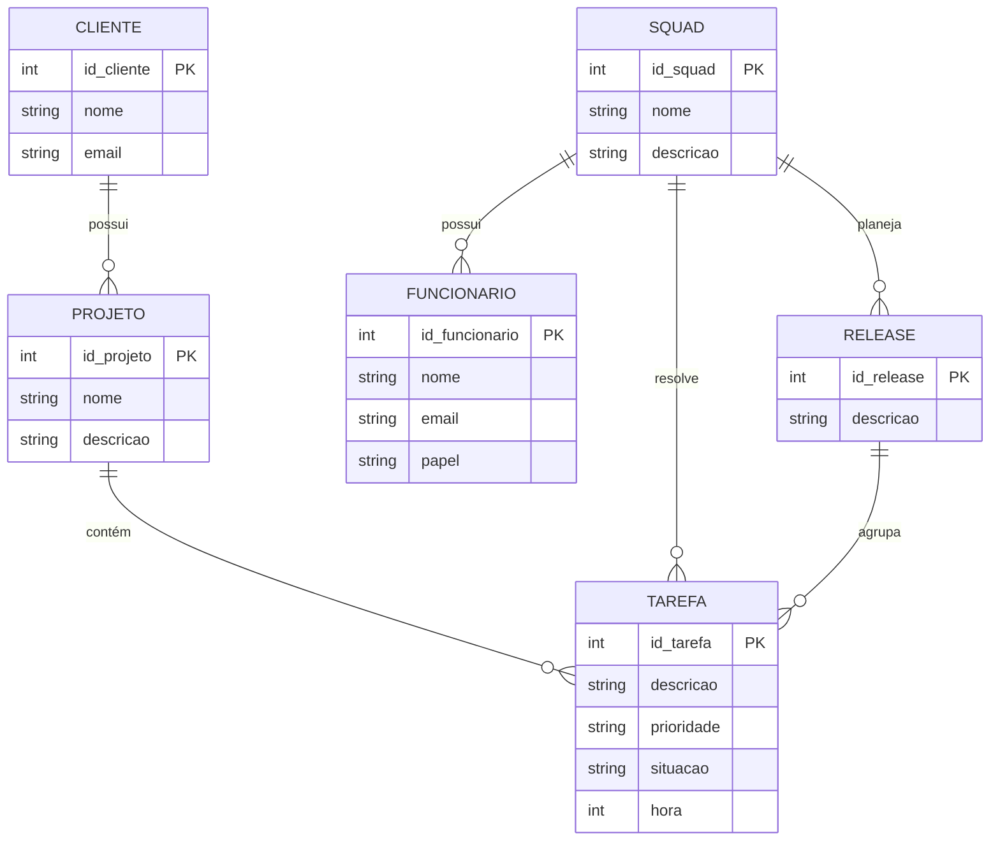

# Q1. O modelo de dados entidade-relacionamento foi desenvolvido para facilitar o projeto de banco de dados, permitindo especificação de um esquema que representa a estrutura lógica geral de um banco de dados. Descreva os três elementos básicos de um Modelo Entidade Relacionamento (MER).

* Entidades: são os objetos de um banco de dados. As entidades são as coisas que se relacionam, onde costumam se relacionar e interagir outras Entidades. Cliente, Produto e Venda são exemplos de entidades.

* Atributos: São as características das Entidades, seus dados e informações, como o nome e o cpf de um cliente; o id e o preço de um produto; e os produtos e data de uma venda. são nos atributos que cada entidade se diferencia de outra do mesmo tipo.

* Relacionamentos: É a interação entre as entidades. No banco podemos ter Clientes e Contas como Entidades, ou seja, um cliente possui uma conta, então essas duas entidades interagem entre si.

# Q2. Pesquise sobre as várias notações possíveis para Diagramas ER e cite alguns exemplos de notações diferentes para o mesmo conceito (ex.: cardinalidade, entidade subordinada, etc.).

A cardinalidade no diagrama ER é feito com um número 0 ou 1 ou N, seguido de 2 pontos e logo após um número 1 ou uma letra, que costumar ser N ou M(EX: 1:N, N:M). Já no modelo UML, em vez dos dois pontos usamos reticências, e em vez das letras usamos '*', mas elas querem dizer a mesma coisa(Ex: 1..*, 0..*). Se estivessemos fazendo em crows foot usamos tracinhos '|' para 1 e '|{' para muitos.

# Q3. Construa um Diagrama ER para projetar a base de dados de uma empresa de desenvolvimento de software com outras empresas como clientes. A base de dados não deve conter redundância de dados. O modelo ER deve ser representado com um diagrama usando Mermaid.js. O modelo deve apresentar, ao menos, entidades, relacionamentos, atributos, identificadores e restrições de cardinalidade. O modelo deve ser feito no nível conceitual, sem incluir chaves estrangeiras. 
### a) A empresa presta serviços de desenvolvimento de software para outras empresas (clientes). Cada cliente é identificado por um código, um nome e um e-mail de contato. 
### b) Os funcionários da empresa trabalham em squads (equipes). Cada funcionário é identificado por um código, um nome e um e-mail, e possui um papel na equipe: desenvolvedor, testador, líder técnico, supervisor ou gerente de produto. 
### c) Cada squad é formada por vários funcionários e resolve tarefas (issues). Uma tarefa tem código, descrição, prioridade, situação e uma estimativa em horas. As tarefas pertencem a projetos de um cliente. 
### d) O trabalho é organizado em iterações (sprints). Uma squad planeja releases para seus clientes; uma release agrupa um conjunto de tarefas e passa por testes de validação.

# Q4. A partir do Diagrama ER da questão anterior, faça o mapeamento para o Modelo Relacional: liste as relações (tabelas), com seus atributos, e identifique as chaves primárias e as chaves estrangeiras de cada relação.

* CLIENTE (id_cliente (PK), nome, email)

* PROJETO (id_projeto (PK), nome, descricao, id_cliente (FK))

* SQUAD (id_squad (PK), nome, descricao)

* FUNCIONARIO (id_funcionario (PK), nome, email, papel, id_squad (FK))

* RELEASE (id_release (PK), descricao, id_squad (FK))

* TAREFA (id_tarefa (PK), descricao, prioridade, situacao, hora, id_projeto (FK), id_squad (FK), id_release (FK))

# Q5. Descreva, em linguagem natural, as restrições de integridade referencial que devem ser garantidas no esquema projetado (ex.: "uma tarefa só pode existir vinculada a um projeto de cliente existente", "toda squad deve possuir um líder técnico").

1. Projeto: Um projeto só pode ser criado se estiver vinculado a um cliente já cadastrado no sistema.

2. Funcionário: Um funcionário só poderá ser alocado em uma squad que já exista no sistema.

3. Release: Uma release só poderá ser planejada e vinculada a uma squad já existente.

4. Tarefa: Uma tarefa só poderá existir se for vinculada a um projeto, a uma squad e a uma release que também já estejam previamente cadastrados no sistema.