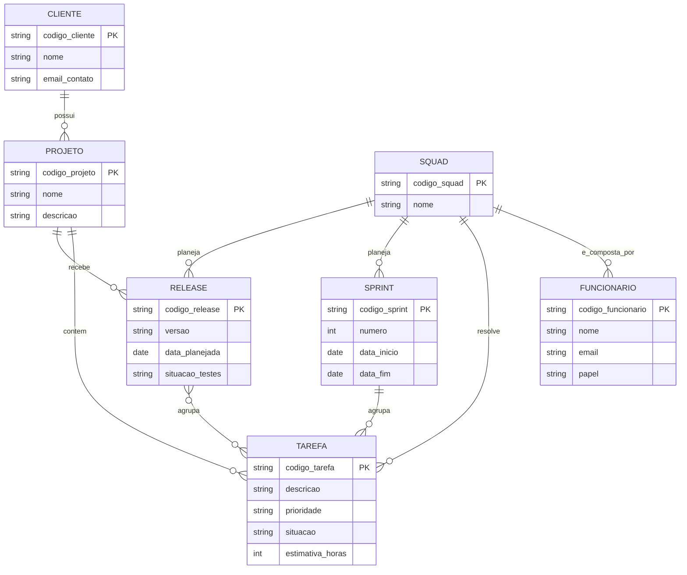

# Tarefa 02 - MER e Projeto de Banco de Dados Relacional

## Q1. Os três elementos básicos de um Modelo Entidade-Relacionamento (MER)

O MER é composto essencialmente por três elementos:

1. **Entidade**: representa um objeto ou conceito do mundo real sobre o qual
   queremos armazenar informações. É
   representada graficamente por um retângulo. Cada ocorrência individual de
   uma entidade é chamada de "instância".

2. **Atributo**: representa uma propriedade ou característica de uma entidade. É representado por uma elipse ligada à
   entidade ou listado dentro do retângulo da entidade. Um atributo pode ser
   definido como **identificador (chave)** da entidade, garantindo que cada
   instância seja única.

3. **Relacionamento**: representa uma associação entre duas ou mais entidades. É representado por um losango
   conectando as entidades envolvidas ou por uma linha entre
   as entidades. Cada relacionamento possui uma
   **cardinalidade**, que indica quantas instâncias de uma entidade podem se
   associar a quantas instâncias da outra.

## Q2. Notações diferentes para Diagramas ER

Existem várias notações gráficas para representar os mesmos conceitos de um
diagrama ER. Algumas das mais conhecidas:

- **Notação de Chen**: entidades são retângulos, atributos são
  elipses ligadas à entidade por uma linha, relacionamentos são losangos.
  Entidades fracas/subordinadas são representadas por um **retângulo duplo**,
  e o relacionamento identificador correspondente por um **losango duplo**.
  A cardinalidade é anotada nas linhas como números ou pares (ex.: "1", "N",
  ou "(0,1)", "(1,N)").

- **Notação Crow's Foot**: muito usada em ferramentas de
  modelagem modernas (e também é a notação usada pelo Mermaid.js). As
  entidades são retângulos com os atributos listados dentro. A cardinalidade
  é representada por símbolos nas pontas da linha de relacionamento: um traço
  simples (|) indica "um", um círculo (o) indica "zero" (opcional), e um
  "pé de galinha" (<) indica "muitos". Combinações como `||--o{` indicam
  "exatamente um" de um lado e "zero ou muitos" do outro.

- **Notação UML**: entidades viram
  classes, atributos são listados com seus tipos dentro da classe, e a
  cardinalidade é escrita diretamente nas extremidades da associação usando a
  notação `0..1`, `1`, `0..*`, `1..*`, em vez de símbolos gráficos.

- **Notação IDEF1X**: usada em modelagem de dados corporativa, diferencia
  entidades independentes (retângulo de canto reto) de entidades dependentes
  (retângulo de canto arredondado), e usa uma bolinha preta na ponta da linha
  para indicar cardinalidade "muitos".

**Exemplo comparativo (cardinalidade "um para muitos"):**

| Notação | Como representa "um para muitos" |
|---|---|
| Chen | Números "1" e "N" escritos ao lado das linhas que ligam as entidades ao losango |
| Crow's Foot / Mermaid | `\|\|--o{` (um trace simples de um lado, "pé de galinha" do outro) |
| UML | `1` de um lado e `0..*` do outro, escritos nas pontas da associação |

**Exemplo comparativo (entidade fraca/subordinada, ex.: "Dependente" que só
existe se existir um "Funcionário"):**

| Notação | Como representa entidade fraca |
|---|---|
| Chen | Retângulo de borda dupla + losango de borda dupla no relacionamento identificador |
| Crow's Foot | Geralmente um retângulo normal, mas a chave estrangeira/identificação é indicada de forma textual ou por uma linha "identifying relationship" (traço contínuo) versus "non-identifying" (traço tracejado) |
| IDEF1X | Retângulo de cantos arredondados para a entidade dependente |

## Q3. Diagrama ER — Empresa de desenvolvimento de software

## Q4. Mapeamento do Diagrama ER para o Modelo Relacional

**CLIENTE** (**codigo_cliente**, nome, email_contato)

**PROJETO** (**codigo_projeto**, nome, descricao, `codigo_cliente` **FK** → CLIENTE)

**SQUAD** (**codigo_squad**, nome)

**FUNCIONARIO** (**codigo_funcionario**, nome, email, papel, `codigo_squad` **FK** → SQUAD)

**TAREFA** (**codigo_tarefa**, descricao, prioridade, situacao, estimativa_horas,
`codigo_projeto` **FK** → PROJETO, `codigo_squad` **FK** → SQUAD,
`codigo_sprint` **FK** → SPRINT, *nullable até a tarefa ser alocada a uma sprint*)

**SPRINT** (**codigo_sprint**, numero, data_inicio, data_fim, `codigo_squad` **FK** → SQUAD)

**RELEASE** (**codigo_release**, versao, data_planejada, situacao_testes,
`codigo_projeto` **FK** → PROJETO, `codigo_squad` **FK** → SQUAD)

**RELEASE_TAREFA** (**codigo_release** **FK** → RELEASE, **codigo_tarefa** **FK** → TAREFA)
*(tabela associativa criada para resolver o relacionamento N:N entre RELEASE e TAREFA; a chave primária é composta pelas duas chaves estrangeiras)*

**Resumo de chaves primárias (PK) e estrangeiras (FK):**

| Tabela | Chave Primária | Chaves Estrangeiras |
|---|---|---|
| CLIENTE | codigo_cliente | — |
| PROJETO | codigo_projeto | codigo_cliente → CLIENTE |
| SQUAD | codigo_squad | — |
| FUNCIONARIO | codigo_funcionario | codigo_squad → SQUAD |
| TAREFA | codigo_tarefa | codigo_projeto → PROJETO, codigo_squad → SQUAD, codigo_sprint → SPRINT |
| SPRINT | codigo_sprint | codigo_squad → SQUAD |
| RELEASE | codigo_release | codigo_projeto → PROJETO, codigo_squad → SQUAD |
| RELEASE_TAREFA | (codigo_release, codigo_tarefa) | codigo_release → RELEASE, codigo_tarefa → TAREFA |

## Q5. Restrições de integridade referencial

- Uma **tarefa** só pode existir se estiver vinculada a um **projeto**
  existente.
- Uma **tarefa** só pode ser resolvida por uma **squad** que exista
  cadastrada no sistema.
- Um **projeto** só pode existir vinculado a um **cliente** existente.
- Um **funcionário** só pode pertencer a uma **squad** que já esteja
  cadastrada.
- Uma **sprint** só pode existir vinculada a uma **squad** existente.
- Uma **release** só pode existir vinculada a um **projeto** e a
  uma **squad**, ambos já cadastrados.
- Não é permitido excluir um **cliente** que ainda possua **projetos**
  cadastrados.
- Não é permitido excluir uma **squad** que ainda possua **funcionários**,
  **tarefas**, **sprints** ou **releases** vinculados a ela.
- Na tabela associativa **RELEASE_TAREFA**, cada par (release, tarefa) deve
  referenciar uma release e uma tarefa que realmente existam nas tabelas
  RELEASE e TAREFA, respectivamente.
- Toda **squad** deve possuir, entre seus funcionários, ao menos um membro
  com o papel de **líder técnico**.
