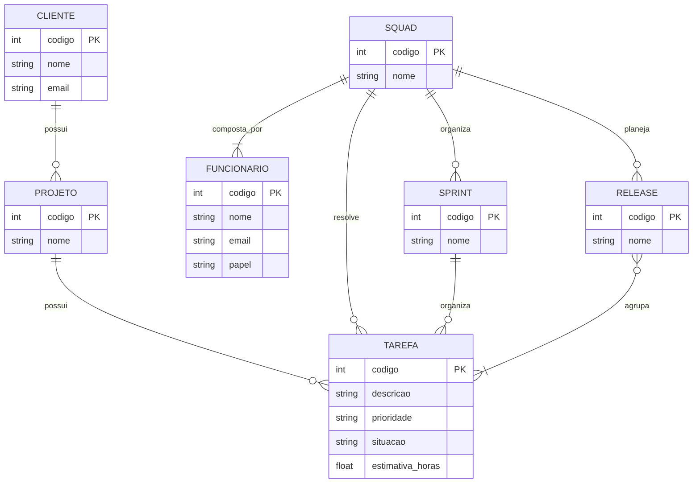

# Tarefa 02 - MER e Projeto de Banco de Dados Relacional

## Q1. Elementos básicos do Modelo Entidade-Relacionamento

O Modelo Entidade-Relacionamento (MER) é utilizado para representar, em nível conceitual, a estrutura dos dados de um sistema e as associações existentes entre eles. Seus três elementos básicos são entidades, atributos e relacionamentos.

**Entidades** representam objetos ou conceitos do mundo real que são relevantes para o sistema e sobre os quais se deseja armazenar informações. Exemplos de entidades são Cliente, Funcionário, Projeto e Squad.

**Atributos** representam as características ou propriedades das entidades. Por exemplo, a entidade Cliente pode possuir os atributos código, nome e e-mail. Entre os atributos, pode existir um identificador capaz de distinguir unicamente cada ocorrência da entidade, como o código do cliente.

**Relacionamentos** representam as associações entre duas ou mais entidades. Por exemplo, pode existir um relacionamento entre Cliente e Projeto indicando que um cliente possui projetos. Os relacionamentos podem apresentar restrições de cardinalidade, que determinam quantas ocorrências de uma entidade podem estar associadas a ocorrências de outra.

---

## Q2. Notações para Diagramas Entidade-Relacionamento

Existem diferentes notações para representar Diagramas Entidade-Relacionamento (ER). Embora utilizem símbolos e formas de representação diferentes, elas podem expressar os mesmos conceitos, como entidades, relacionamentos e cardinalidades.

Uma das notações clássicas é a **notação de Chen**, na qual as entidades são representadas por retângulos, os relacionamentos por losangos e os atributos por elipses. Essa notação destaca os componentes conceituais do modelo e a associação entre eles.

Outra notação bastante utilizada é a **Crow's Foot (Pé de Galinha)**. Nela, as entidades são representadas por caixas e os relacionamentos por linhas, sendo utilizados símbolos nas extremidades das linhas para indicar a cardinalidade. Por exemplo, um círculo indica zero, uma barra indica um e o símbolo de "pé de galinha" indica muitos. A combinação desses símbolos permite representar cardinalidades como zero ou um, exatamente um, zero ou muitos e um ou muitos. O Mermaid.js utiliza a notação Crow's Foot em seus diagramas ER. [1]

A **UML (Unified Modeling Language)** também pode ser utilizada para representar relacionamentos entre entidades, utilizando multiplicidades próximas às extremidades das associações. Exemplos de multiplicidades são `1`, `0..1`, `1..*` e `*`, correspondendo, respectivamente, a exatamente um, zero ou um, um ou mais e muitos. [2]

Um mesmo relacionamento pode, portanto, ser representado de maneiras diferentes. Por exemplo, considerando que um cliente pode possuir vários projetos e que cada projeto pertence a um único cliente, na notação Crow's Foot pode-se representar a relação como:

CLIENTE `||--o{` PROJETO

Enquanto em uma representação baseada em UML, pode-se utilizar:

CLIENTE `1` -------- `*` PROJETO

Apesar da diferença visual e sintática, as duas representações expressam a mesma ideia de cardinalidade: **um cliente pode estar associado a vários projetos, enquanto cada projeto está associado a um único cliente**.

### Referências

[1] MERMAID. *Entity Relationship Diagrams*. Disponível em: https://mermaid.js.org/syntax/entityRelationshipDiagram.html. Acesso em: 10 set. 2026.

[2] MERMAID. *Class diagrams*. Disponível em: https://mermaid.js.org/syntax/classDiagram.html. Acesso em: 10 set. 2026.

---

## Q3. Modelo Entidade-Relacionamento

Para uma empresa de desenvolvimento de software, o modelo conceitual foi elaborado considerando clientes, projetos, funcionários, squads, tarefas, sprints e releases. O modelo busca evitar redundâncias, representando cada informação em uma única entidade e utilizando os relacionamentos para estabelecer as associações entre os elementos do sistema.

### Entidades e atributos

- **CLIENTE:** código, nome e e-mail de contato.
- **PROJETO:** código e nome.
- **FUNCIONARIO:** código, nome, e-mail e papel, podendo ser desenvolvedor, tester, líder técnico, supervisor ou gerente de produto.
- **SQUAD:** código e nome.
- **TAREFA:** código, descrição, prioridade, situação e estimativa de horas.
- **SPRINT:** código e nome.
- **RELEASE:** código e nome.

### Q3. Diagrama Entidade-Relacionamento

---

## Q4. Mapeamento para o Modelo Relacional

A partir do modelo Entidade-Relacionamento apresentado na questão anterior, foi realizado o mapeamento para o modelo relacional. As chaves estrangeiras são utilizadas para representar os relacionamentos entre as tabelas.

### Relações

**CLIENTE**
- codigo_cliente (PK)
- nome
- email

**PROJETO**
- codigo_projeto (PK)
- codigo_cliente (FK → CLIENTE.codigo_cliente)

**FUNCIONARIO**
- codigo_funcionario (PK)
- nome
- email
- papel
- codigo_squad (FK → SQUAD.codigo_squad)

**SQUAD**
- codigo_squad (PK)

**TAREFA**
- codigo_tarefa (PK)
- descricao
- prioridade
- situacao
- estimativa_horas
- codigo_projeto (FK → PROJETO.codigo_projeto)
- codigo_squad (FK → SQUAD.codigo_squad)
- codigo_sprint (FK → SPRINT.codigo_sprint)

**SPRINT**
- codigo_sprint (PK)
- codigo_squad (FK → SQUAD.codigo_squad)

**RELEASE**
- codigo_release (PK)
- codigo_cliente (FK → CLIENTE.codigo_cliente)

Como a relação entre RELEASE e TAREFA é muitos-para-muitos, é necessária uma relação associativa:

**RELEASE_TAREFA**
- codigo_release (PK, FK → RELEASE.codigo_release)
- codigo_tarefa (PK, FK → TAREFA.codigo_tarefa)

---

## Q5. Restrições de Integridade Referencial

As seguintes restrições de integridade referencial devem ser garantidas no esquema projetado:

- Um projeto só pode existir se estiver vinculado a um cliente existente.
- Uma tarefa só pode existir se estiver vinculada a um projeto existente.
- Uma tarefa só pode ser atribuída a uma squad existente.
- Um funcionário só pode pertencer a uma squad existente.
- Uma sprint só pode estar vinculada a uma squad existente.
- Uma tarefa organizada em uma sprint só pode estar vinculada a uma sprint existente.
- Uma release só pode estar vinculada a um cliente existente.
- Uma associação entre release e tarefa só pode ser criada se a release e a tarefa existirem.
- Toda squad deve possuir pelo menos um funcionário com o papel de líder técnico.
- O papel de um funcionário deve corresponder a uma das funções previstas: desenvolvedor, tester, líder técnico, supervisor ou gerente de produto.
- Ao excluir um cliente, seus projetos e releases não devem permanecer vinculados a um cliente inexistente.