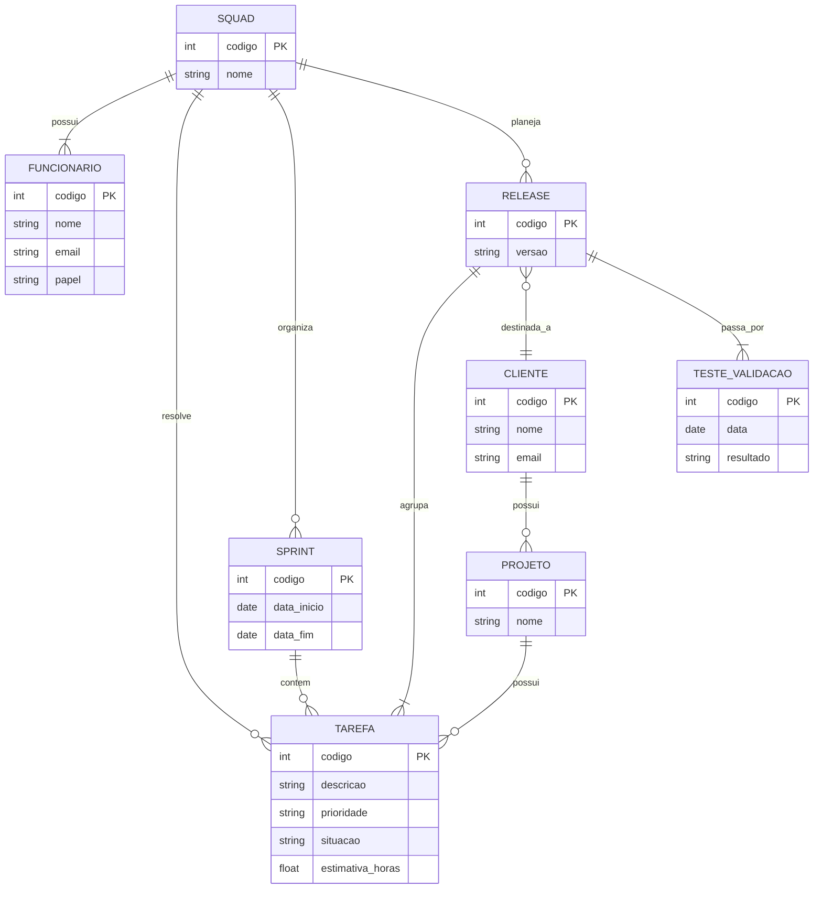

# Tarefa 02 - MER e Projeto de Banco de Dados Relacional
## Q1. Modelo Entidade-Relacionamento

Os três elementos básicos de um Modelo Entidade-Relacionamento (MER) são:

* **Entidade:** representa objetos ou elementos sobre os quais serão armazenados dados, como `Cliente` ou `Funcionário`.
* **Atributo:** representa as características de uma entidade, como o nome e o e-mail de um `Cliente`.
* **Relacionamento:** representa a associação entre duas ou mais entidades, como um `Cliente` possuir um `Projeto`.

## Q2. Notações para Diagramas ER

Existem diferentes notações para representar um Diagrama Entidade-Relacionamento (ER). As mais conhecidas são **Chen**, **Crow's Foot** e **UML**. Os mesmos conceitos podem ser representados de maneiras diferentes em cada notação.

| Conceito | Chen | Crow's Foot | UML |
|---|---|---|---|
| **Entidade** | Retângulo | Caixa | Classe/caixa |
| **Atributo** | Elipse | Campo dentro da entidade | Atributo dentro da classe |
| **Relacionamento** | Losango | Linha entre as entidades | Associação entre classes |
| **Cardinalidade** | Números ou indicadores próximos ao relacionamento | Símbolos de "pé de galinha" | Multiplicidades, como `1`, `0..1` e `1..*` |
| **Entidade subordinada (fraca)** | Retângulo duplo | Dependência indicada pelo relacionamento | Pode ser representada por composição ou associação, dependendo do caso |

Assim, um mesmo relacionamento, como **um cliente possuir vários projetos (1:N)**, pode ser representado por símbolos de cardinalidade diferentes dependendo da notação utilizada.

## Q3. Diagrama ER

