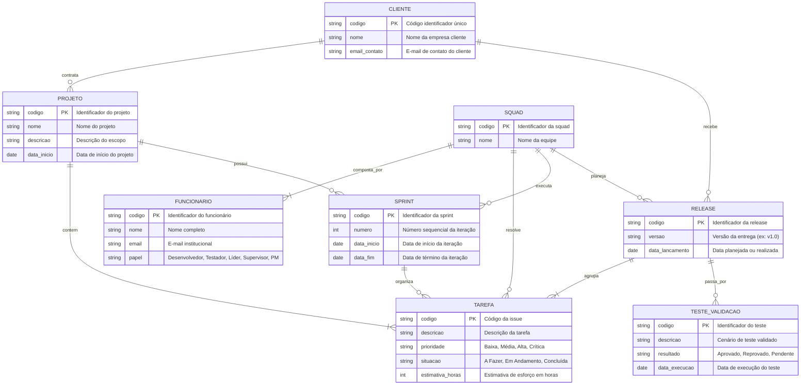
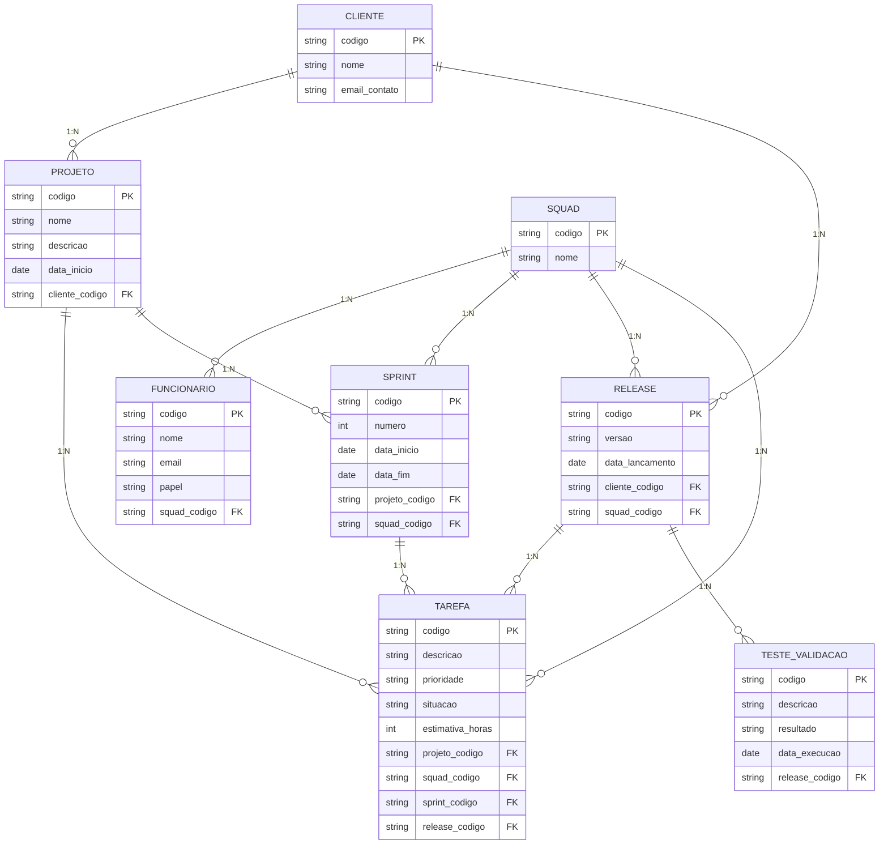

# Tarefa 02 - MER e Projeto de Banco de Dados Relacional

## Q1. Elementos Básicos do Modelo Entidade-Relacionamento (MER)

O Modelo Entidade-Relacionamento (MER), proposto por Peter Chen em 1976, é um modelo conceitual de alto nível utilizado para especificar a estrutura lógica de um banco de dados de maneira independente de aspectos físicos de implementação.

O modelo é fundamentado em três conceitos básicos:

1. **Entidades:** São objetos, pessoas, conceitos ou fatos do mundo real que possuem existência própria e sobre os quais a organização deseja armazenar dados. No diagrama, são comumente representadas por retângulos (por exemplo: `Cliente`, `Projeto`, `Funcionario`). As entidades podem ser concretas (tangíveis, como um funcionário) ou abstratas (conceituais, como uma matrícula ou um projeto).
2. **Atributos:** São as propriedades, características ou descrições que qualificam cada entidade ou relacionamento, definindo os dados que serão guardados (por exemplo: a entidade `Cliente` possui atributos como `codigo`, `nome` e `email_contato`). Entre os atributos, destaca-se o identificador (ou chave primária), cujo valor identifica unicamente cada ocorrência da entidade.
3. **Relacionamentos:** São as associações ou conexões lógicas entre duas ou mais entidades, refletindo a forma como elas interagem no mundo real (por exemplo: a relação entre `Cliente` e `Projeto` através do vínculo *contrata*). Os relacionamentos definem as regras do negócio por meio de restrições estruturais, como a cardinalidade (1:1, 1:N ou N:M).

## Q2. Notações para Diagramas ER

Ao longo dos anos, diferentes metodologias e padrões visuais surgiram para representar os conceitos de um Modelo Entidade-Relacionamento (MER). Embora o objetivo principal seja sempre o mesmo — mapear entidades, atributos e relacionamentos —, a forma gráfica de expressar esses elementos varia consideravelmente dependendo da notação adotada.

### 1. Principais Notações Existentes

* **Notação de Chen (Original):** Criada por Peter Chen em 1976, é a abordagem clássica mais ensinada no ambiente acadêmico. Nela, as entidades são representadas por retângulos, os atributos por elipses ligadas às entidades, e os relacionamentos por losangos conectados às entidades participantes.
* **Notação Pé de Galinha (Crow's Foot / Information Engineering):** Muito comum no desenvolvimento de software comercial e ferramentas de modelagem (como MySQL Workbench, Lucidchart e Mermaid.js). Ela elimina os losangos e elipses, desenhando as entidades como blocos tabulares onde os atributos aparecem listados internamente, e utiliza traços e ramificações que lembram o pé de uma ave para indicar as cardinalidades.
* **Notação UML (Unified Modeling Language - Diagrama de Classes):** Focada no paradigma orientado a objetos, mas frequentemente aplicada para modelagem de dados. As entidades são representadas como classes (retângulos divididos em nome e atributos) e os relacionamentos são expressos por linhas com multiplicidades numéricas nas extremidades (ex: `1..1`, `0..*`).
* **Notação Min-Max (Elmasri & Navathe):** Variação que associa a cada extremidade de relacionamento um par ordenado `(mínimo, máximo)` representando a participação mínima (0 ou 1) e a cardinalidade máxima (1 ou N) da entidade no relacionamento.
* **Notação de Bachman:** Um dos modelos pioneiros, voltado a bancos em rede e estruturas hierárquicas, utilizando retângulos para os registros e setas para representar dependências e fluxos estruturais.

---

### 2. Exemplos Comparativos de Notações para o Mesmo Conceito

Abaixo estão exemplos práticos de como diferentes notações representam o mesmo conceito estrutural:

* **Cardinalidade 1 para N (Um para Muitos):**
  * *Notação de Chen:* Posiciona o número `1` sobre a linha de um lado do losango e a letra `N` sobre a linha do outro lado.
  * *Notação Pé de Galinha:* Utiliza duas barras perpendiculares `||` (um e somente um) na ponta da entidade "um" e um símbolo ramificado `}|` ou `}o` (muitos) na ponta da entidade "muitos".
  * *Notação UML:* Utiliza notação textual nas pontas da linha de associação (ex: `1` de um lado e `0..*` ou `1..*` do outro).
  * *Notação Min-Max:* Adiciona o par `(1, 1)` junto à entidade do lado "um" e `(0, N)` ou `(1, N)` junto à entidade do lado "muitos".

* **Entidade Subordinada / Fraca (Entidade que depende de outra para existir):**
  * *Notação de Chen:* É desenhada com um **retângulo duplo** e conectada à sua entidade proprietária por um **losango duplo** (relacionamento identificador).
  * *Notação Pé de Galinha:* Representada com cantos arredondados e conectada por uma **linha contínua** (*identifying relationship*), indicando que a chave primária da entidade forte compõe a chave primária da entidade fraca.
  * *Notação UML:* Expressa pelo conceito de **Composição**, indicada por um losango preenchido (preto) na extremidade da classe proprietária.

* **Atributos Multivalorados (Atributos com múltiplos valores, como telefones de um cliente):**
  * *Notação de Chen:* É desenhado como uma **elipse dupla** conectada à entidade.
  * *Notação Pé de Galinha / Modelo Relacional:* Como o modelo relacional não comporta múltiplos valores numa mesma coluna, a notação modela uma **entidade dependente associada** (tabela separada) ligada por uma relação 1 para N.

## Q3. Diagrama ER Conceitual (Mermaid.js)

Com base nos requisitos da empresa de desenvolvimento de software, o modelo conceitual abaixo descreve as entidades do negócio, seus atributos, identificadores (indicados por `PK`) e as relações de cardinalidade, sem incluir chaves estrangeiras (mantendo o foco puramente conceitual):

## Q4. Mapeamento para o Modelo Relacional

A partir do Diagrama ER conceitual, realizamos o mapeamento para o modelo relacional convertendo as entidades em tabelas e propagando as chaves estrangeiras (FK) para representar as relações:

### Relações (Tabelas) e Estrutura de Chaves

1. **CLIENTE**
   * **Atributos:** `codigo` (PK), `nome`, `email_contato`
   * **Chave Primária (PK):** `codigo`
   * **Chave Estrangeira (FK):** Nenhuma

2. **PROJETO**
   * **Atributos:** `codigo` (PK), `nome`, `descricao`, `data_inicio`, `cliente_codigo` (FK)
   * **Chave Primária (PK):** `codigo`
   * **Chave Estrangeira (FK):** `cliente_codigo` referencia `CLIENTE(codigo)` *(representa a relação 1:N entre Cliente e Projeto)*

3. **SQUAD**
   * **Atributos:** `codigo` (PK), `nome`
   * **Chave Primária (PK):** `codigo`
   * **Chave Estrangeira (FK):** Nenhuma

4. **FUNCIONARIO**
   * **Atributos:** `codigo` (PK), `nome`, `email`, `papel`, `squad_codigo` (FK)
   * **Chave Primária (PK):** `codigo`
   * **Chave Estrangeira (FK):** `squad_codigo` referencia `SQUAD(codigo)` *(representa a relação 1:N entre Squad e Funcionário)*

5. **SPRINT**
   * **Atributos:** `codigo` (PK), `numero`, `data_inicio`, `data_fim`, `projeto_codigo` (FK), `squad_codigo` (FK)
   * **Chave Primária (PK):** `codigo`
   * **Chaves Estrangeiras (FK):**
     * `projeto_codigo` referencia `PROJETO(codigo)`
     * `squad_codigo` referencia `SQUAD(codigo)`

6. **RELEASE**
   * **Atributos:** `codigo` (PK), `versao`, `data_lancamento`, `cliente_codigo` (FK), `squad_codigo` (FK)
   * **Chave Primária (PK):** `codigo`
   * **Chaves Estrangeiras (FK):**
     * `cliente_codigo` referencia `CLIENTE(codigo)`
     * `squad_codigo` referencia `SQUAD(codigo)`

7. **TAREFA (Issue)**
   * **Atributos:** `codigo` (PK), `descricao`, `prioridade`, `situacao`, `estimativa_horas`, `projeto_codigo` (FK), `squad_codigo` (FK), `sprint_codigo` (FK - opcional), `release_codigo` (FK - opcional)
   * **Chave Primária (PK):** `codigo`
   * **Chaves Estrangeiras (FK):**
     * `projeto_codigo` referencia `PROJETO(codigo)`
     * `squad_codigo` referencia `SQUAD(codigo)`
     * `sprint_codigo` referencia `SPRINT(codigo)`
     * `release_codigo` referencia `RELEASE(codigo)`

8. **TESTE_VALIDACAO**
   * **Atributos:** `codigo` (PK), `descricao`, `resultado`, `data_execucao`, `release_codigo` (FK)
   * **Chave Primária (PK):** `codigo`
   * **Chave Estrangeira (FK):** `release_codigo` referencia `RELEASE(codigo)`

### Diagrama do Modelo Relacional em Mermaid.js

## Q5. Restrições de Integridade Referencial e de Domínio

As restrições de integridade garantem que os dados no banco de dados reflitam fielmente as regras de negócio e previnam dados inválidos ou órfãos:

* **Vínculo Obrigatório de Projetos:** Todo projeto deve estar obrigatoriamente associado a um cliente existente (`cliente_codigo` não nulo referenciando `CLIENTE`). Um projeto não pode existir de forma órfã.
* **Atribuição Obrigatória de Tarefas:** Toda tarefa (issue) deve pertencer obrigatoriamente a um projeto existente (`projeto_codigo`) e estar sob a responsabilidade de uma squad existente (`squad_codigo`). Opcionalmente, pode ser alocada a uma sprint ou a uma release.
* **Alocação de Funcionários:** Todo funcionário cadastrado deve pertencer a uma squad ativa (`squad_codigo` em `FUNCIONARIO`).
* **Liderança Técnica da Squad:** Cada squad deve possuir em sua composição pelo menos um funcionário com o papel de Líder Técnico como responsável técnico da equipe.
* **Planejamento de Releases e Sprints:** Toda release planejada e toda sprint executada devem estar associadas à squad responsável e a um cliente/projeto válido.
* **Validação de Testes:** Todo teste de validação deve estar referenciado a uma release existente no banco (`release_codigo`).
* **Consistência Temporal:** A data de término de uma sprint (`data_fim`) não pode ser anterior à sua data de início (`data_inicio`).
* **Proteção contra Dados Órfãos (Integridade Referencial na Exclusão):** A exclusão de um cliente ou projeto deve ser impedida (`RESTRICT` ou `NO ACTION`) enquanto existirem tarefas ou releases ativas vinculadas a eles, garantindo que o histórico do desenvolvimento permaneça íntegro.\n