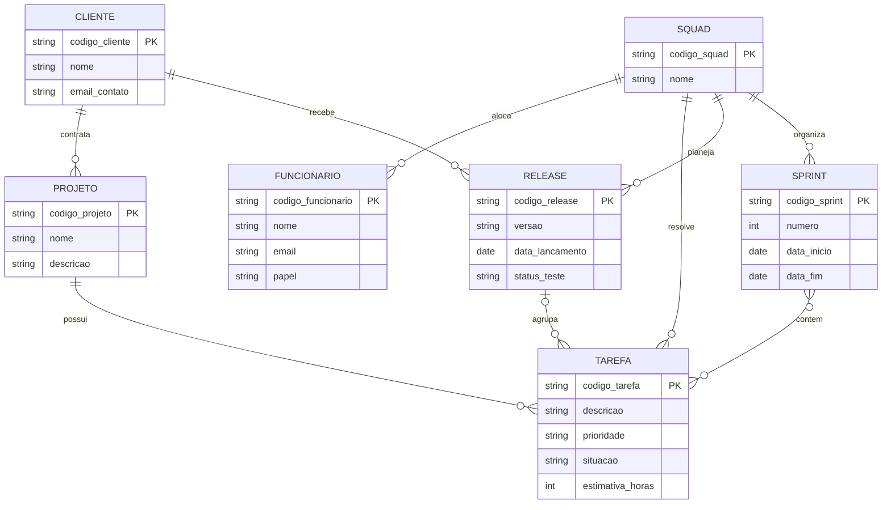

# Tarefa 02 - MER e Projeto de Banco de Dados Relacional

> `database/20262/<Jezreel-Asaias>/tarefa02.md`

---

## Q1. Os três elementos básicos do Modelo Entidade-Relacionamento (MER)

1. **Entidade**: representa um objeto, conceito ou "coisa" do mundo real (ou abstrato) sobre a qual se deseja armazenar dados, e que possui existência independente (ex.: Cliente, Funcionário, Tarefa). No diagrama, é normalmente representada por um retângulo.
2. **Atributo**: representa uma propriedade ou característica de uma entidade (ou de um relacionamento), como o `nome` ou `email` de um Cliente. Pode ser simples, composto, monovalorado, multivalorado ou derivado. Um ou mais atributos formam o **identificador (chave)** da entidade.
3. **Relacionamento**: representa uma associação entre duas ou mais entidades (ex.: Squad **resolve** Tarefa). Cada relacionamento possui uma **cardinalidade**, que define quantas ocorrências de uma entidade podem se associar a ocorrências de outra (1:1, 1:N, N:M).

---

## Q2. Notações para Diagramas ER

Existem várias notações usadas para representar os mesmos conceitos de um MER. Algumas das mais conhecidas:

| Conceito | Notação de Chen (clássica) | Crow's Foot ("pé de galinha") | UML (diagrama de classes) |
|---|---|---|---|
| Entidade | Retângulo | Retângulo | Retângulo (classe) |
| Atributo | Elipse ligada à entidade por uma linha | Listado dentro do retângulo da entidade | Listado dentro do retângulo da classe |
| Relacionamento | Losango entre as entidades | Linha direta entre as entidades (sem símbolo de losango) | Linha (associação) entre as classes |
| Entidade fraca/subordinada | Retângulo de borda dupla | Retângulo com cantos arredondados ou notação específica (ex.: IDEF1X usa caixa com cantos arredondados) | Composição (losango preenchido) |
| Cardinalidade | Números ou pares `(min,max)` escritos próximos à entidade na linha do relacionamento | Símbolos gráficos nas extremidades da linha: traço (1), círculo (0), "pé de galinha" (N) | Multiplicidade textual nas extremidades: `1`, `0..1`, `1..*`, `0..*` |
| Identificador (chave) | Atributo sublinhado | Atributo marcado como PK (chave primária) dentro do retângulo | Atributo marcado como `{id}` ou com estereótipo |

Outro exemplo prático: a cardinalidade "um para muitos" pode aparecer como `(1,1)` e `(1,N)` na notação de Chen, como uma barra simples + "pé de galinha" na notação Crow's Foot, ou como `1` e `0..*` em UML — todas representando exatamente a mesma regra de negócio.

O Mermaid.js utiliza a notação **Crow's Foot** para representar cardinalidade (ex.: `||--o{`).

---

## Q3. Diagrama ER (Mermaid.js) — Empresa de Desenvolvimento de Software

### Premissas de modelagem

- Um **Cliente** contrata **Projetos**; cada projeto pertence a um único cliente.
- Cada **Funcionário** pertence a exatamente uma **Squad**; uma squad tem vários funcionários.
- Uma **Squad** resolve várias **Tarefas**; cada tarefa é resolvida por uma squad.
- Uma **Tarefa** pertence a um **Projeto** (e, por consequência, a um cliente).
- O trabalho é organizado em **Sprints**; cada sprint pertence a uma squad, e uma tarefa pode ser trabalhada em várias sprints (e uma sprint contém várias tarefas) — relação N:M.
- Uma **Squad** planeja **Releases** para os **Clientes**; cada release é de uma squad e de um cliente.
- Uma **Release** agrupa um conjunto de **Tarefas**; cada tarefa está associada a, no máximo, uma release (0 ou 1), pois pode ainda não ter sido incluída em nenhuma release.

### Diagrama

Observações:
- `papel` do funcionário assume valores do domínio: `desenvolvedor`, `testador`, `líder técnico`, `supervisor`, `gerente de produto`.
- Não há atributos duplicados entre entidades (ex.: dados do cliente só existem em `CLIENTE`, nunca copiados para `PROJETO` ou `RELEASE`), evitando redundância.
- Nenhuma chave estrangeira foi incluída, conforme exigido — o modelo está no nível conceitual.

---

## Q4. Mapeamento para o Modelo Relacional

Regras de mapeamento aplicadas: relacionamentos 1:N geram uma FK na entidade do lado "N"; o relacionamento N:M (`SPRINT` × `TAREFA`) gera uma tabela associativa própria.

**CLIENTE** (`codigo_cliente`, nome, email_contato)
- PK: `codigo_cliente`

**FUNCIONARIO** (`codigo_funcionario`, nome, email, papel, `codigo_squad`)
- PK: `codigo_funcionario`
- FK: `codigo_squad` → SQUAD(codigo_squad)

**SQUAD** (`codigo_squad`, nome)
- PK: `codigo_squad`

**PROJETO** (`codigo_projeto`, nome, descricao, `codigo_cliente`)
- PK: `codigo_projeto`
- FK: `codigo_cliente` → CLIENTE(codigo_cliente)

**TAREFA** (`codigo_tarefa`, descricao, prioridade, situacao, estimativa_horas, `codigo_projeto`, `codigo_squad`, `codigo_release`)
- PK: `codigo_tarefa`
- FK: `codigo_projeto` → PROJETO(codigo_projeto)
- FK: `codigo_squad` → SQUAD(codigo_squad)
- FK: `codigo_release` → RELEASE(codigo_release) — *aceita nulo*, pois uma tarefa pode ainda não pertencer a nenhuma release

**SPRINT** (`codigo_sprint`, numero, data_inicio, data_fim, `codigo_squad`)
- PK: `codigo_sprint`
- FK: `codigo_squad` → SQUAD(codigo_squad)

**RELEASE** (`codigo_release`, versao, data_lancamento, status_teste, `codigo_squad`, `codigo_cliente`)
- PK: `codigo_release`
- FK: `codigo_squad` → SQUAD(codigo_squad)
- FK: `codigo_cliente` → CLIENTE(codigo_cliente)

**SPRINT_TAREFA** (`codigo_sprint`, `codigo_tarefa`) — tabela associativa para o relacionamento N:M entre SPRINT e TAREFA
- PK composta: (`codigo_sprint`, `codigo_tarefa`)
- FK: `codigo_sprint` → SPRINT(codigo_sprint)
- FK: `codigo_tarefa` → TAREFA(codigo_tarefa)

---

## Q5. Restrições de Integridade Referencial

- Um **funcionário** só pode existir vinculado a uma **squad** já cadastrada; não é permitido cadastrar um funcionário sem squad.
- Um **projeto** só pode existir vinculado a um **cliente** já cadastrado.
- Uma **tarefa** só pode existir vinculada a um **projeto** existente e a uma **squad** existente.
- Se uma tarefa estiver associada a uma **release**, essa release deve existir previamente; uma tarefa pode, no entanto, existir sem estar associada a nenhuma release ainda.
- Uma **sprint** só pode existir vinculada a uma **squad** já cadastrada.
- Um registro na tabela associativa **SPRINT_TAREFA** só pode referenciar uma sprint e uma tarefa que já existam.
- Uma **release** só pode existir vinculada a uma **squad** e a um **cliente** já cadastrados.
- Não é permitido excluir um **cliente** que ainda possua **projetos** ou **releases** vinculados (ou a exclusão deve ser bloqueada/tratada em cascata, conforme regra de negócio definida).
- Não é permitido excluir uma **squad** que ainda possua **funcionários**, **tarefas**, **sprints** ou **releases** vinculados.
- Não é permitido excluir um **projeto** que ainda possua **tarefas** vinculadas.
- Regra de negócio adicional (não garantida apenas por integridade referencial, exige validação de aplicação/trigger): **toda squad deve possuir ao menos um funcionário com o papel de "líder técnico"**.
