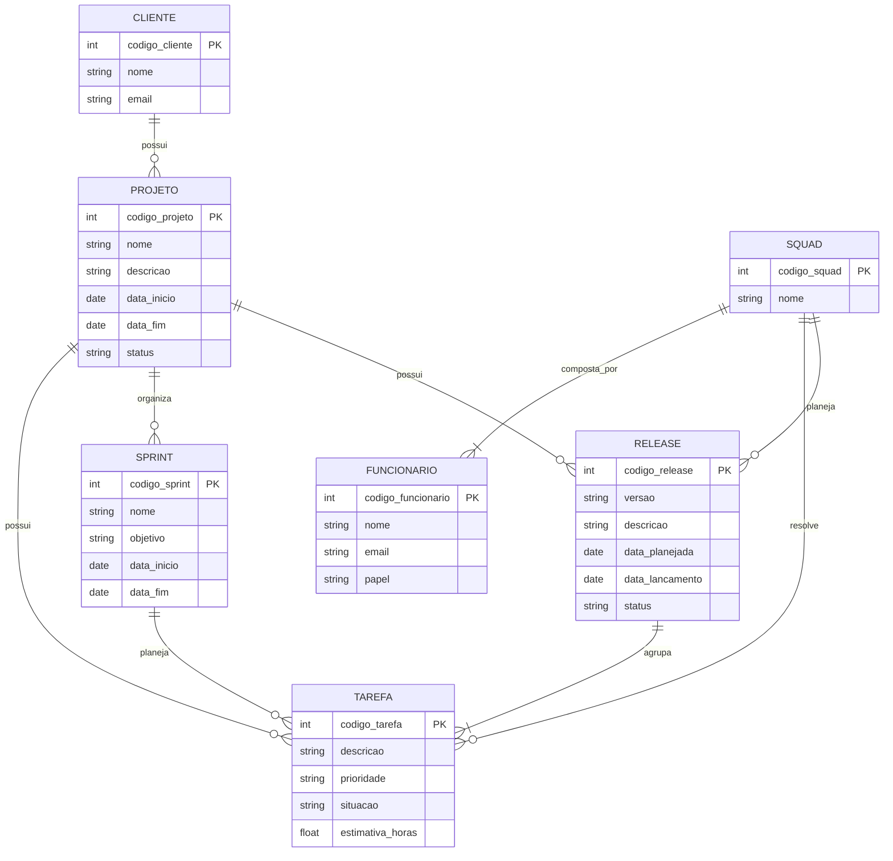

# Tarefa 02 - MER e Projeto de Banco de Dados Relacional

### Q1. O modelo de dados entidade-relacionamento foi desenvolvido para facilitar o projeto de banco de dados, permitindo especificação de um esquema que representa a estrutura lógica geral de um banco de dados. Descreva os três elementos básicos de um Modelo Entidade Relacionamento (MER).

Os três elementos básicos de um **Modelo Entidade-Relacionamento (MER)** são **entidades, atributos e relacionamentos**.

**Entidades:**

As entidades representam objetos ou elementos do mundo real que possuem importância para o sistema e sobre os quais é necessário armazenar informações.

**Atributos:**

Os atributos representam as características ou propriedades de uma entidade.

**Relacionamentos:**

Os relacionamentos representam as associações existentes entre as entidades. Os relacionamentos também possuem **cardinalidades**, que indicam quantas ocorrências de uma entidade podem estar relacionadas a outra.

### Q2. Pesquise sobre as várias notações possíveis para Diagramas ER e cite alguns exemplos de notações diferentes para o mesmo conceito (ex.: cardinalidade, entidade subordinada, etc.).

Existem diferentes formas de representar um **Diagrama Entidade-Relacionamento (ER)**. As principais notações utilizadas são **Chen**, **Crow's Foot (Pé de Galinha)** e **UML**.
Embora utilizem símbolos diferentes, todas elas podem representar os mesmos conceitos, como entidades, atributos, relacionamentos e cardinalidades.

1. Notação de Chen

A **notação de Chen** é uma das formas tradicionais de representação de modelos entidade-relacionamento.
Nessa notação:

- **Retângulos** representam entidades;
- **Losangos** representam relacionamentos;
- **Elipses** representam atributos;
- As cardinalidades são indicadas próximas aos relacionamentos.

2. Notação Crow's Foot

Na notação **Crow's Foot**, as entidades normalmente são representadas por caixas contendo seus atributos.
A cardinalidade é representada graficamente nas extremidades dos relacionamentos.

3. Notação UML

A UML (Unified Modeling Language) também pode ser utilizada para representar estruturas de dados.
As entidades são representadas como classes, contendo seus atributos, e os relacionamentos são representados por linhas entre as classes.

As multiplicidades podem ser representadas como:
1 — exatamente um; 0..1 — zero ou um; * — muitos; 1..* — um ou muitos.

### Q3. Construa um Diagrama ER para projetar a base de dados de uma empresa de desenvolvimento de software com outras empresas como clientes. A base de dados não deve conter redundância de dados. O modelo ER deve ser representado com um diagrama usando Mermaid.js. O modelo deve apresentar, ao menos, entidades, relacionamentos, atributos, identificadores e restrições de cardinalidade. O modelo deve ser feito no nível conceitual, sem incluir chaves estrangeiras. a) A empresa presta serviços de desenvolvimento de software para outras empresas (clientes). Cada cliente é identificado por um código, um nome e um e-mail de contato. b) Os funcionários da empresa trabalham em squads (equipes). Cada funcionário é identificado por um código, um nome e um e-mail, e possui um papel na equipe: desenvolvedor, testador, líder técnico, supervisor ou gerente de produto. c) Cada squad é formada por vários funcionários e resolve tarefas (issues). Uma tarefa tem código, descrição, prioridade, situação e uma estimativa em horas. As tarefas pertencem a projetos de um cliente. d) O trabalho é organizado em iterações (sprints). Uma squad planeja releases para seus clientes; uma release agrupa um conjunto de tarefas e passa por testes de validação.

### Q4.  A partir do Diagrama ER da questão anterior, faça o mapeamento para o Modelo Relacional: liste as relações (tabelas), com seus atributos, e identifique as chaves primárias e as chaves estrangeiras de cada relação.

A partir do Diagrama ER da Q3, as entidades podem ser transformadas em relações (tabelas) no Modelo Relacional.
As **chaves primárias (PK)** identificam unicamente cada registro, enquanto as **chaves estrangeiras (FK)** são utilizadas para representar os relacionamentos entre as tabelas.

CLIENTE
**CLIENTE**(
**codigo_cliente**,
nome,
email
)
- **PK:** `codigo_cliente`

PROJETO
**PROJETO**(
**codigo_projeto**,
nome,
descricao,
data_inicio,
data_fim,
status,
codigo_cliente
)
- **PK:** `codigo_projeto`
- **FK:** `codigo_cliente` -> `CLIENTE(codigo_cliente)`
O atributo `codigo_cliente` é uma chave estrangeira porque cada projeto pertence a um cliente existente.

SQUAD
**SQUAD**(
**codigo_squad**,
nome
)
- **PK:** `codigo_squad`

FUNCIONARIO
**FUNCIONARIO**(
**codigo_funcionario**,
nome,
email,
papel,
codigo_squad
)
- **PK:** `codigo_funcionario`
- **FK:** `codigo_squad` → `SQUAD(codigo_squad)`
O atributo `codigo_squad` representa a squad à qual o funcionário está vinculado.

TAREFA
**TAREFA**(
**codigo_tarefa**,
descricao,
prioridade,
situacao,
estimativa_horas,
codigo_projeto,
codigo_squad,
codigo_sprint,
codigo_release
)
- **PK:** `codigo_tarefa`
- **FK:** `codigo_projeto` → `PROJETO(codigo_projeto)`
- **FK:** `codigo_squad` → `SQUAD(codigo_squad)`
- **FK:** `codigo_sprint` → `SPRINT(codigo_sprint)`
- **FK:** `codigo_release` → `RELEASE(codigo_release)`
As chaves estrangeiras permitem identificar o projeto ao qual a tarefa pertence, a squad responsável, a sprint em que está planejada e a release na qual será entregue.

SPRINT
**SPRINT**(
**codigo_sprint**,
nome,
objetivo,
data_inicio,
data_fim,
codigo_projeto
)
- **PK:** `codigo_sprint`
- **FK:** `codigo_projeto` → `PROJETO(codigo_projeto)`
Cada sprint pertence a um projeto existente.

RELEASE
**RELEASE**(
**codigo_release**,
versao,
descricao,
data_planejada,
data_lancamento,
status,
codigo_squad,
codigo_projeto
)
- **PK:** `codigo_release`
- **FK:** `codigo_squad` → `SQUAD(codigo_squad)`
- **FK:** `codigo_projeto` → `PROJETO(codigo_projeto)`
Cada release está vinculada a um projeto e possui uma squad responsável pelo planejamento.

### Q5. Descreva, em linguagem natural, as restrições de integridade referencial que devem ser garantidas no esquema projetado.

As restrições de integridade referencial garantem que os relacionamentos entre as tabelas permaneçam válidos e que não existam registros relacionados a entidades que não existem.
No modelo desenvolvido, o banco de dados deve garantir as seguintes regras:

1. Um **projeto só pode estar vinculado a um cliente existente**. Portanto, o `codigo_cliente` utilizado em PROJETO deve corresponder a um cliente cadastrado.

2. Um **cliente pode possuir vários projetos**, mas cada projeto deve estar vinculado a apenas um cliente.

3. Um **funcionário só pode estar vinculado a uma squad existente**. O `codigo_squad` da relação FUNCIONARIO deve corresponder a uma squad cadastrada.

4. Toda **squad deve possuir funcionários** e deve existir apenas um funcionário com o papel de **líder técnico** em cada squad.

5. O papel de cada funcionário deve ser válido, podendo ser: **desenvolvedor, testador, líder técnico, supervisor ou gerente de produto**.

6. Uma **tarefa só pode estar vinculada a um projeto existente**. O `codigo_projeto` da relação TAREFA deve corresponder a um projeto cadastrado.

7. Toda **tarefa deve possuir uma squad responsável existente**. O `codigo_squad` da tarefa deve corresponder a uma squad cadastrada.

8. Uma **sprint só pode estar vinculada a um projeto existente**. O `codigo_projeto` da relação SPRINT deve corresponder a um projeto cadastrado.

9. A **data de término de uma sprint não pode ser anterior à data de início**.

10. Uma **release só pode estar vinculada a um projeto existente**. O `codigo_projeto` da relação RELEASE deve corresponder a um projeto cadastrado.

11. Toda **release deve possuir uma squad responsável existente**, portanto o `codigo_squad` da release deve corresponder a uma squad cadastrada.

12. Uma **release deve agrupar tarefas existentes** e nenhuma tarefa pode ser vinculada a uma release que não esteja cadastrada.

13. Uma tarefa não pode possuir referências para **projeto, squad, sprint ou release inexistentes**.

14. Os identificadores das entidades devem ser **únicos e não podem ser nulos**, garantindo que cada registro possa ser identificado corretamente.

15. O banco de dados deve impedir a exclusão de um **cliente** enquanto existirem projetos vinculados a ele, a menos que exista uma regra específica para tratar essa exclusão.

16. Da mesma forma, o banco deve impedir a exclusão de um **projeto, squad, sprint ou release** enquanto existirem tarefas ou outros registros que dependam deles, evitando referências inválidas.

17. Os dados obrigatórios, como nome do cliente, nome do projeto, nome da squad e descrição da tarefa, devem ser preenchidos.