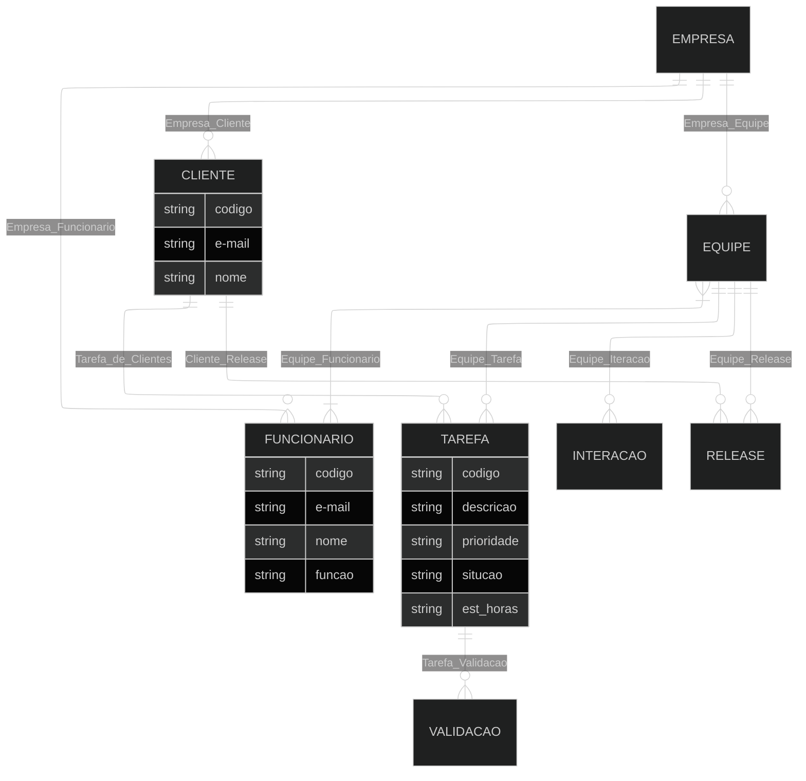

#

# Q1

### Entidade
Representa um objeto do mundo real(físico ou abstrato) sobre o qual o sistema precisa armazenar informações. Graficamente, é representado por um rentângulo.
### Atributo 
São as características, propriedades ou campos que descrevem uma entidade. Graficamente, é representado por uma elipse ou círculo ligado à entidade.
### Relacionamento
Define a associação ou ligação lógica entre duas ou mais entidades, decrevendo como elas interagem. Graficamente, é representado por um losango

#

# Q2

### Pé de Galinha
Linha com terminações em ramificações(três pontas para "muitos", traço perpendicular para "um", círculo para "zero"). Entidades representadas em retângulos divididos em duas seções. Os atributos são listados diretamente na entidade(dentro do retângulo).

### Peter Chen
Retângulos(Entidades), Losangolos(Relacionementos) e Elipses(Atributos).

### IDEF1X
Caixas com cantos arrendodados ou retos, círculos cheios/vazios no final das linhas para relacionamentos. Atrobutos ficam na caixa da entidade, divididos por uma linha horizontal.

### UML 
Classes(Retângulos divididos em 3 partes) com atributos e métodos, multiplicidade nas pontas(1..*,0..1).

### Barker
Caixas com cantos arredondados, linhas contínuas, tracejados, com "pé de galinha" em uma extremidade.

#

# Q3

### Relações

- EMPRESA (1,1) -- ◇ Empresa_Cliente ◇ -- (0,N) CLIENTE;
- EMPRESA (1,1) -- ◇ Empresa_Equipe ◇ -- (0,N) EQUIPE;
- EMPRESA (1,1) -- ◇ Empresa_Funcionario ◇ -- (1,N) FUNCIONARIO;
- EQUIPE (1,N) -- ◇ Equipe_Funcionario ◇ -- (1,N) FUNCIONARIO;
- EQUIPE (1,1) -- ◇ Equipe_Release ◇ -- (0,N) RELEASE;
- EQUIPE (1,1) -- ◇ Equipe_Interacao ◇ -- (0,N) INTERACAO;
- CLIENTE (1,1) -- ◇ Tarefa_de_Clientes ◇ -- (0,N) TAREFA;
- CLIENTE (1,1) -- ◇ Cliente_Release ◇ -- (0,N) RELEASE;
- TAREFA (1,1) -- ◇ Tarefa_Validacao ◇ -- (1,N).

