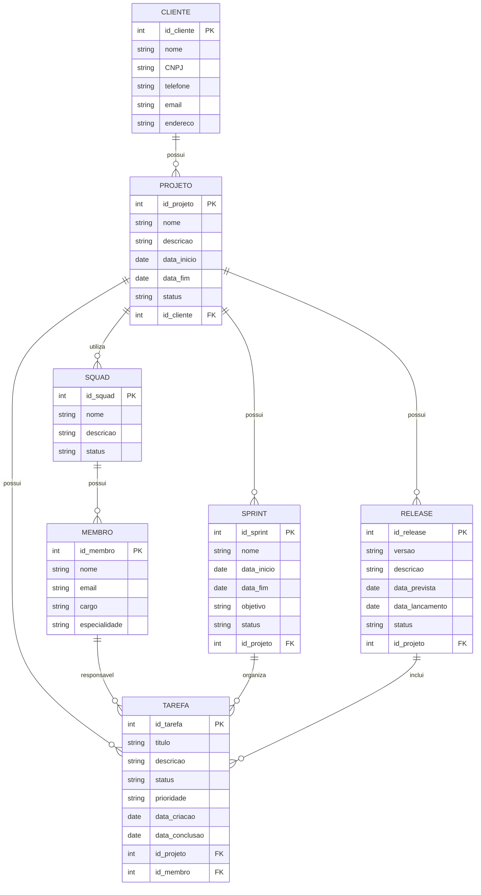

# Tarefa 01 - Conceitos de BD - PHS-00

## Q1. Banco de Dados e SGBD

Um Banco de Dados é um conjunto de dados organizados de uma forma que facilite o armazenamento, a consulta e a alteração dessas informações. Ele pode guardar, por exemplo, dados de clientes, produtos, funcionários, vendas, entre outros.

Já o SGBD (Sistema Gerenciador de Banco de Dados) é o software responsável por gerenciar o banco de dados. Ele permite criar tabelas, inserir e consultar dados, além de controlar segurança, integridade, concorrência e recuperação das informações.

Alguns exemplos de bancos de dados são:

* **MySQL** - utiliza o SGBD MySQL.
* **PostgreSQL** - utiliza o SGBD PostgreSQL.
* **Oracle Database** - utiliza o SGBD Oracle.
* **SQL Server** - utiliza o SGBD Microsoft SQL Server.
* **SQLite** - utiliza o SGBD SQLite.

Na prática, muitas vezes usamos o nome do próprio SGBD para falar do banco de dados, mas os dois conceitos não são exatamente a mesma coisa.

## Q2. Problemas dos Sistemas de Arquivos

Utilizar sistemas de arquivos para armazenar grandes quantidades de dados pode gerar vários problemas. Alguns deles são:

* **Redundância de dados:** a mesma informação pode acabar sendo armazenada várias vezes.
* **Inconsistência:** quando uma informação é alterada em um arquivo e não é alterada em outro, os dados ficam diferentes.
* **Dificuldade de acesso:** consultas mais complexas podem ser difíceis de realizar.
* **Problemas de segurança:** pode ser mais difícil controlar quem pode acessar ou modificar cada informação.
* **Falta de controle de concorrência:** dois usuários podem tentar alterar o mesmo dado ao mesmo tempo.
* **Dificuldade de recuperação:** se um arquivo for perdido ou corrompido, recuperar os dados pode ser complicado.
* **Pouca organização:** conforme a quantidade de informações aumenta, fica mais difícil manter os dados organizados.

Por causa desses problemas, os SGBDs foram criados para facilitar o gerenciamento e aumentar a confiabilidade dos dados.

## Q3. Propriedades ACID

As propriedades ACID são características importantes das transações realizadas em um banco de dados. ACID significa Atomicidade, Consistência, Isolamento e Durabilidade.

### Atomicidade

Atomicidade significa que uma transação deve ser realizada por completo ou não ser realizada. Não pode acontecer de apenas uma parte da operação ser concluída.

**Exemplo:** em uma transferência de R$ 100,00, o banco precisa retirar os R$ 100,00 da conta de origem e adicionar os R$ 100,00 na conta de destino.

Se o SGBD não garantisse atomicidade, poderia acontecer de o dinheiro ser retirado da primeira conta, mas não chegar na segunda.

### Consistência

Consistência significa que uma transação deve manter o banco de dados em um estado válido, respeitando as regras definidas.

**Exemplo:** se uma conta não pode ficar com saldo abaixo de -R$ 500,00, uma transferência que ultrapasse esse limite deve ser rejeitada.

Sem consistência, o banco poderia permitir operações que deixassem os dados em uma situação inválida.

### Isolamento

Isolamento significa que transações executadas ao mesmo tempo não devem causar problemas umas nas outras.

**Exemplo:** dois atendentes tentam realizar uma transferência usando o mesmo saldo ao mesmo tempo. O banco precisa controlar essas operações para que o saldo não seja utilizado de forma incorreta.

Sem isolamento, as duas operações poderiam ler o mesmo saldo antes de uma delas ser atualizada e acabar causando um saldo incorreto.

### Durabilidade

Durabilidade significa que, depois que uma transação é confirmada, seus dados devem continuar armazenados mesmo que ocorra uma falha no sistema.

**Exemplo:** depois que uma transferência é confirmada, o resultado precisa continuar registrado mesmo que o servidor seja desligado logo depois.

Sem durabilidade, uma transferência poderia aparecer como concluída e depois desaparecer quando o servidor fosse reiniciado.

## Q4. Propriedades ACID nos cenários

### a) Queda de energia no meio de uma transferência deixou o valor debitado da conta de origem, mas não creditado na conta de destino.

A propriedade envolvida é principalmente a **atomicidade**.

A transferência deveria ser tratada como uma única operação. Ou o débito e o crédito são realizados, ou nenhum dos dois deveria ser aplicado. Nesse caso, apenas uma parte foi realizada.

### b) Dois atendentes debitam, ao mesmo tempo, o mesmo saldo de uma conta.

A propriedade envolvida é o **isolamento**.

As duas operações estão acontecendo ao mesmo tempo e precisam ser controladas para não utilizarem o mesmo saldo de forma incorreta.

### c) O sistema confirma a operação, mas após reiniciar o servidor o dado foi perdido.

A propriedade envolvida é a **durabilidade**.

Depois que uma operação foi confirmada, ela deveria continuar registrada mesmo após uma falha ou reinicialização do servidor.

### d) Uma transferência que levaria o saldo abaixo do limite permitido é rejeitada pelo banco.

A propriedade envolvida é a **consistência**.

A operação foi rejeitada porque violaria uma regra definida para o banco. Dessa forma, o banco de dados continua em um estado válido.

## Q5. Recuperação, integridade, redundância e inconsistência

### Recuperação

Recuperação é a capacidade de recuperar os dados depois de uma falha, como queda de energia, erro do sistema ou problema no servidor.

O SGBD pode utilizar recursos como logs, backups e mecanismos de recuperação para tentar restaurar o banco para um estado correto.

### Integridade

Integridade está relacionada à garantia de que os dados armazenados continuam corretos e obedecem às regras definidas no banco.

O SGBD pode fazer isso usando restrições, como chaves primárias, chaves estrangeiras, valores obrigatórios e regras para determinados dados.

### Redundância

Redundância acontece quando a mesma informação é armazenada várias vezes sem necessidade.

O SGBD ajuda a diminuir esse problema por meio da organização adequada dos dados e da normalização das tabelas, evitando repetir informações desnecessariamente.

### Inconsistência

Inconsistência acontece quando existem informações diferentes para o mesmo dado.

Por exemplo, se o endereço de um cliente estiver atualizado em uma tabela, mas continuar antigo em outra, existe uma inconsistência.

O SGBD ajuda a evitar isso centralizando os dados e aplicando regras de integridade, além de controlar as alterações realizadas pelos usuários.

## Q6. Mini-projeto conceitual

Para o sistema da empresa de desenvolvimento de software, eu organizaria o banco de dados com as seguintes entidades:

### Cliente

Representa as empresas que contratam os serviços.

**Principais atributos:**

* id_cliente
* nome
* CNPJ
* telefone
* email
* endereço

### Projeto

Representa um projeto desenvolvido para um cliente.

**Principais atributos:**

* id_projeto
* nome
* descrição
* data_inicio
* data_fim
* status
* id_cliente

### Squad

Representa uma equipe de desenvolvimento.

**Principais atributos:**

* id_squad
* nome
* descrição
* status

### Membro

Representa uma pessoa que participa de uma squad.

**Principais atributos:**

* id_membro
* nome
* email
* cargo
* especialidade

O cargo pode ser, por exemplo, desenvolvedor, testador, líder técnico, supervisor ou gerente de produto.

### Tarefa

Representa uma issue ou tarefa que precisa ser realizada dentro de um projeto.

**Principais atributos:**

* id_tarefa
* título
* descrição
* status
* prioridade
* data_criacao
* data_conclusao
* id_projeto
* id_membro

### Sprint

Representa uma iteração de desenvolvimento.

**Principais atributos:**

* id_sprint
* nome
* data_inicio
* data_fim
* objetivo
* status
* id_projeto

### Release

Representa uma versão ou entrega do projeto.

**Principais atributos:**

* id_release
* versão
* descrição
* data_prevista
* data_lancamento
* status
* id_projeto

### Relacionamentos

Os principais relacionamentos seriam:

* **Um cliente pode ter vários projetos**, mas cada projeto pertence a um cliente.
* **Um projeto pode possuir várias squads**, e uma squad pode participar de vários projetos, caso a empresa permita esse modelo.
* **Uma squad possui vários membros**, e um membro pode participar de uma ou mais squads ao longo do tempo.
* **Um projeto possui várias tarefas**, mas cada tarefa deve estar vinculada a um projeto.
* **Um membro pode ser responsável por várias tarefas**, enquanto uma tarefa pode ter um responsável principal.
* **Um projeto possui várias sprints**, mas cada sprint pertence a um projeto.
* **Uma sprint pode possuir várias tarefas**, permitindo organizar as atividades de cada iteração.
* **Um projeto pode possuir várias releases**, sendo cada release vinculada a um único projeto.
* **Uma release pode incluir várias tarefas** que foram concluídas naquela versão.

### Regras de integridade

O banco de dados também deveria garantir algumas regras para evitar informações incorretas.

* Todo projeto deve estar vinculado a um cliente existente.
* Uma tarefa não pode existir sem estar vinculada a um projeto.
* Uma sprint deve estar vinculada a um projeto.
* Uma release deve estar vinculada a um projeto.
* Um membro deve possuir um cargo válido.
* Uma squad deve possuir pelo menos um membro.
* Cada squad deve possuir apenas um líder técnico principal.
* Uma tarefa não pode ser atribuída a um membro que não faça parte da squad responsável pelo projeto.
* A data de fim de uma sprint não pode ser anterior à sua data de início.
* A data de lançamento de uma release não deve ser anterior à data de criação da release.
* Os dados que identificam unicamente clientes, projetos, membros, tarefas, sprints e releases não podem ser duplicados.
* Não deve ser possível apagar um cliente caso existam projetos que dependam dele, sem antes tratar esses projetos.

### Representação visual

Abaixo está uma representação visual:

Esse diagrama representa de forma visual as principais entidades do sistema e como elas se relacionam. Por exemplo, um cliente pode possuir vários projetos, um projeto pode possuir várias tarefas, sprints e releases, e uma squad pode possuir vários membros.
