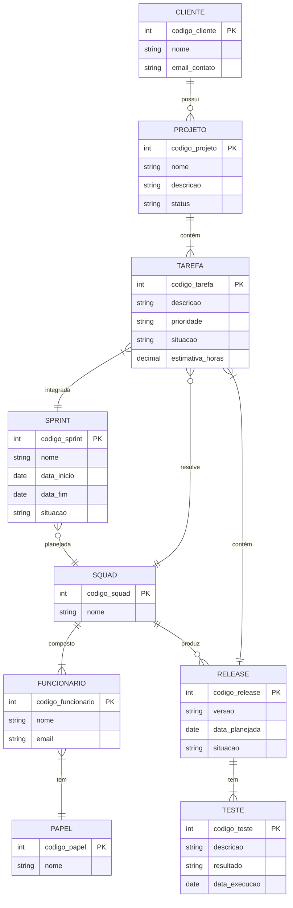

## Q1. O modelo de dados entidade-relacionamento foi desenvolvido para facilitar o projeto de banco de dados, permitindo especificação de um esquema que representa a estrutura lógica geral de um banco de dados. Descreva os três elementos básicos de um Modelo Entidade Relacionamento (MER).
### Resposta:
  * **Entidade:** É um objeto que existe e é distinguível dos outros objetos. Além disso, esse objeto pode ser concreto ou abstrato.
  * **Atributo:** São as características que descrevem instâncias de uma entidade. Além disso, cada atributo possui um domínio, que é um conjunto de valores usados para representá-lo.
    - **Tipos de atributos:**
      - Simples: São atributos que não são uma informação composta (ex: idade, nome)
      - Composto: Contém sub-atributos que compõem o atributo (ex: o atributo endereço tem como sub-atributos: rua, bairro, cidade etc.)
      - Simplesmente valorados: Têm um único valor para uma instância de uma entidade (ex: idade)
      - Multivalorados: Possuem vários valores numa instância de uma entidade (ex: Telefone: residencial, comercial)
  * **Relacionamento:** São associações entre uma ou mais entidades.
    - **Tipos de relacionamentos:**
      - Auto-relacionamento: É um relacionamento com uma única entidade (ex: empregado supervisiona empregado)
      - Relacionamento binário: É um relacionamento entre duas entidades (ex: filme possui diretor)
      - Relacionamento não-binário: É um relacionamento entre mais de duas entidades (ex: fornecedor fornece produto para projeto)

## Q2. Pesquise sobre as várias notações possíveis para Diagramas ER e cite alguns exemplos de notações diferentes para o mesmo conceito (ex.: cardinalidade, entidade subordinada, etc.).
### Resposta:
  * **Notação de Chen**: Essa notação foi criada por Peter Chen em 1976. Ela foi a primeira notação criada e continua sendo uma das notações mais populares para modelos ER conceituais e lógicos. Por fim, as entidades são representadas por retângulos, os relacionamentos por losangos e os atributos por elipses.
  * **Notação UML**: É uma notação muito utilizada no desenvolvimento de sistemas e em ferramentas profissionais de modelagem. Ela não foi criada inicialmente para ser uma notação de
    diagramas ER, mas devido a sua popularidade, a notação UML também comoçou a ser usada em diagramas ER. As entidades são epresentadas como classes (retângulos com divisões internas), os
    atributos são listados dentro do retângulo com seus respectivos tipos de dados e os relacionamentos são representados por linhas retas.
  * **Notação Crow's Foot**: É uma das notações mais populares no ambiente profissional e nas ferramentas de software de modelagem. Ela foi criada no final da década de 1970 e tem um foco
    naleitura rápida da cardinalidade, tanto que seu nome deriva da aparência do símbolo que representa a cardinalidade "n" (que lembra o pé de um pássaro). As entidades são representadas
    por caixas, os atributos são listados dentro das caixas e os relacionamentos são representados por linhas.
  * **Exemplos de notações diferentes para o mesmo conceito**:
    - **Entidade**: Na notação de Chen é representada por um retângulo. Na Crow's Foot é representada por uma caixa. Na UML é representada por uma classe.
    - **Atributo:** Na notação de Chen, os atributos são representados por elipses. Na Crow's Foot, geralmente ficam dentro da caixa da entidade. Na UML, os atributos ficam dentro da
      classe.
    - **Cardinalidade 1:N**: Na notação de Chen é representada por "1:N". Na Crow's Foot é representada por "1" no lado 1 e pelo o símbolo de “pé de corvo” no lado N. Na UML é representada
      como "1..*".

## Q3. Construa um Diagrama ER para projetar a base de dados de uma empresa de desenvolvimento de software com outras empresas como clientes. A base de dados não deve conter redundância de dados. O modelo ER deve ser representado com um diagrama usando Mermaid.js. O modelo deve apresentar, ao menos, entidades, relacionamentos, atributos, identificadores e restrições de cardinalidade. O modelo deve ser feito no nível conceitual, sem incluir chaves estrangeiras. a) A empresa presta serviços de desenvolvimento de software para outras empresas (clientes). Cada cliente é identificado por um código, um nome e um e-mail de contato. b) Os funcionários da empresa trabalham em squads (equipes). Cada funcionário é identificado por um código, um nome e um e-mail, e possui um papel na equipe: desenvolvedor, testador, líder técnico, supervisor ou gerente de produto. c) Cada squad é formada por vários funcionários e resolve tarefas (issues). Uma tarefa tem código, descrição, prioridade, situação e uma estimativa em horas. As tarefas pertencem a projetos de um cliente. d) O trabalho é organizado em iterações (sprints). Uma squad planeja releases para seus clientes; uma release agrupa um conjunto de tarefas e passa por testes de validação.
### Resposta:

## Q4. A partir do Diagrama ER da questão anterior, faça o mapeamento para o Modelo Relacional: liste as relações (tabelas), com seus atributos, e identifique as chaves primárias e as chaves estrangeiras de cada relação.
### Resposta:

* **Cliente** {
    - int codigo_cliente PK
    - string nome
    - string email_contato
  
  }

* **Squad** {
    - int codigo_squad PK
    - string nome
  
  }

* **Papel** {
    - int codigo_papel PK
    - string nome
  
  }

* **Funcionário** {
    - int codigo_funcionario PK
    - string nome
    - string email_contato
    - int codigo_papel FK
    - int codigo_squad FK

  }

* **Projeto** {
    - int codigo_projeto PK
    - string nome
    - string descricao
    - string status
    - int codigo_cliente FK

  }

* **Sprint** {
    - int codigo_sprint PK
    - string nome
    - date data_inicio
    - date data_fim
    - string situacao
    - int codigo_squad FK

  }

* **Release** {
    - int codigo_release PK
    - string versao
    - date data_planejada
    - string situacao
    - int codigo_squad FK
  }

* **Tarefa** {
    - int codigo_tarefa PK
    - string descricao
    - string prioridade
    - string situacao
    - float estimativa_horas
    - int codigo_projeto FK
    - int codigo_release FK
    - int codigo_sprint FK
    - int codigo_squad FK

  }

* **Teste** {
    - int codigo_teste PK
    - string descricao
    - date data_execucao
    - string resultado
    - int codigo_release FK
 
  }

## Q5. Descreva, em linguagem natural, as restrições de integridade referencial que devem ser garantidas no esquema projetado (ex.: "uma tarefa só pode existir vinculada a um projeto de cliente existente", "toda squad deve possuir um líder técnico").
### Resposta:
Um funcionário deve fazer parte de apenas um squad e deve ter apenas um papel. Além disso, um projeto só pode existir se um cliente estiver vinculado a ele. Ademais, uma release deve ser trabalhada por apenas um squad. Adicionalmente, uma tarefa só pode existir se estiver relacionada a um projeto, uma release, um sprint e um squad. Um teste deve estar relacionado a uma release. Além disso, um squad deve ter somente um funcionário com a função "líder", um com a função "supervisor" e um com a função "gerente de produto". Ademais, uma sprint só pode ser trabalhada por um squad. Por fim, não deve ser possível excluir um projeto se uma tarefa ainda estiver ativa.
