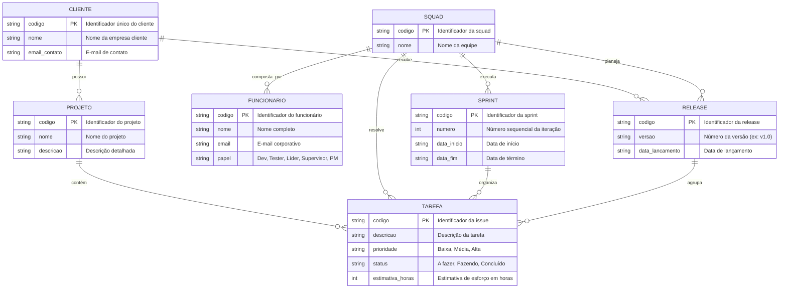
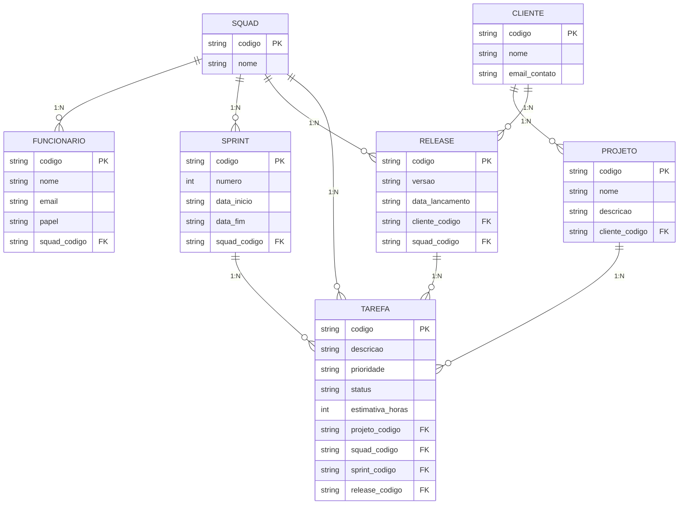

# Tarefa 02 - MER e Projeto de Banco de Dados Relacional

##  Q1. O modelo de dados entidade-relacionamento foi desenvolvido para facilitar o projeto de banco de dados, permitindo especificação de um esquema que representa a estrutura lógica geral de um banco de dados. Descreva os três elementos básicos de um Modelo Entidade Relacionamento (MER). 

O Modelo Entidade-Relacionamento fundamenta-se em três conceitos fundamentais para representar a estrutura lógica de um banco de dados:

1. **Entidades:** São objetos, coisas ou conceitos do mundo real que possuem existência independente e sobre os quais desejamos armazenar dados. No diagrama, são representadas por retângulos (ex: `Cliente`, `Produto`, `Funcionario`).
2. **Atributos:** São as propriedades, características ou descrições que qualificam uma entidade ou um relacionamento (ex: para a entidade `Cliente`, os atributos podem ser `CPF`, `Nome`, `Data_Nascimento`).
3. **Relacionamentos:** São as associações ou conexões lógicas que ocorrem.

## Q2. Notações para Diagramas ER

Ao longo dos anos, diferentes metodologias e padrões surgiram para representar visualmente os conceitos de um Modelo Entidade-Relacionamento (MER). Embora o objetivo principal seja sempre o mesmo — mapear entidades, atributos e relacionamentos —, a forma gráfica de expressar esses elementos muda consideravelmente dependendo da notação escolhida. 

Abaixo estão as principais notações utilizadas na modelagem de dados e como elas diferem na representação de conceitos específicos:

### 1. Principais Notações Existentes

*   **Notação de Chen (Original):** Criada por Peter Chen em 1976, é a abordagem clássica e amplamente utilizada em contextos acadêmicos. Nela, as entidades são retângulos, os atributos são elipses (bolinhas) ligadas às entidades, e os relacionamentos são representados por losangos.
*   **Notação Pé de Galinha (Crow's Foot / Information Engineering):** Muito comum no desenvolvimento de software comercial e ferramentas modernas de modelagem (como Lucidchart, dbdiagram.io, etc.). Ela elimina os losangos e elipses, transformando as entidades em tabelas compactas onde os atributos aparecem listados internamente, e utiliza símbolos bifurcados nas pontas das linhas para indicar a cardinalidade.
*   **Notação UML (Unified Modeling Language):** Originalmente voltada para a Orientação a Objetos, a UML possui um diagrama específico chamado *Diagrama de Classes* que frequentemente substitui o ERD tradicional. Nele, as entidades viram classes (retângulos divididos em compartimentos para nome, atributos e operações) e os relacionamentos são linhas com pontas numéricas indicando multiplicidade.
*   **Notação de Bachman:** Um dos modelos predecessores, focado em estruturas de redes e dados hierárquicos, onde setas e blocos indicam o fluxo e as dependências estruturais.

---

### 2. Exemplos Comparativos de Representação para o Mesmo Conceito

Para entender a divergência prática entre as abordagens, veja como diferentes notações tratam os mesmos conceitos estruturais:

*   **Cardinalidade (Ex: Relação 1 para N):**
    *   *Notação de Chen:* Utiliza letras ou números posicionados em cima das linhas que ligam a entidade ao losango de relacionamento (ex: `1` de um lado e `N` ou `M` do outro).
    *   *Notação Pé de Galinha:* Utiliza traços verticais para "um" e um símbolo ramificado (semelhante a um pé de galinha) para "muitos" na própria extremidade da linha de ligação entre as tabelas.
    *   *Notação UML:* Utiliza restrições textuais diretas nas pontas da associação (ex: `1..1` para um e somente um, e `0..*` para de zero a muitos).

*   **Entidade Fraca (Entidade que depende de uma forte para existir):**
    *   *Notação de Chen:* É representada por um **retângulo duplo** (duas bordas) e seu relacionamento com a entidade forte é desenhado com um **losango duplo**.
    *   *Notação Pé de Galinha:* Geralmente é representada visualmente como uma entidade comum, mas diferenciada pelo tipo de chave estrangeira que compõe sua chave primária composta (identificação dependente) ou por traços pontilhados na linha de relacionamento (relacionamento identificador).

*   **Atributos Multivalorados (Atributos que podem ter vários valores, como vários telefones para uma pessoa):**
    *   *Notação de Chen:* Utiliza uma **elipse dupla** ligada à entidade.
    *   *Notação Pé de Galinha / Relacional:* Como o modelo relacional puro não suporta atributos multivalorados em uma única coluna, essa notação exige a criação de uma **nova entidade filha** (uma tabela auxiliar) ligada por uma relação 1 para N.

## Q3. Diagrama ER Conceitual (Mermaid.js)

Com base nos requisitos apresentados, o modelo conceitual mapeia as entidades do negócio, seus atributos, identificadores (chaves primárias indicadas por `PK`) e as cardinalidades entre elas, sem incluir chaves estrangeiras (foco puramente conceitual).

### Diagrama ER em Mermaid.js

## Q4. Mapeamento para o Modelo Relacional

A partir do Diagrama ER conceitual, realizamos o mapeamento para o modelo relacional convertendo as entidades em tabelas e aplicando as regras de transformação de relacionamentos (como a propagação de chaves estrangeiras nas relações 1 para N).

### Relações (Tabelas) e suas Estruturas

1. **CLIENTE**
   * **Atributos:** `codigo` (PK), `nome`, `email_contato`
   * **Chave Primária (PK):** `codigo`
   * **Chave Estrangeira (FK):** Nenhuma

2. **PROJETO**
   * **Atributos:** `codigo` (PK), `nome`, `descricao`, `cliente_codigo` (FK)
   * **Chave Primária (PK):** `codigo`
   * **Chave Estrangeira (FK):** `cliente_codigo` faz referência a `CLIENTE(codigo)` *(Representa a cardinalidade 1 para N entre Cliente e Projeto)*.

3. **SQUAD**
   * **Atributos:** `codigo` (PK), `nome`
   * **Chave Primária (PK):** `codigo`
   * **Chave Estrangeira (FK):** Nenhuma

4. **FUNCIONARIO**
   * **Atributos:** `codigo` (PK), `nome`, `email`, `papel`, `squad_codigo` (FK)
   * **Chave Primária (PK):** `codigo`
   * **Chave Estrangeira (FK):** `squad_codigo` faz referência a `SQUAD(codigo)` *(Representa a cardinalidade 1 para N entre Squad e Funcionário)*.

5. **SPRINT**
   * **Atributos:** `codigo` (PK), `numero`, `data_inicio`, `data_fim`, `squad_codigo` (FK)
   * **Chave Primária (PK):** `codigo`
   * **Chave Estrangeira (FK):** `squad_codigo` faz referência a `SQUAD(codigo)` *(Representa a cardinalidade 1 para N entre Squad e Sprint)*.

6. **TAREFA (Issue)**
   * **Atributos:** `codigo` (PK), `descricao`, `prioridade`, `status`, `estimativa_horas`, `projeto_codigo` (FK), `squad_codigo` (FK), `sprint_codigo` (FK), `release_codigo` (FK - opcional)
   * **Chave Primária (PK):** `codigo`
   * **Chaves Estrangeiras (FK):** 
     * `projeto_codigo` faz referência a `PROJETO(codigo)`
     * `squad_codigo` faz referência a `SQUAD(codigo)`
     * `sprint_codigo` faz referência a `SPRINT(codigo)`
     * `release_codigo` faz referência a `RELEASE(codigo)` *(vínculo da tarefa com a release que a agrupa)*.

7. **RELEASE**
   * **Atributos:** `codigo` (PK), `versao`, `data_lancamento`, `cliente_codigo` (FK), `squad_codigo` (FK)
   * **Chave Primária (PK):** `codigo`
   * **Chaves Estrangeiras (FK):** 
     * `cliente_codigo` faz referência a `CLIENTE(codigo)` *(indica o cliente para quem a release é planejada)*
     * `squad_codigo` faz referência a `SQUAD(codigo)` *(indica qual squad planejou a release)*.

## Q5. Restrições de Integridade Referencial e de Domínio

As restrições de integridade garantem que os dados permaneçam consistentes, válidos e reflitam corretamente as regras de negócio do sistema. No esquema projetado para a empresa de desenvolvimento de software, aplicam-se as seguintes restrições:

*   **Vínculo Obrigatório de Projeto:** Um projeto não pode existir de forma isolada; todo projeto deve estar obrigatoriamente associado a um cliente cadastrado e existente (`cliente_codigo` em `PROJETO` é uma chave estrangeira obrigatória).
*   **Atribuição de Tarefas:** Toda tarefa (issue) deve estar estritamente vinculada a um projeto válido (`projeto_codigo`). Opcionalmente, pode ser associada a uma sprint e a uma release, mas o projeto de origem é mandatório.
*   **Alocação de Funcionários:** Nenhum funcionário pode ficar sem equipe; todo funcionário deve estar alocado a uma squad existente (`squad_codigo` em `FUNCIONARIO`).
*   **Composição Mínima da Squad:** Para que uma squad esteja apta a operar, seu quadro de membros deve conter obrigatoriamente pelo menos um funcionário com o papel de **Líder Técnico**, um **Supervisor** e um **Gerente de Produto**, além dos desenvolvedores e testadores.
*   **Gestão de Sprints e Releases:** Sprints e releases devem estar associadas a uma squad válida responsável pela sua execução e planejamento. 
*   **Coerência Temporal:** A data de término de uma sprint (`data_fim`) nunca pode ser anterior à sua data de início (`data_inicio`).
*   **Proteção contra Dados Órfãos (Exclusão):** Um cliente que possui projetos ativos não pode ser excluído do banco de dados enquanto existirem registros dependentes vinculados a ele, evitando inconsistências estruturais.