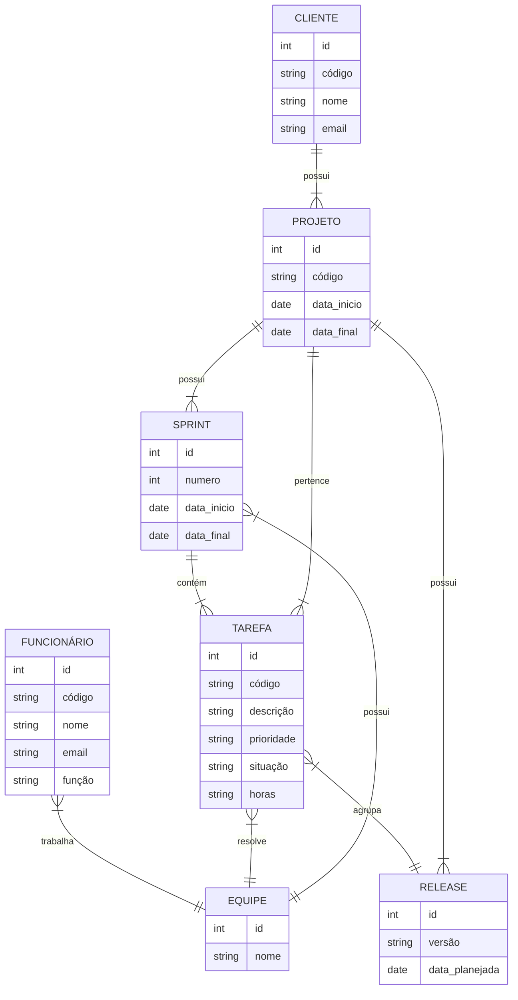
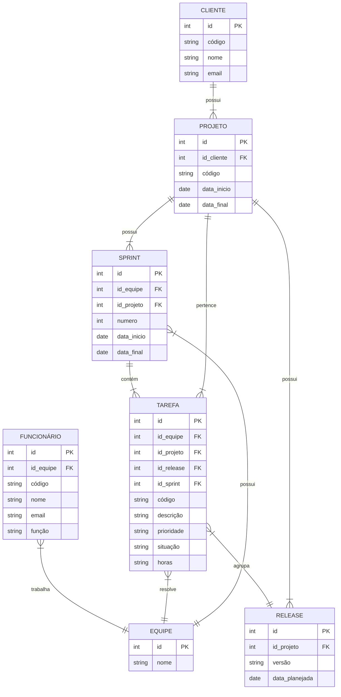

## Questão 1
**Resposta:**

Entidade: É um objeto que existe e é parte do negócio seja ele um objeto real ou abstrato (ex: carro ou venda). Uma entidade é um conjunto de atributos

Atributos: São características comuns a instâncias das entidades. São divididas em 2 tipos
- Simples: É atômico (ex: Idade: numérico; Nome: cadeia de caracteres).
- Composto: Contém sub atributos que compõem o atributo (ex: Endereço: (rua, número, bairro, cidade)).

Relacionamento: são a forma e a quantidade na qual as entidades se relacionam entre si. pra ver a cardinalidade sempre se pergunte "1 instância dessa está em quantas instâncias da outra". OBS: Na cardinalidade a relação só é total quando não existe a opção de uma instância de relacionar. E parcial se possuir a opção de uma instância se relacionar.

## Questão 2
**Resposta:**

- Notação de Chen: Criada por Peter Chen (o pioneiro do modelo), utiliza formas geométricas distintas para cada elemento.
- Notação Pé de Galinha (Crow's Foot): Focada na legibilidade, posiciona os atributos dentro do bloco da entidade e utiliza símbolos 
na extremidade das linhas. Essa é a notação utilizada no mermaid, por exemplo.
- Notação UML: Adaptada da orientação a objetos, utiliza caixas de classes para representar entidades e multiplicidades numéricas.

## Questão 3
**Resposta: **

## Questão 04
**Resposta:**

## Questão 05
**Resposta:**

- Um cliente não pode ser excluído se ainda houver projetos ativos vinculados a ele.
- Uma tarefa não pode ser excluída se já estiver associada a uma release publicada.
- Uma release só pode ser publicada se todas as tarefas vinculadas a ela estiverem concluídas.
- Toda squad deve ter exatamente um líder técnico e um gerente de produto.
- Um funcionário só pode estar em uma equipe por vez.
- Um sprint deve ter data de início anterior à data de término.
- uma tarefa só pode existir vinculada a um projeto de cliente existente.
- O id_projeto de TAREFA deve ser consistente com a id_projeto de RELEASE referenciada pela mesma tarefa (ou seja, uma tarefa não pode estar associada a uma release de um projeto diferente do associado a release).
