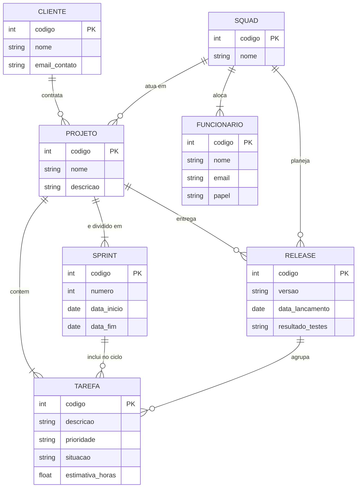

# Tarefa 02 - Modelo Entidade-Relacionamento e Modelo Relacional

## Questão 01 - Elementos Básicos do Modelo Entidade-Relacionamento (MER)

O Modelo Entidade-Relacionamento (proposto originalmente por Peter Chen em 1976) fundamenta-se em três elementos conceituais principais:

1. **Entidades:**
   * **Conceito:** Representam objetos, seres ou conceitos do mundo real que possuem existência própria e sobre os quais se deseja armazenar dados.
   * **Exemplo:** `CLIENTE`, `FUNCIONARIO`, `PROJETO`.
   * **Classificação:** Podem ser **fortes** (existem de forma autônoma) ou **fracas** (sua existência depende da existência de outra entidade pai).

2. **Atributos:**
   * **Conceito:** São as propriedades, características ou dados descritivos que definem e qualificam uma entidade ou um relacionamento.
   * **Exemplo:** Em `FUNCIONARIO`, os atributos podem ser `codigo`, `nome` e `email`.
   * **Identificador (Chave Primária Conceitual):** Atributo (ou conjunto de atributos) cujo valor é único para cada instância da entidade, permitindo distingui-las sem ambiguidade.

3. **Relacionamentos:**
   * **Conceito:** Associações lógicas existentes entre duas ou mais entidades, representando como interagem no domínio modelado.
   * **Exemplo:** A associação `ALOCA` entre `SQUAD` e `FUNCIONARIO`.
   * **Cardinalidade:** Restrição estrutural que define o número mínimo e máximo de ocorrências de uma entidade que podem estar associadas a ocorrências de outra entidade (ex.: `1:1`, `1:N`, `N:M`).

---

## Questão 02 - Notações em Diagramas Entidade-Relacionamento (DER)

Ao longo da evolução da Engenharia de Software e Banco de Dados, surgiram diversas notações gráficas para expressar os mesmos conceitos de modelagem:

| Conceito / Elemento | Notação de Peter Chen (1976) | Notação Pé de Galinha (*Crow's Foot* / Martin) | Notação UML (*Class Diagram*) |
| :--- | :--- | :--- | :--- |
| **Entidade** | Retângulo com o nome da entidade. | Retângulo dividido em seções (Nome, Chaves, Atributos). | Retângulo com três compartimentos (Nome, Atributos, Operações). |
| **Relacionamento** | Losango conectado às entidades por linhas retas. | Linha conectando as entidades com conectores nas pontas. | Linha de associação com nome do papel ou multiplicidade. |
| **Atributos** | Elipses (ovais) ligadas à entidade por linhas. | Listados dentro da caixa da própria entidade. | Listados como propriedades dentro da classe. |
| **Cardinalidade** | Rótulos nas linhas (ex.: `(1,1)`, `(0,n)`, `(1,n)`). | Símbolos gráficos nas pontas: anel (`0`), traço (`1`), tridente/pé de galinha (`N`). | Notação intervalar nas extremidades: `0..1`, `1..1`, `0..*`, `1..*`. |
| **Entidade Fraca** | Retângulo duplo ligado por losango duplo. | Retângulo com cantos arredondados ou linha de relacionamento contínua (*identificadora*). | Composição (linha terminada em losango preenchido preto). |

---

## Questão 03 — Diagrama ER Conceitual (Mermaid.js)

---

## Questão 04 - Mapeamento para o Modelo Relacional

O mapeamento conceitual (MER) para o modelo lógico relacional resulta no conjunto de tabelas abaixo. Os atributos sublinhados e destacados representam as **Chaves Primárias (PK)**, enquanto os identificadores com referência externa representam as **Chaves Estrangeiras (FK)**.

### Tabela: `CLIENTE`
> Armazena os dados cadastrais das empresas contratantes.

| Atributo | Tipo de Dado | Restrição de Chave | Descrição |
| :--- | :--- | :---: | :--- |
| `codigo` | `INT` | **PK** | Identificador único do cliente |
| `nome` | `VARCHAR(100)` | — | Razão social / nome da empresa |
| `email_contato` | `VARCHAR(100)` | — | E-mail corporativo de contato |

---

### Tabela: `SQUAD`
> Registra as equipes multidisciplinares da empresa.

| Atributo | Tipo de Dado | Restrição de Chave | Descrição |
| :--- | :--- | :---: | :--- |
| `codigo` | `INT` | **PK** | Identificador único da squad |
| `nome` | `VARCHAR(50)` | — | Nome da squad |

---

### Tabela: `FUNCIONARIO`
> Contém os membros alocados nas squads e suas funções.

| Atributo | Tipo de Dado | Restrição de Chave | Referência Externa |
| :--- | :--- | :---: | :--- |
| `codigo` | `INT` | **PK** | — |
| `nome` | `VARCHAR(100)` | — | — |
| `email` | `VARCHAR(100)` | — | — |
| `papel` | `VARCHAR(30)` | — | Domínio: desenvolvedor, testador, líder técnico, supervisor, gerente de produto |
| `squad_codigo` | `INT` | **FK** | Referencia `SQUAD(codigo)` |

---

### Tabela: `PROJETO`
> Representa as demandas e produtos contratados por cada cliente.

| Atributo | Tipo de Dado | Restrição de Chave | Referência Externa |
| :--- | :--- | :---: | :--- |
| `codigo` | `INT` | **PK** | — |
| `nome` | `VARCHAR(100)` | — | — |
| `descricao` | `TEXT` | — | — |
| `cliente_codigo` | `INT` | **FK** | Referencia `CLIENTE(codigo)` |

---

### Tabela: `SQUAD_PROJETO`
> Tabela associativa que resolve o relacionamento muitos-para-muitos ($N:M$) entre squads e projetos.

| Atributo | Tipo de Dado | Restrição de Chave | Referência Externa |
| :--- | :--- | :---: | :--- |
| `squad_codigo` | `INT` | **PK, FK** | Referencia `SQUAD(codigo)` |
| `projeto_codigo` | `INT` | **PK, FK** | Referencia `PROJETO(codigo)` |

---

### Tabela: `SPRINT`
> Controla os ciclos de iteração de cada projeto.

| Atributo | Tipo de Dado | Restrição de Chave | Referência Externa |
| :--- | :--- | :---: | :--- |
| `codigo` | `INT` | **PK** | — |
| `numero` | `INT` | — | — |
| `data_inicio` | `DATE` | — | — |
| `data_fim` | `DATE` | — | — |
| `projeto_codigo` | `INT` | **FK** | Referencia `PROJETO(codigo)` |

---

### Tabela: `RELEASE`
> Registra as versões homologadas e entregues de um projeto.

| Atributo | Tipo de Dado | Restrição de Chave | Referência Externa |
| :--- | :--- | :---: | :--- |
| `codigo` | `INT` | **PK** | — |
| `versao` | `VARCHAR(20)` | — | Exemplo: `v1.0.0` |
| `data_lancamento` | `DATE` | — | — |
| `resultado_testes`| `VARCHAR(50)` | — | — |
| `projeto_codigo` | `INT` | **FK** | Referencia `PROJETO(codigo)` |
| `squad_codigo` | `INT` | **FK** | Referencia `SQUAD(codigo)` |

---

### Tabela: `TAREFA`
> Especifica as issues operacionais do sistema e seus vínculos de ciclo.

| Atributo | Tipo de Dado | Restrição de Chave | Referência Externa |
| :--- | :--- | :---: | :--- |
| `codigo` | `INT` | **PK** | — |
| `descricao` | `TEXT` | — | — |
| `prioridade` | `VARCHAR(20)` | — | Exemplo: Baixa, Média, Alta |
| `situacao` | `VARCHAR(20)` | — | Exemplo: Aberta, Em Andamento, Concluída |
| `estimativa_horas`| `DECIMAL(5,2)` | — | — |
| `projeto_codigo` | `INT` | **FK** | Referencia `PROJETO(codigo)` (Obrigatória) |
| `sprint_codigo` | `INT` | **FK** | Referencia `SPRINT(codigo)` (Opcional / Nula se estiver no backlog) |
| `release_codigo` | `INT` | **FK** | Referencia `RELEASE(codigo)` (Opcional / Nula até ser homologada) |