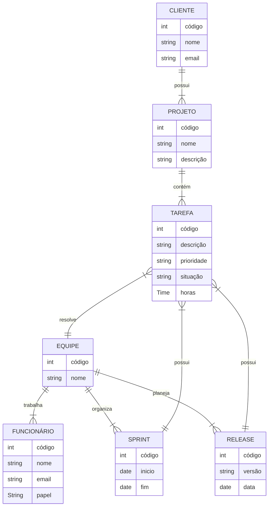
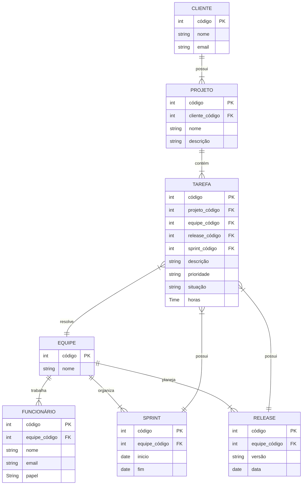

**Tarefa 02 \- MER e Projeto de Banco de Dados Relacional**

**Q1.** O modelo de dados entidade-relacionamento foi desenvolvido para facilitar o projeto de banco de dados, permitindo especificação de um esquema que representa a estrutura lógica geral de um banco de dados. Descreva os três elementos básicos de um Modelo Entidade Relacionamento (MER).

Entidades, atributos e relacionamentos. Entidade é o objeto que você quer representar no banco e guardar informações sobre. Já os atributos são as informações que descrevem essa entidade. E por fim os relacionamentos é a conexão entre as entidades e como elas se relacionam.

**Q2.** Pesquise sobre as várias notações possíveis para Diagramas ER e cite alguns exemplos de notações diferentes para o mesmo conceito (ex.: cardinalidade, entidade subordinada, etc.).

Temos a notação de chan, criada por Peter Chen em 1976. Nela as entidades são representadas em retângulos, os atributos em elipses, os relacionamentos em losangos e a cardinalidade pode ser indicada por números e letras(ex: 1:1, 1:N, N:N). Temos também a Notação Pé de Galinha (Crow's Foot), onde as entidades também são representadas por retângulos, os atributos ficam dentro do retângulo da entidade (organizados em lista), os relacionamentos são representados por linhas e a cardinalidade é indicada por símbolos em suas extremidades.

**Q3.** Construa um Diagrama ER para projetar a base de dados de uma **empresa de desenvolvimento de software** com outras empresas como clientes. A base de dados não deve conter redundância de dados. O modelo ER deve ser representado com um diagrama usando **Mermaid.js**. O modelo deve apresentar, ao menos, entidades, relacionamentos, atributos, identificadores e restrições de cardinalidade. O modelo deve ser feito no nível conceitual, **sem incluir chaves estrangeiras**.
a) A empresa presta serviços de desenvolvimento de software para outras empresas (clientes). Cada cliente é identificado por um código, um nome e um e-mail de contato.
b) Os funcionários da empresa trabalham em squads (equipes). Cada funcionário é identificado por um código, um nome e um e-mail, e possui um papel na equipe: desenvolvedor, testador, líder técnico, supervisor ou gerente de produto.
c) Cada squad é formada por vários funcionários e resolve tarefas (issues). Uma tarefa tem código, descrição, prioridade, situação e uma estimativa em horas. As tarefas pertencem a projetos de um cliente.
d) O trabalho é organizado em iterações (sprints). Uma squad planeja releases para seus clientes; uma release agrupa um conjunto de tarefas e passa por testes de validação.

**Q4.** A partir do Diagrama ER da questão anterior, faça o **mapeamento para o Modelo Relacional**: liste as relações (tabelas), com seus atributos, e identifique as **chaves primárias** e as **chaves estrangeiras** de cada relação.

**Q5.** Descreva, em linguagem natural, as **restrições de integridade referencial** que devem ser garantidas no esquema projetado (ex.: "uma tarefa só pode existir vinculada a um projeto de cliente existente", "toda squad deve possuir um líder técnico").

Todo funcionário deve estar vinculado a uma equipe;  
Toda tarefa deve estar vinculada a uma equipe e a um projeto;  
Toda tarefa deve estar vinculada a uma release;  
Toda sprint deve estar vinculada a uma equipe;  
Toda release deve estar vinculada a um projeto;  
Todo projeto deve estar vinculado a um cliente;  
Não deve ser possível excluir uma equipe que tenha funcionários, tarefas ou sprints vinculados;  
Não deve ser possível excluir um projeto que tenha tarefas ou releases vinculados;  
Não deve ser possível excluir um cliente que tenha projetos vinculados;
