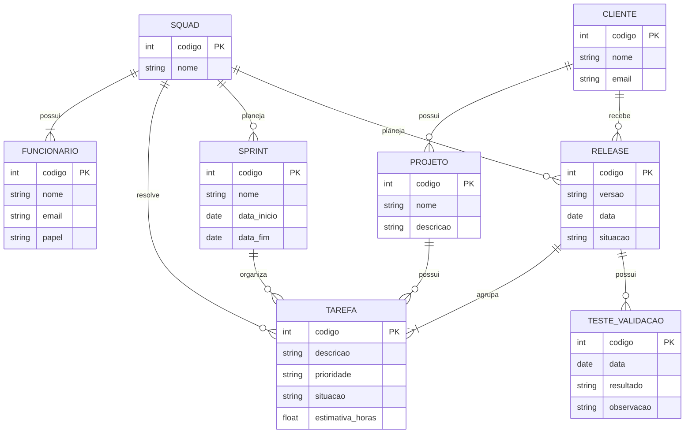

Tarefa 02 - MER e Projeto BDR

Q1. Elementos básicos do Modelo Entidade-Relacionamento

O Modelo Entidade-Relacionamento (MER) e utilizado para representar a estrutura de um banco de dados antes de sua implementação.

Os tres elementos basicos de um MER sao entidades, atributos e relacionamentos.

Entidades

As entidades representam os objetos ou elementos que fazem parte do sistema e que possuem informações que precisam ser armazenadas.

Por exemplo, em uma empresa podemos ter como entidades Cliente, Funcionario, Projeto e Tarefa.

Atributos

Os atributos sao as caracteristicas ou informações de uma entidade.

Por exemplo, a entidade Cliente pode possuir os atributos codigo, nome e email.

Relacionamentos

Os relacionamentos representam a forma como as entidades se relacionam entre si.

Por exemplo, um Cliente pode possuir varios Projetos e um Projeto pertence a um Cliente.

Dessa forma, as entidades representam os objetos do sistema, os atributos representam suas caracteristicas e os relacionamentos representam as ligações entre as entidades.

Q2. Notacoes de Diagramas Entidade-Relacionamento

Existem diferentes formas de representar um Modelo Entidade-Relacionamento em um diagrama.

Uma das notacoes mais conhecidas e a notacao de Chen.

Na notacao de Chen, as entidades sao representadas por retangulos, os relacionamentos por losangos e os atributos por elipses.

Outra notacao muito utilizada e a notacao Crow's Foot, tambem conhecida como pata de corvo.

Nessa notacao, as entidades sao representadas de forma semelhante a tabelas e os relacionamentos sao representados por linhas, utilizando simbolos que indicam a cardinalidade entre as entidades.

Tambem existe a notacao UML, que pode ser utilizada para representar classes e seus relacionamentos. Ela utiliza caixas para representar as classes e linhas para representar os relacionamentos.

As diferentes notacoes possuem formas diferentes de representar os mesmos conceitos, como entidades, atributos, relacionamentos e cardinalidades.

Q3. Diagrama ER

O diagrama abaixo representa o modelo Entidade-Relacionamento conceitual da empresa de desenvolvimento de software.

No modelo, cada entidade possui um identificador próprio e seus atributos. Os relacionamentos representam as ligações entre os dados e suas cardinalidades.

Um cliente pode possuir varios projetos, e cada projeto pertence a um cliente.

Uma squad e formada por varios funcionarios, e cada funcionario pertence a uma squad. O papel do funcionario indica se ele e desenvolvedor, testador, lider tecnico, supervisor ou gerente de produto.

Uma squad pode resolver varias tarefas, e cada tarefa pertence a um projeto de um cliente.

Uma squad pode planejar varias sprints, e uma sprint pode organizar varias tarefas.

Uma squad pode planejar varias releases para seus clientes. Uma release agrupa varias tarefas e pode possuir varios testes de validacao.

Q4. Mapeamento para o Modelo Relacional

CLIENTE

codigo_cliente (PK)
nome
email

FUNCIONARIO

codigo_funcionario (PK)
nome
email
papel
codigo_squad (FK)

SQUAD

codigo_squad (PK)
nome

PROJETO

codigo_projeto (PK)
nome
descricao
codigo_cliente (FK)

TAREFA

codigo_tarefa (PK)
descricao
prioridade
situacao
estimativa_horas
codigo_squad (FK)
codigo_projeto (FK)
codigo_sprint (FK)
codigo_release (FK)

SPRINT

codigo_sprint (PK)
nome
data_inicio
data_fim
codigo_squad (FK)

RELEASE

codigo_release (PK)
versao
data
situacao
codigo_squad (FK)
codigo_cliente (FK)

TESTE_VALIDACAO

codigo_teste (PK)
data
resultado
observacao
codigo_release (FK)

As chaves primarias identificam de forma unica cada registro de uma tabela.

As chaves estrangeiras sao utilizadas para relacionar as tabelas entre si.

Por exemplo, a tabela PROJETO possui a chave estrangeira codigo_cliente, que referencia a chave primaria da tabela CLIENTE.

A tabela FUNCIONARIO possui a chave estrangeira codigo_squad, que indica a qual squad o funcionario pertence.

A tabela TAREFA possui chaves estrangeiras para representar os relacionamentos com SQUAD, PROJETO, SPRINT e RELEASE.

A tabela TESTE_VALIDACAO possui uma chave estrangeira para RELEASE, pois os testes sao realizados sobre uma release.

Q4. Mapeamento para o Modelo Relacional

Com o Diagrama ER anterior, montar as tabelas do banco de dados.

CLIENTE

codigo_cliente (PK)
nome
email

FUNCIONARIO

codigo_funcionario (PK)
nome
email
papel
codigo_squad (FK)

SQUAD

codigo_squad (PK)
nome

PROJETO

codigo_projeto (PK)
nome
descricao
codigo_cliente (FK)

TAREFA

codigo_tarefa (PK)
descricao
prioridade
situacao
estimativa_horas
codigo_squad (FK)
codigo_projeto (FK)
codigo_sprint (FK)
codigo_release (FK)

SPRINT

codigo_sprint (PK)
nome
data_inicio
data_fim
codigo_squad (FK)

RELEASE

codigo_release (PK)
versao
data
situacao
codigo_squad (FK)
codigo_cliente (FK)

TESTE_VALIDACAO

codigo_teste (PK)
data
resultado
observacao
codigo_release (FK)

A chave primaria (PK) serve para identificar cada registro da tabela.

A chave estrangeira (FK) serve para fazer a ligação entre as tabelas.

Por exemplo, a tabela PROJETO possui codigo_cliente como chave estrangeira, que faz referencia ao codigo_cliente da tabela CLIENTE.

A tabela FUNCIONARIO possui codigo_squad como chave estrangeira, que faz referencia ao codigo_squad da tabela SQUAD.

A tabela TAREFA possui chaves estrangeiras para SQUAD, PROJETO, SPRINT e RELEASE.

A tabela TESTE_VALIDACAO possui codigo_release como chave estrangeira, que faz referencia ao codigo_release da tabela RELEASE.