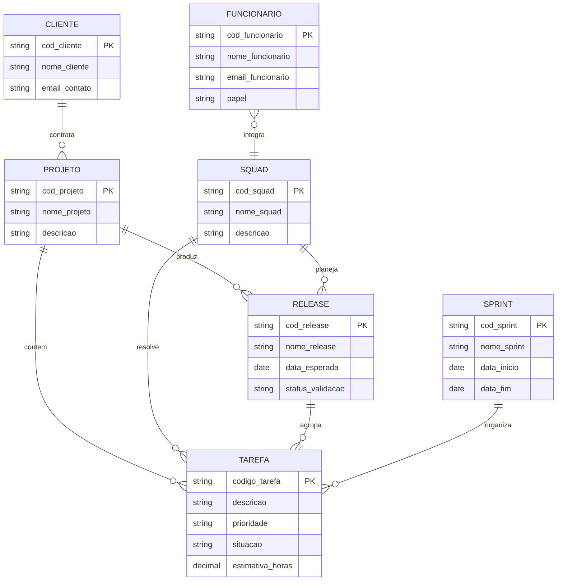

## Q1.Descreva os três elementos básicos de um Modelo Entidade Relacionamento (MER).
Os três elementos básicos são:
- Entidade 
- Atributo 
- Relacionamentos

 Com esses elementos, é possível representar a estrutura dos dados de um sistema, suas características e as relações existentes entre as entidades.

## Q2. Pesquise sobre as várias notações possíveis para Diagramas ER e cite alguns exemplos de notações diferentes para o mesmo conceito (ex.: cardinalidade, entidade subordinada, etc.).
1. Notação de Chen
Criada por Peter Chen, é uma notação clássica e muito utilizada no meio acadêmico.

Entidades: representadas por retângulos.
Atributos: representados por ovais (elipses) ligados às entidades.
Relacionamentos: representados por losangos.

É uma notação bastante detalhada, porém pode ocupar muito espaço em sistemas mais complexos.

2. Notação Pé de Galinha (Crow's Foot)
É uma das notações mais utilizadas atualmente, principalmente por ser mais compacta e facilitar a visualização dos relacionamentos.

Entidades: representadas por caixas ou tabelas divididas em linhas.
Atributos: listados dentro da própria caixa da entidade.
Relacionamentos: representados por linhas, cujas extremidades utilizam símbolos para indicar a cardinalidade, como o "pé de galinha" para representar o lado "muitos".

3. Notação UML
A notação UML, principalmente por meio dos diagramas de classes, é muito utilizada na engenharia de software.

Entidades: são representadas como classes, contendo o nome, atributos e operações.
Relacionamentos: são representados por linhas de associação, podendo utilizar números para indicar a multiplicidade entre as classes.

Exemplos de representação do mesmo conceito
Um mesmo relacionamento pode ser representado de maneiras diferentes dependendo da notação utilizada. Por exemplo, uma relação de um para muitos (1) pode ser representada com números na notação de Chen, com o símbolo de "pé de galinha" na Crow's Foot e com multiplicidades como 1.. na UML.

## Q3.

## Q4.

O mapeamento do Diagrama ER para o Modelo Relacional resulta nas seguintes relações:

### CLIENTE

- **cod_cliente** — PK
- nome_cliente
- email_contato

### PROJETO

- **cod_projeto** — PK
- nome_projeto
- descricao
- cod_cliente — FK → CLIENTE(cod_cliente)

### TAREFA

- **codigo_tarefa** — PK
- descricao
- prioridade
- situacao
- estimativa_horas
- codigo_projeto — FK → PROJETO(cod_projeto)
- cod_squad — FK → SQUAD(cod_squad)

### RELEASE

- **cod_release** — PK
- nome_release
- data_esperada
- status_validacao
- cod_squad — FK → SQUAD(cod_squad)
- cod_projeto — FK → PROJETO(cod_projeto)

### SQUAD

- **cod_squad** — PK
- nome_squad
- descricao

### FUNCIONARIO

- **cod_funcionario** — PK
- nome_funcionario
- email_funcionario
- papel
- cod_squad — FK → SQUAD(cod_squad)

### SPRINT

- **cod_sprint** — PK
- nome_sprint
- data_inicio
- data_fim
- cod_squad — FK → SQUAD(cod_squad)

## Q5.

As principais restrições de integridade referencial do esquema são:

- Um projeto só pode existir vinculado a um cliente existente na tabela CLIENTE.
- Uma tarefa só pode existir vinculada a um projeto existente na tabela PROJETO.
- Uma tarefa só pode estar vinculada a uma squad existente na tabela SQUAD.
- Uma release só pode ser criada para uma squad existente na tabela SQUAD.
- Uma release só pode estar vinculada a um projeto existente na tabela PROJETO.
- Um funcionário só pode estar vinculado a uma squad existente na tabela SQUAD.
- Uma sprint só pode estar vinculada a uma squad existente na tabela SQUAD.
- Uma tarefa agrupada em uma release deve existir previamente na tabela TAREFA.
- Os códigos utilizados como chaves primárias devem ser únicos e não podem ser nulos.
- Não deve ser permitido excluir um cliente, projeto ou squad caso existam registros que ainda dependam deles, evitando referências para registros inexistentes.