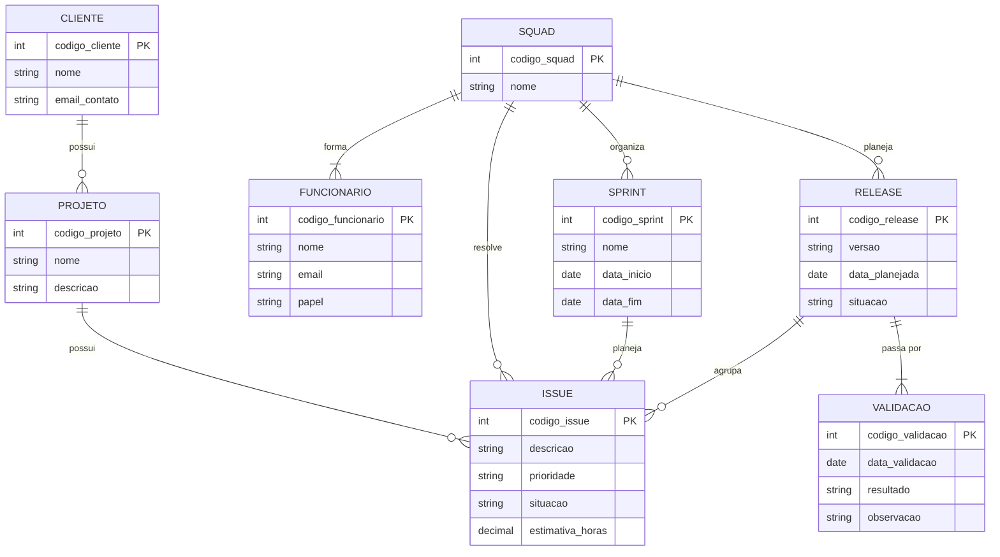

# Resposta da Tarefa 2 — Modelagem de Banco de Dados (MER e Relacional)
*Aluno: Paulo André Alves de Moura*


## Q1. Descreva os três elementos básicos de um Modelo Entidade Relacionamento (MER).

O Modelo Entidade-Relacionamento é fundamentado em três conceitos estruturais básicos:
1. **Entidades:** Representam objetos, coisas ou conceitos do mundo real sobre os quais se deseja manter informações (ex: `Funcionario`, `Cliente`, `Projeto`).
2. **Atributos:** São as propriedades ou características descritivas que definem as entidades (ex: `código`, `nome`, `e-mail`).
3. **Relacionamentos:** Representam as associações lógicas e estruturais entre as entidades, descrevendo como elas interagem (ex: um funcionário *trabalha* em uma squad).

## Q2. Notações para Diagramas ER
Existem várias formas de representar um Modelo Entidade-Relacionamento (MER). Embora todas tenham como objetivo representar **entidades, atributos, relacionamentos e restrições**, a simbologia pode variar.

### 1. Notação de Chen

A notação de **Peter Chen** é uma das formas clássicas de representar modelos ER.

- **Entidade:** retângulo.
- **Relacionamento:** losango.
- **Atributo:** elipse.
- **Identificador (chave):** atributo geralmente sublinhado.
- **Entidade fraca:** retângulo duplo.
- **Relacionamento identificador:** losango duplo.
- **Cardinalidade:** pode ser representada por números, como `1:1`, `1:N` e `N:N`.

Exemplo conceitual:

```text
[CLIENTE] ---- <CONTRATA> ---- [PROJETO]
                    |
               relacionamento
```

Uma entidade fraca pode ser representada por um **retângulo duplo**, indicando que sua identificação depende de outra entidade.

---

### 2. Notação Crow's Foot (Pé de Galinha)

É muito utilizada em ferramentas de modelagem e sistemas de banco de dados.

A cardinalidade é representada graficamente nas extremidades dos relacionamentos:

- `|` = exatamente um;
- `O` = zero (opcional);
- `<` ou a "pata de galinha" = muitos.

Algumas combinações:

| Representação | Significado |
|---|---|
| `\|—\|` | exatamente 1 para exatamente 1 |
| `O—\|` | zero ou 1 |
| `\|—<` | 1 para muitos |
| `O—<` | zero ou muitos |

Exemplo:

```text
CLIENTE ||--o{ PROJETO
```

Significa que um cliente pode possuir **zero ou vários projetos**, enquanto cada projeto está associado a **exatamente um cliente**.

---

### 3. Notação UML

A UML também pode ser utilizada para representar estruturas semelhantes às de um modelo ER, principalmente por meio de **diagramas de classes**.

- **Classe/entidade:** retângulo dividido em seções.
- **Atributos:** aparecem dentro da classe.
- **Relacionamentos:** linhas entre as classes.
- **Multiplicidade:** representada por valores como `1`, `0..1`, `1..*` e `0..*`.

Exemplo:

```text
CLIENTE 1 -------- 0..* PROJETO
```

Nesse caso:

- um `CLIENTE` pode estar relacionado a zero ou vários `PROJETOS`;
- cada `PROJETO` está relacionado a um cliente.

---

### 4. Notação IDEF1X

A IDEF1X é outra notação utilizada para modelagem de dados, especialmente em projetos de bancos de dados relacionais.

Ela diferencia, entre outros elementos:

- entidades independentes;
- entidades dependentes;
- atributos identificadores;
- atributos não identificadores;
- relacionamentos identificadores e não identificadores.

A representação visual das entidades e dos relacionamentos possui regras próprias, diferentes da notação Chen e da Crow's Foot.

---

### Comparação de alguns conceitos

| Conceito | Chen | Crow's Foot | UML |
|---|---|---|---|
| Entidade | Retângulo | Caixa/entidade | Classe |
| Relacionamento | Losango | Linha entre entidades | Associação |
| Atributo | Elipse | Dentro da entidade | Dentro da classe |
| Identificador | Atributo sublinhado | Atributo marcado como PK | Atributo com indicação de chave |
| 1:1 | `1:1` | `\|—\|` | `1 — 1` |
| 1:N | `1:N` | `\|—<` | `1 — 1..*` |
| 0:N | `0:N` | `O—<` | `0 — 0..*` |
| Entidade fraca/subordinada | Retângulo duplo | Entidade dependente, conforme a convenção | Pode ser modelada por composição/dependência |

**Observação:** a forma exata dos símbolos pode variar de acordo com a ferramenta e a convenção adotada. O importante é que o modelo apresente claramente os conceitos e suas restrições.

## Q3. Diagrama ER (Empresa de Software)

O modelo deve apresentar, ao menos, entidades, relacionamentos, atributos, identificadores e restrições de cardinalidade. O modelo deve ser feito no nível conceitual, sem incluir chaves estrangeiras. 

* a) A empresa presta serviços de desenvolvimento de software para outras empresas (clientes). Cada cliente é identificado por um código, um nome e um e-mail de contato. 

* b) Os funcionários da empresa trabalham em squads (equipes). Cada funcionário é identificado por um código, um nome e um e-mail, e possui um papel na equipe: desenvolvedor, testador, líder técnico, supervisor ou gerente de produto. 

* c) Cada squad é formada por vários funcionários e resolve tarefas (issues). Uma tarefa tem código, descrição, prioridade, situação e uma estimativa em horas. As tarefas pertencem a projetos de um cliente. 

* d) O trabalho é organizado em iterações (sprints). Uma squad planeja releases para seus clientes; uma release agrupa um conjunto de tarefas e passa por testes de validação.

### Análise do problema

A empresa de desenvolvimento possui **clientes**, **funcionários**, **squads**, **projetos**, **issues**, **sprints** e **releases**.

Para evitar redundância:

- os dados de um cliente são armazenados somente em `CLIENTE`;
- os dados de um funcionário são armazenados somente em `FUNCIONARIO`;
- a associação entre funcionário e squad é representada pelo relacionamento;
- um projeto pertence a um cliente, evitando repetir os dados do cliente em cada issue;
- uma issue pertence a um projeto;
- uma release agrupa issues;
- uma sprint organiza o trabalho de uma squad;
- a validação da release é representada por um relacionamento com o processo/registro de validação, sem duplicar os dados da release.

O modelo abaixo está no nível conceitual. Portanto, não são utilizadas chaves estrangeiras (FKs).


