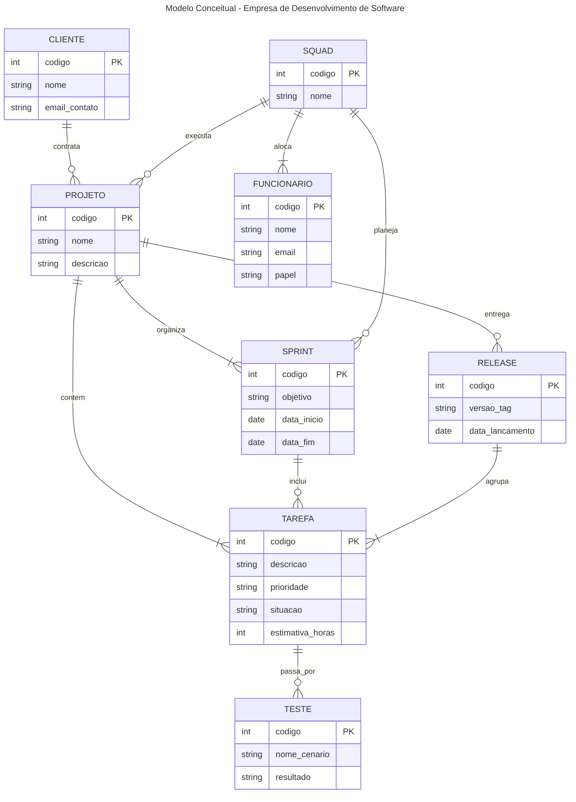

# Q1 - O modelo de dados entidade-relacionamento foi desenvolvido para facilitar o projeto de banco de dados, permitindo especificação de um esquema que representa a estrutura lógica geral de um banco de dados. Descreva os três elementos básicos de um Modelo Entidade Relacionamento (MER). 

Os três elementos básicos do Modelo Entidade-Relacionamento (MER) são:

* **Entidades**: representam objetos, conceitos ou coisas do mundo real que possuem existência concreta ou abstrata e sobre os quais a organização precisa armazenar informações (ex.: Cliente, Aluno, Venda). No modelo, formam conjuntos de entidades com as mesmas propriedades.

* **Atributos**: são as características, propriedades ou dados específicos que qualificam e descrevem uma entidade ou um relacionamento (ex.: nome, CPF, data_nascimento). Entre eles, destaca-se o atributo identificador (chave), que distingue de forma única cada ocorrência.

* **Relacionamentos**: são as associações e conexões lógicas existentes entre duas ou mais entidades, representando como elas interagem dentro do contexto do negócio (ex.: o relacionamento Contrata entre a entidade Cliente e a entidade Projeto).

---

# Q2 - Pesquise sobre as várias notações possíveis para Diagramas ER e cite alguns exemplos de notações diferentes para o mesmo conceito (ex.: cardinalidade, entidade subordinada, etc.). 

As notações de Diagrama Entidade-Relacionamento mais comuns são a Notação de Chen, a Pé de Galinha (Crow’s Foot) e a UML. Embora usem símbolos visuais distintos, todas expressam os mesmos conceitos:

* **Cardinalidade**:

    * Chen: Usa números e letras nas pontas das linhas conectadas a um losango (1:N ou (0, n)).

    * Crow's Foot: Usa símbolos gráficos nas pontas das linhas, como traços duplos (exatamente um) ou pontas ramificadas (muitos/pé de galinha).

    * UML: Usa intervalos numéricos próximos às entidades (1..*, 0..1).

* **Entidade Fraca (Subordinada)**:

    * Chen: Retângulo com borda dupla conectado a um losango com borda dupla.

    * Crow's Foot: Linha contínua (relacionamento identificador) ligando a entidade pai à filha, contrapondo linhas tracejadas de entidades normais.

    * UML: Linha com um losango preto preenchido (Composição) na classe pai.

* **Atributos**:

    * Chen: Elipses (círculos/ovais) ligadas à entidade por linhas, com a chave sublinhada.

    * Crow's Foot e UML: Listados diretamente em compartimentos dentro da caixa da entidade, indicados com marcações como PK.

---

# Q3 - Construa um Diagrama ER para projetar a base de dados de uma empresa de desenvolvimento de software com outras empresas como clientes. A base de dados não deve conter redundância de dados. O modelo ER deve ser representado com um diagrama usando Mermaid.js. O modelo deve apresentar, ao menos, entidades, relacionamentos, atributos, identificadores e restrições de cardinalidade. O modelo deve ser feito no nível conceitual, sem incluir chaves estrangeiras. 

## a) A empresa presta serviços de desenvolvimento de software para outras empresas (clientes). Cada cliente é identificado por um código, um nome e um e-mail de contato. 

## b) Os funcionários da empresa trabalham em squads (equipes). Cada funcionário é identificado por um código, um nome e um e-mail, e possui um papel na equipe: desenvolvedor, testador, líder técnico, supervisor ou gerente de produto. 

## c) Cada squad é formada por vários funcionários e resolve tarefas (issues). Uma tarefa tem código, descrição, prioridade, situação e uma estimativa em horas. As tarefas pertencem a projetos de um cliente. 

## d) O trabalho é organizado em iterações (sprints). Uma squad planeja releases para seus clientes; uma release agrupa um conjunto de tarefas e passa por testes de validação.

---

# Q4 - A partir do Diagrama ER da questão anterior, faça o mapeamento para o Modelo Relacional: liste as relações (tabelas), com seus atributos, e identifique as chaves primárias e as chaves estrangeiras de cada relação.

* **Cliente** (
    **codigo** [PK], 
    nome, 
    email_contato
  )

* **Squad** (
    **codigo** [PK], 
    nome
  )

* **Funcionario** (
    **codigo** [PK], 
    nome, 
    email, 
    papel, 
    **codigo_squad** [FK -> Squad(codigo)]
  )

* **Projeto** (
    **codigo** [PK], 
    nome, 
    descricao, 
    **codigo_cliente** [FK -> Cliente(codigo)], 
    **codigo_squad** [FK -> Squad(codigo)]
  )

* **Sprint** (
    **codigo** [PK], 
    objetivo, 
    data_inicio, 
    data_fim, 
    **codigo_projeto** [FK -> Projeto(codigo)], 
    **codigo_squad** [FK -> Squad(codigo)]
  )

* **Release** (
    **codigo** [PK], 
    versao_tag, 
    data_lancamento, 
    **codigo_projeto** [FK -> Projeto(codigo)]
  )

* **Tarefa** (
    **codigo** [PK], 
    descricao, 
    prioridade, 
    situacao, 
    estimativa_horas, 
    **codigo_projeto** [FK -> Projeto(codigo)], 
    **codigo_sprint** [FK -> Sprint(codigo)], 
    **codigo_release** [FK -> Release(codigo)]
  )

* **Teste** (
    **codigo** [PK], 
    nome_cenario, 
    resultado, 
    **codigo_tarefa** [FK -> Tarefa(codigo)]
  )

---

# Q5 - Descreva, em linguagem natural, as restrições de integridade referencial que devem ser garantidas no esquema projetado (ex.: "uma tarefa só pode existir vinculada a um projeto de cliente existente", "toda squad deve possuir um líder técnico"). 

As principais restrições de integridade referencial que o esquema deve garantir são:

* Funcionários e Squads: Todo funcionário vinculado a uma equipe deve apontar para uma Squad existente. A exclusão de uma squad com membros ativos deve ser bloqueada.
* Projetos, Clientes e Squads: Todo Projeto deve obrigatoriamente referenciar um Cliente e uma Squad válidos. Não é permitido excluir um cliente que possua projetos ativos.
* Sprints e Releases: Toda Sprint e toda Release devem pertencer a um Projeto cadastrado, impedindo iterações ou entregas "órfãs".
* Tarefas (Issues): Toda Tarefa deve estar ligada a um Projeto existente. Quando vinculada a uma Sprint ou Release, estas devem existir e pertencer obrigatoriamente ao mesmo projeto da tarefa.
* Testes: Todo Teste depende da existência de uma Tarefa. A exclusão de uma tarefa deve remover em cascata os seus testes de validação correspondentes.
* Regras de Negócio e Domínio: O campo papel em Funcionario só aceita os valores pré-definidos da equipe, e cada squad deve manter ao menos um funcionário com a função de líder técnico.

---