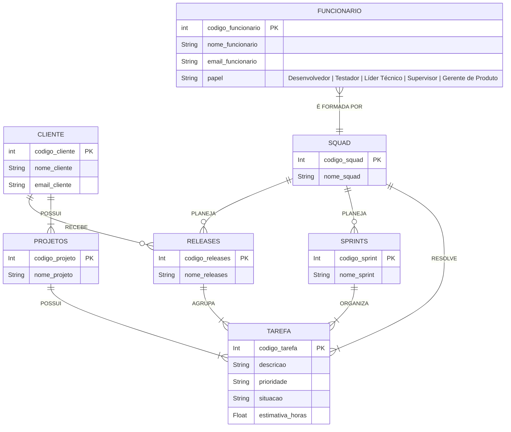

# TAREFA 02 - MER e Projeto de Banco de Dados Relacional
---
**Nome:** Gleydson Henrique Dantas da Silva  
**Github:** Gleydson-HDS  
---
**Q1. O modelo de dados entidade-relacionamento foi desenvolvido para facilitar o projeto de banco de dados, permitindo especificação de um esquema que representa a estrutura lógica geral de um banco de dados. Descreva os três elementos básicos de um Modelo Entidade Relacionamento (MER).**
- Entidade: Objetos ou elementos do mundo real que se deseja guardar informações em um banco de dados.
- Atributo: Características físicas ou não de uma Entidade, suas propriedades.
- Relacionamento: As relações que as entidades realizam entre si.
---
**Q2. Pesquise sobre as várias notações possíveis para Diagramas ER e cite alguns exemplos de notações diferentes para o mesmo conceito (ex.: cardinalidade, entidade subordinada, etc.).**
- **Notação de Chen.** A notação de Chen, proposta por Peter Chen em 1976, é uma das formas clássicas de representar o modelo ER e é muito comum em livros e cursos acadêmicos. A Entidade nessa notação é representada por um retângulo.
- **Notação Crow’s Foot.** A notação Crow’s Foot, também chamada de Information Engineering (IE), é muito utilizada em ferramentas de modelagem e projetos de bancos de dados relacionais. Nessa notação, a Entidade também é representada por um retângulo, contendo atributos/colunas.
- **Notação UML.** A UML (Unified Modeling Language) também pode ser utilizada para representar estruturas semelhantes às de um DER, principalmente por meio de diagramas de classes. Já nesse exemplo, a Entidade é representada por uma caixa dividida em compartimentos.

  Cada notação apresentada não representa a totalidade das notações existentes para Diagramas ER, mas representam alguns dos principais    exemplos que podemos usar para tratar a respeito de suas diferenças, como foi observado com o elemento Entidade em questão.  
---
**Q3. Construa um Diagrama ER para projetar a base de dados de uma empresa de desenvolvimento de software com outras empresas como clientes. A base de dados não deve conter redundância de dados. O modelo ER deve ser representado com um diagrama usando Mermaid.js. O modelo deve apresentar, ao menos, entidades, relacionamentos, atributos, identificadores e restrições de cardinalidade. O modelo deve ser feito no nível conceitual, sem incluir chaves estrangeiras. a) A empresa presta serviços de desenvolvimento de software para outras empresas (clientes). Cada cliente é identificado por um código, um nome e um e-mail de contato. b) Os funcionários da empresa trabalham em squads (equipes). Cada funcionário é identificado por um código, um nome e um e-mail, e possui um papel na equipe: desenvolvedor, testador, líder técnico, supervisor ou gerente de produto. c) Cada squad é formada por vários funcionários e resolve tarefas (issues). Uma tarefa tem código, descrição, prioridade, situação e uma estimativa em horas. As tarefas pertencem a projetos de um cliente. d) O trabalho é organizado em iterações (sprints). Uma squad planeja releases para seus clientes; uma release agrupa um conjunto de tarefas e passa por testes de validação.**  

RESOLUÇÃO DO DIAGRAMA:

---
**Q4. A partir do Diagrama ER da questão anterior, faça o mapeamento para o Modelo Relacional: liste as relações (tabelas), com seus atributos, e identifique as chaves primárias e as chaves estrangeiras de cada relação.**  

| Relação | Atributos | Chave Primária | Chaves Estrangeiras |
|---|---|---|---|
| **CLIENTE** | codigo_cliente, nome_cliente, email_cliente | `codigo_cliente` | — |
| **FUNCIONARIO** | codigo_funcionario, nome_funcionario, email_funcionario, papel, codigo_squad | `codigo_funcionario` | `codigo_squad` → SQUAD |
| **SQUAD** | codigo_squad, nome_squad | `codigo_squad` | — |
| **SPRINTS** | codigo_sprint, nome_sprint, codigo_squad | `codigo_sprint` | `codigo_squad` → SQUAD |
| **RELEASES** | codigo_releases, nome_releases, codigo_squad, codigo_cliente | `codigo_releases` | `codigo_squad` → SQUAD; `codigo_cliente` → CLIENTE |
| **PROJETOS** | codigo_projeto, nome_projeto, codigo_cliente | `codigo_projeto` | `codigo_cliente` → CLIENTE |
| **TAREFA** | codigo_tarefa, descricao, prioridade, situacao, estimativa_horas, codigo_squad, codigo_projeto, codigo_sprint, codigo_releases | `codigo_tarefa` | `codigo_squad` → SQUAD; `codigo_projeto` → PROJETOS; `codigo_sprint` → SPRINTS; `codigo_releases` → RELEASES |
---
**Q5. Descreva, em linguagem natural, as restrições de integridade referencial que devem ser garantidas no esquema projetado (ex.: "uma tarefa só pode existir vinculada a um projeto de cliente existente", "toda squad deve possuir um líder técnico").**  
As seguintes restrições de integridade referencial devem ser garantidas no esquema relacional:

1. Todo funcionário deve estar vinculado a uma squad existente. O codigo_squad de FUNCIONARIO deve corresponder a um codigo_squad existente em SQUAD.
2. Todo projeto deve estar vinculado a um cliente existente. O codigo_cliente de PROJETOS deve corresponder a um codigo_cliente existente em CLIENTE.
4. Toda sprint deve estar vinculada a uma squad existente. O codigo_squad de SPRINTS deve corresponder a um codigo_squad existente em SQUAD.
5. Toda release deve estar vinculada a uma squad existente. O codigo_squad de RELEASES deve corresponder a um codigo_squad existente em SQUAD.
6. Toda release deve estar vinculada a um cliente existente. O codigo_cliente de RELEASES deve corresponder a um codigo_cliente existente em CLIENTE.
7. Toda tarefa deve estar vinculada a uma squad existente. O codigo_squad de TAREFA deve corresponder a um codigo_squad existente em SQUAD.
8. Toda tarefa deve estar vinculada a um projeto existente. O codigo_projeto de TAREFA deve corresponder a um codigo_projeto existente em PROJETOS. Como cada projeto pertence a um cliente, a tarefa estará indiretamente associada a um cliente existente.
9. Toda tarefa deve estar vinculada a uma sprint existente. O codigo_sprint de TAREFA deve corresponder a um codigo_sprint existente em SPRINTS.
10. Toda tarefa deve estar vinculada a uma release existente. O codigo_releases de TAREFA deve corresponder a um codigo_releases existente em RELEASES.
11. Não podem existir chaves estrangeiras com valores que não correspondam a registros existentes nas respectivas tabelas. Por exemplo, não pode existir uma TAREFA com codigo_projeto = 5 se não existir um PROJETOS com codigo_projeto = 5.

