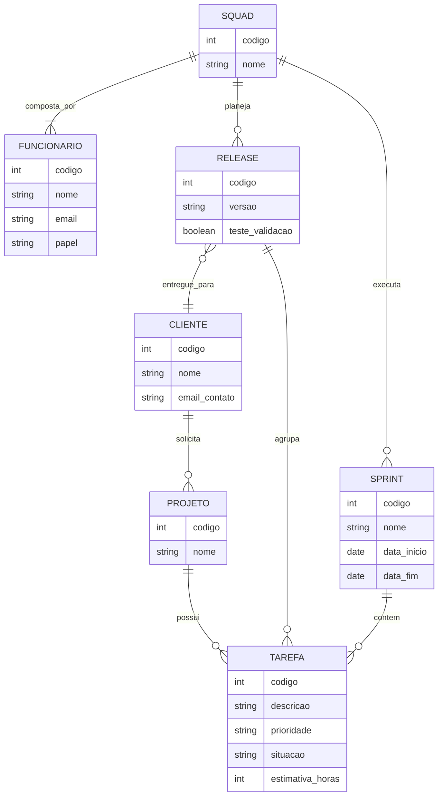

# Tarefa 02 - MER e Projeto de Banco de Dados Relacional

### Q1. Elementos básicos do Modelo Entidade Relacionamento (MER)
Os três elementos básicos do MER são:
1. **Entidades:** Representam objetos do mundo real ou conceitos abstratos sobre os quais se deseja guardar informações (ex: Cliente, Funcionario, Squad).
2. **Relacionamentos:** Representam as associações lógicas e regras de negócio que ligam as entidades umas às outras (ex: um Funcionario *pertence* a uma Squad).
3. **Atributos:** São as propriedades ou características que descrevem as entidades e os relacionamentos (ex: o "nome" e o "email" de um Cliente).

### Q2. Notações para Diagramas ER
Existem diversas notações gráficas para desenhar diagramas ER, cada uma com sua forma de representar entidades, atributos e relacionamentos.
* **Notação de Chen:** Uma das mais clássicas. Usa retângulos para entidades, losangos para relacionamentos e elipses para atributos. A cardinalidade é escrita nos conectores (ex: 1, N, M).
* **Pé de Galinha (Crow's Foot / Information Engineering):** Muito usada no mercado e em ferramentas de modelagem e CASE. As entidades são caixas que já contêm os atributos dentro. A cardinalidade é representada por terminações gráficas nas linhas de relacionamento (um círculo para "zero", um traço para "um", e um desenho de três pontas, o "pé de galinha", para "muitos").
* **UML (Diagrama de Classes):** Embora seja da orientação a objetos, é amplamente adaptada para banco de dados. Usa caixas compartimentadas e anotações numéricas nas extremidades (ex: `0..1`, `1..*`) para representar multiplicidade.
* **IDEF1X:** Notação rigorosa adotada como padrão governamental nos EUA. Representa claramente chaves primárias e estrangeiras, além de diferenciar entidades independentes (cantos quadrados) de entidades dependentes/fracas (cantos arredondados).

### Q3. Diagrama ER (Conceitual) usando Mermaid.js

### Q4. Mapeamento para o Modelo Relacional
Abaixo, a listagem das tabelas geradas a partir do MER acima, com os atributos, chaves primárias (PK) indicadas sublinhadas e chaves estrangeiras (FK) indicadas em itálico com a tabela de referência:

* **Cliente** (<u>codigo</u>, nome, email_contato)
* **Projeto** (<u>codigo</u>, nome, *cod_cliente*)
  * *FK: cod_cliente referencia Cliente(codigo)*
* **Squad** (<u>codigo</u>, nome)
* **Funcionario** (<u>codigo</u>, nome, email, papel, *cod_squad*)
  * *FK: cod_squad referencia Squad(codigo)*
* **Sprint** (<u>codigo</u>, nome, data_inicio, data_fim, *cod_squad*)
  * *FK: cod_squad referencia Squad(codigo)*
* **Release** (<u>codigo</u>, versao, teste_validacao, *cod_squad*, *cod_cliente*)
  * *FK: cod_squad referencia Squad(codigo)*
  * *FK: cod_cliente referencia Cliente(codigo)*
* **Tarefa** (<u>codigo</u>, descricao, prioridade, situacao, estimativa_horas, *cod_projeto*, *cod_sprint*, *cod_release*)
  * *FK: cod_projeto referencia Projeto(codigo)*
  * *FK: cod_sprint referencia Sprint(codigo)*
  * *FK: cod_release referencia Release(codigo)*

  ### Q5. Restrições de Integridade Referencial
Para garantir a consistência dos dados do nosso esquema lógico, as seguintes regras de integridade referencial devem ser garantidas pelo SGBD:
1. Um projeto não pode existir sem estar vinculado a um cliente cadastrado e válido.
2. Todo funcionário deve estar obrigatoriamente alocado a uma squad existente no sistema.
3. Uma sprint e uma release só podem ser planejadas/executadas por uma squad que já exista no banco de dados.
4. Uma release só pode ser entregue para um cliente que tenha cadastro prévio.
5. Uma tarefa (issue) só pode ser criada se estiver atrelada a um projeto existente.
6. Se uma tarefa for alocada a uma sprint ou a uma release, o registro correspondente dessa sprint ou release já deve existir previamente.