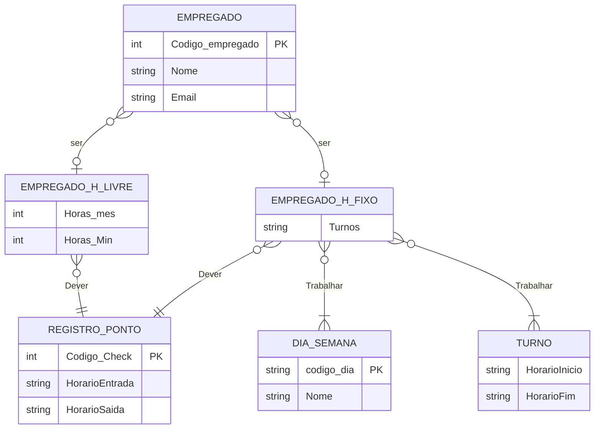

Tarefa 01 - Conceitos BD e MER

Nome: Victor Ryan
perfil github: https://github.com/VictorRyan3612
email: vitorsilva3612@gmail.com

## Questão 1:
Um banco de dados é uma forma de armazenagem de dados, diferentemente de um sistema de arquivos, esse é mais recomendável para grandes volumes de dados. E
para gerenciar esses dados se faz necessário um e com um Sistema Gerenciador de Banco de Dados (SGBD), um software que permite a criação, administração e manutensão de um banco de dados

## Questão 2:
Em um sistema de arquivo, por ser gerenciado pelo proprio programa que o usa, resulta em falta de funções feitas exclusivamente para sua administração, por exemplo, nos SGBDs o controle centralizado garante a integridade dos dados, segurança e prevem a redundancia de dados. Então, por faltar tantas funções, os sistemas de arquivos não são recomendados para usos em larga escala.

## Questão 3
Para projetar um banco de dados e entender seu funcionamento no sistema, pode-se usar o Modelo Entidade-Relacionamento (MER), que, com três elementos básicos, proporciona uma visualização clara em forma de diagrama. Esses elementos são:

- Entidade: que são representações de objetos ou conceitos abstratos do mundo real, sendo visualmente representadas como retângulos no MER.
- Atributos: características intrínsecas das entidades, que são visualmente representadas como pequenas elipses dentro das entidades.
- Relacionamento: descritos como verbos ou ações do sistema, ligando duas entidades ou se auto ligando.

## Questão 4
Se aprofundando mais sobre o Modelo ER, existe diferentes notações para usar nos relaciomantos, como a Notação de Crow's Foot que usa 0, 1 e N para Cardinalidade entre duas entidades, enquanto a Notação Chen usa uma linha com dois traços para 1 pra 1, circulos para 1 para muitos, sobre a entidade suboordinada a notação Chen usa linhas duplas e a outra losangos.

## Questão 5:

Legenda: PK = chave primária
