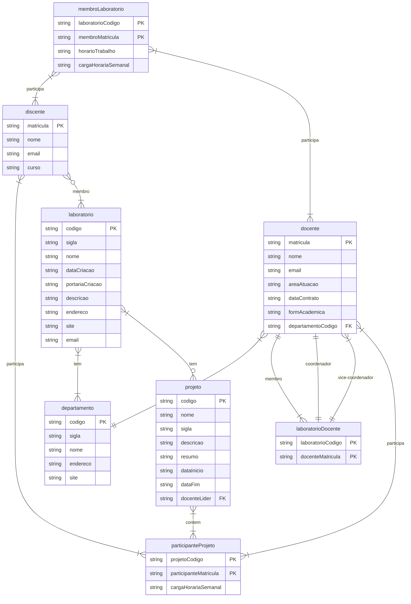

# **Tarefa 02 - Modelo Relacional e Regras de Conversão**

## Rafael da Silva Garcia / garciaRafa / rafael.garcia.113@ufrn.edu.br

### **7**
1. 
    No modelo relacional, os dados são organizados em tabelas, também conhecidas como relações. Cada tabela consiste em linhas (tuplas) e colunas (atributos). Cada coluna possui um nome exclusivo e um tipo de dado associado, como texto, número, data, etc.
2. 
    **Integridade de Chave**: 
        
        A restrição de chave primária garante que uma coluna ou conjunto de colunas em uma tabela seja único. Isso significa que cada valor da chave primária identifica exclusivamente uma linha na tabela.

    **Integridade de Entidade**: 
        
        Não pode existir valores nulos para chaves primárias.

    **Integridade Referencial**: 
        
        A restrição de integridade referencial é uma combinação das restrições de chave primária e chave estrangeira. Ela garante que a chave estrangeira de uma tabela referencie apenas valores válidos na tabela referenciada, mantendo a consistência dos relacionamentos entre as tabelas.
3. 
    **Regra 1: Entidades Regulares**
    
        Para cada entidade regular E no esquema E-R, criamos uma relação R que inclui os atributos simples de E
        Para cada atributo composto de E incluímos somente os seus atributos simples.
        Escolhemos um dos atributos chaves de E para ser a chave primária de R.

    **Regra 2: Entidades Fracas**

        Para cada entidade fraca EF, com entidade forte E, no esquema E-R, criamos uma relação R e incluímos todos os atributos simples da EF como atributos de R.
        Incluímos como atributos da chave estrangeira de R os atributos que compõem a chave primária da entidade forte E.
        A chave primária de R é a combinação da chave primária da entidade forte E e a chave da entidade fraca EF.

    **Regra 3: Relacionamentos 1:1**

        Sem atributo: Cada entidade se transforma em uma relação e a chave primária de uma das tabelas é herdada pela outra como uma chave estrangeira.

        Com atributo: Cria-se uma tabela para cada entidade do relacionamento A e B, e uma terceira tabela C é criada com os atributos do relacionamento, tendo como chave primária às chaves principais das tabelas A e B.

    **Regra 4: Relacionamentos 1:N**

        Sem atributos: Cada entidade vira uma tabela e a entidade que representa o “lado N” do relacionamento herda a chave principal da entidade que representa o “lado 1” como chave estrangeira.

        Com atributo: Cada entidade se transforma em uma tabela e a entidade que representa o “lado N” do relacionamento herda a chave principal da entidade que representa o “lado 1” como chave estrangeira e todos os atributos do relacionamento também são migrados para a entidade que representa o “lado N”.

    **Regra 5: Relacionamentos N:N**

        Cada entidade se transforma em uma tabela A e B, o relacionamento da origem a uma terceira tabela C. Nesta terceira tabela são incluídos os atributos do relacionamento, caso existam, e a chave primária é composta pelas chaves principais das tabelas A e B.

    **Regra 6: Atributos Multivalorados**

        Criamos uma nova tabela R que inclui o atributo multivalorado A mais a chave primária K da relação que representa a entidade (ou relacionamento) que tem A como atributo.
        A chave primária da tabela R é a combinação de A e K.
        Se o atributo multivalorado é composto => incluir seus componentes atômicos.

    **Regra 7: Especialização/Generalização**

        Criar uma única tabela para toda hierarquia de generalização/especialização.
        Criar uma tabela para a entidade genérica e uma tabela para cada entidade especializada.
        Criar uma tabela para cada entidade especializada.

4. 

**Modelo Relacional**

laboratorio(<u>codigo</u>, sigla, nome, dataCriacao, portariaCriacao, descricao, email, site)

departamento(<u>codigo</u>, sigla, nome, site)

docente(<u>matricula</u>, nome, email, dataContratacao, **departamentoCodigo**)

discente(<u>matricula</u>, nome, email, curso)

projeto(<u>matricula</u>, nome, sigla, descricao, dataInicio, dataConclusao, resumo, **liderProjeto**)

laboratorioDocente(<u>**laboratorioCodigo, docenteMatricula**</u>)

participanteProjeto(<u>**docenteMatricula, discenteMatricula, projetoCodigo**</u>)

       

        

