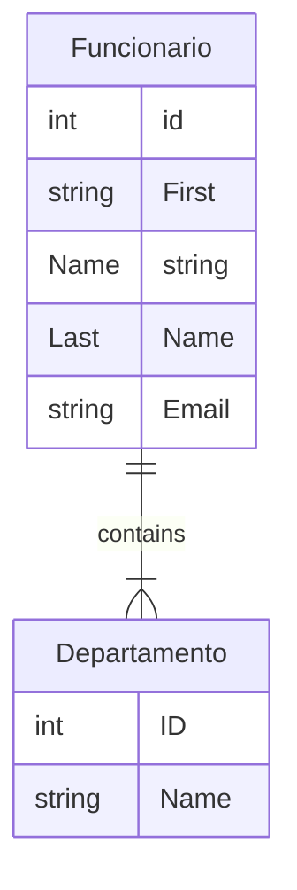

**Modelo Conceitual UML - Employee**

```mermaid
erDiagram
    Funcionario ||--|{ Departamento : contains
    Funcionario {
        int id
        string First Name
        string Last Name
        string Email
    }

    Departamento {
        int ID
        string Name
    }
```
