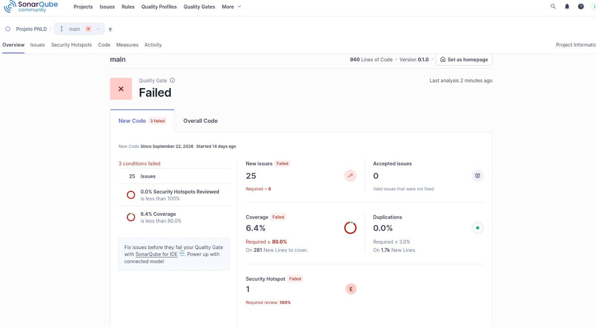

# Tarefa 02 - Implementação do User Story da Iteração 1 e Atuação como QA

## Identificação

- Nome: Isabelle Cavalcanti da Silva
- GitHub: Isabellecavalcant
- E-mail: isabelle.silva.712@ufrn.edu.br
- Issue: https://github.com/tacianosilva/bsi-tasks/issues/464

## Projeto

- Nome: HBL Control — Projeto PNLD
- Repositório: https://github.com/HelenaMariano2025/projetoPNLD
- User Story implementada: US03 — Gerenciar alunos
- Branch de desenvolvimento: feat/us03-gerenciar-alunos

## Links de entrega

- Pull Request da implementação: https://github.com/HelenaMariano2025/projetoPNLD/pull/12
- Relatório de Testes de Aceitação da US01: https://github.com/HelenaMariano2025/projetoPNLD/blob/feat/us03-gerenciar-alunos/docs/qa/relatorio-aceitacao-helena.md
- Pull Request testado como QA: https://github.com/HelenaMariano2025/projetoPNLD/pull/10

## Implementação da US03

Foram implementadas as seguintes funcionalidades:

- Cadastro de alunos com matrícula, nome, data de nascimento, endereço, sexo, e-mail, situação e turma.
- Validação da existência da turma informada.
- Consulta de alunos ativos e consulta por matrícula.
- Alteração dos dados pessoais e da turma associada.
- Inativação de alunos, preservando seus registros de empréstimos e devoluções.
- Pesquisa pelo nome ou parte do nome.
- Mensagem quando nenhum aluno é encontrado.
- Validação dos dados recebidos, proteção CSRF e escape dos valores apresentados no HTML.
- Uso de consultas parametrizadas nas operações do repositório que recebem dados.

### Arquivos da implementação e dos testes

- aluno.php
- php/AlunoRepository.php
- tests/AlunoRepositoryTest.php
- tests/AlunoRepositoryIntegrationTest.php
- coverage-alunos.xml

### Commits principais

- ebdb48a — feat: implementa gerenciamento de alunos da US03
- 775b819 — feat: conecta gerenciamento de alunos ao repository
- 835b718 — test: amplia testes da US03 e registra cobertura
- 2a0fc14 — fix: restaura tela de alunos e corrige apontamentos do Sonar

### Pontos a conferir na especificação

A implementação utiliza inativação, preservando o histórico. O critério TA03.05, que menciona exclusão, precisa ser alinhado com esse comportamento.

A proteção da tela por autenticação depende da integração com a US02.

A inclusão dos cenários formais em BDD/Gherkin no documento de User Stories ainda precisa ser conferida.

## Testes automatizados e cobertura

Os testes unitários utilizam Mock Objects para isolar a conexão e as operações com o banco. Objetos de resultado sem expectativas de interação utilizam stubs.

Os testes de integração foram executados com um banco MySQL real no ambiente Docker.

### Resultados

| Tipo de teste | Testes | Asserções | Resultado |
| --- | ---: | ---: | --- |
| Unitários do AlunoRepository | 9 | 67 | Passou |
| Integração do AlunoRepository | 4 | 34 | Passou |
| Execução conjunta | 13 | 101 | Passou |

### Comando da execução com cobertura

```bash
docker compose exec -e XDEBUG_MODE=coverage app php vendor/bin/phpunit --coverage-text --coverage-clover coverage-alunos.xml tests/AlunoRepositoryTest.php tests/AlunoRepositoryIntegrationTest.php
```

### Cobertura obtida

- AlunoRepository: 100% dos métodos, correspondentes a 7 de 7.
- AlunoRepository: 100% das linhas, correspondentes a 53 de 53.
- Cobertura geral dos arquivos considerados nessa execução: 36,05% das linhas.

Os resultados referem-se à suíte do AlunoRepository. Eles não representam a execução de todos os testes do projeto nem a cobertura completa da tela aluno.php.

Essa execução ocorreu antes do último commit de correção da tela.

## Análise estática — SonarQube

- Servidor: http://labens.dct.ufrn.br/sonarqube
- Projeto: Projeto PNLD
- Chave: pnldkey
- Dashboard: http://labens.dct.ufrn.br/sonarqube/dashboard?id=pnldkey

A análise foi enviada com sucesso. O Quality Gate apresentado na análise consultada estava reprovado, com pendências de cobertura, issues e revisão de segurança.

Foram realizadas correções em aluno.php, incluindo:

- Simplificação das expressões regulares da matrícula.
- Centralização da mensagem repetida de aluno não encontrado.
- Substituição de exceções genéricas por uma exceção específica para falhas de persistência.
- Restauração do conteúdo HTML da tela.

Dois apontamentos relativos ao uso de require_once permaneceram pendentes. Uma nova análise após o último commit de correção ainda precisa ser executada para confirmar os resultados.

A cobertura de 100% do AlunoRepository não corresponde à cobertura geral exigida pelo Quality Gate.

### Evidência



## Atuação como QA — US01

- Desenvolvedora: Helena.
- User Story: US01 — Cadastrar administrador.
- Pull Request: https://github.com/HelenaMariano2025/projetoPNLD/pull/10
- Branch da implementação: task/469.
- Branch local utilizada: qa/helena-pr10.
- Commit testado: eea4156.
- Ambiente: aplicação local com Docker Compose e banco MySQL.
- Página testada: http://localhost:8080/cadastro.php

### Casos de aceitação executados

| Caso | Cenário | Resultado observado pela interface |
| --- | --- | --- |
| TA01.01 | Cadastro com matrícula, nome e senha preenchidos | Passou — mensagem de sucesso |
| TA01.02 | Cadastro sem matrícula | Passou — mensagem de matrícula obrigatória |
| TA01.03 | Cadastro sem nome | Passou — mensagem de nome obrigatório |
| TA01.04 | Cadastro sem senha | Passou — mensagem de senha obrigatória |

Foram registrados quatro prints, um para cada cenário.

Não foram observadas falhas na interface nos quatro cenários executados. O relatório apresenta os passos, resultados, evidências e sugestões de melhoria.

A persistência dos resultados não foi conferida diretamente por consultas ao banco. Essa limitação está registrada no relatório.

### Relatório e evidências

- Relatório: https://github.com/HelenaMariano2025/projetoPNLD/blob/feat/us03-gerenciar-alunos/docs/qa/relatorio-aceitacao-helena.md
- Evidências: https://github.com/HelenaMariano2025/projetoPNLD/tree/feat/us03-gerenciar-alunos/docs/qa/evidencias
- Commit: 44e0706 — docs: registra QA da US01 referente a tacianosilva/bsi-tasks#464

## Revisão de código — US02

Também foi realizada a leitura das alterações da US02, implementada por Jaine:

https://github.com/HelenaMariano2025/projetoPNLD/pull/9

Foi identificado que a inicialização da sessão e a verificação de autenticação devem ocorrer antes da saída HTML nas páginas administrativas.

Essa revisão é uma atividade separada dos testes de aceitação da US01 documentados no relatório de QA.