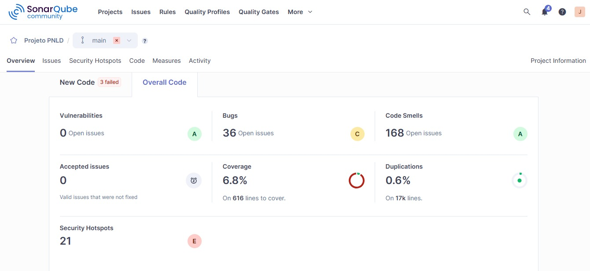

# Tarefa 02 - Implementação do User Story da Iteração 1 e Atuação como QA

## Identificação

* **Nome:** Jaine Souza da Luz
* **GitHub:** JaineSouz
* **E-mail:** [jainesouza1520@gmail.com](mailto:jainesouza1520@gmail.com)

## Links de Entrega

* **Pull Request do projeto:** 
Implementação da US02 - (https://github.com/HelenaMariano2025/projetoPNLD/pull/9) e Implementação do módulo Empréstimos - (https://github.com/HelenaMariano2025/projetoPNLD/pull/13).
* **Relatório de QA:** PR do documento de QA contendo o relatório de Testes de Aceitação da US03 e suas evidências. (https://github.com/HelenaMariano2025/projetoPNLD/pull/14)


## Issue

* Tarefa 02 - Implementação do User Story da Iteração 1 #467

## User Story Implementada

### US02 - Autenticação do administrador

**Como** administrador cadastrado,

**quero** me autenticar utilizando matrícula e senha,

**para** acessar a área administrativa e as funcionalidades de gestão de alunos, turmas, livros, empréstimos, devoluções e relatórios.

### Critérios de Aceitação

* **TA02.01:** Com matrícula e senha válidas, o sistema deve autenticar o administrador e redirecioná-lo para a área administrativa.
* **TA02.02:** Com matrícula existente e senha incorreta, o sistema deve negar o acesso e informar que as credenciais são inválidas.
* **TA02.03:** Com matrícula não cadastrada, o sistema deve negar o acesso e informar que as credenciais são inválidas.
* **TA02.04:** Com matrícula e/ou senha vazias, o sistema deve impedir o acesso e solicitar o preenchimento dos campos obrigatórios.
* **TA02.05:** Após a autenticação, o administrador deve ter acesso às funcionalidades de alunos, turmas, livros, empréstimos, devoluções e histórico.
* **TA02.06:** Usuários não autenticados não devem conseguir acessar diretamente as páginas administrativas.

## BDD / Gherkin

```gherkin
Funcionalidade: Autenticação do administrador

  Como administrador cadastrado

  Quero me autenticar utilizando matrícula e senha

  Para acessar a área administrativa do sistema

  Cenário: Login com credenciais válidas

    Dado que o administrador está cadastrado no sistema
    E informa uma matrícula válida
    E informa uma senha válida
    Quando realizar o login
    Então o sistema deve autenticar o administrador
    E redirecioná-lo para a área administrativa

  Cenário: Login com senha incorreta

    Dado que o administrador está cadastrado no sistema
    E informa uma matrícula válida
    E informa uma senha incorreta
    Quando realizar o login
    Então o sistema deve negar o acesso
    E informar que a matrícula ou senha é inválida

  Cenário: Login com matrícula não cadastrada

    Dado que a matrícula informada não está cadastrada
    E informa uma senha
    Quando realizar o login
    Então o sistema deve negar o acesso
    E informar que a matrícula ou senha é inválida

  Cenário: Login com campos vazios

    Dado que o administrador está na tela de login
    Quando tentar realizar o login sem informar matrícula e senha
    Então o sistema deve impedir o acesso
    E solicitar o preenchimento dos campos obrigatórios

  Cenário: Acesso às funcionalidades após autenticação

    Dado que o administrador realizou o login com sucesso
    Quando acessar a área administrativa
    Então deve poder acessar as funcionalidades de alunos
    E turmas
    E livros
    E empréstimos
    E devoluções
    E histórico

  Cenário: Acesso direto sem autenticação

    Dado que o administrador não está autenticado
    Quando tentar acessar diretamente uma página administrativa
    Então o sistema deve bloquear o acesso
    E redirecioná-lo para a tela de login
```

## Implementação da US02

A implementação da US02 foi realizada no projeto `projetoPNLD`, na branch `task/467`.

Foram implementados:

* `php/AdministradorRepository.php`: consulta o administrador pela matrícula utilizando consulta preparada.
* `php/regras.php`: contém a regra de autenticação e validação dos campos obrigatórios.
* `login.php`: realiza o processamento do login, criação da sessão e redirecionamento para a área administrativa.
* `php/auth.php`: controla a autenticação das páginas administrativas.
* Proteção das páginas administrativas contra acesso direto sem autenticação.

As páginas protegidas incluem as funcionalidades de alunos, turmas, livros, empréstimos/devoluções e histórico.

## Testes Automatizados da US02

Foram implementados testes unitários para a regra de autenticação em `tests/LoginTest.php`.

Os testes verificam:

* Login com credenciais válidas.
* Login com senha inválida.
* Login com matrícula não cadastrada.
* Impedimento de login com campos vazios.

Foram utilizados **Mock Objects** para simular o repositório do administrador nos testes unitários.

Também foi implementado um teste de integração em:

`tests/AdministradorRepositoryIntegrationTest.php`

Esse teste verifica a comunicação entre o `AdministradorRepository` e o banco de dados, buscando um administrador cadastrado pela matrícula.

### Resultado dos testes da US02

```text
Tests: 5
Assertions: 8
Failures: 0
Errors: 0
```

Os testes foram executados utilizando PHPUnit dentro do ambiente Docker.

## Implementação Posterior de Empréstimos e Devoluções

Após a implementação da US02, também foi realizada a implementação da funcionalidade de **empréstimos e devoluções de livros**.

Essa etapa foi desenvolvida posteriormente à implementação do administrador e envolveu a criação e o ajuste das funcionalidades relacionadas ao CRUD de empréstimos e devoluções.

Foram trabalhados:

* Cadastro de empréstimos.
* Consulta dos empréstimos realizados.
* Registro de devoluções.
* Atualização da quantidade disponível de livros.
* Validação da disponibilidade dos livros.
* Prevenção de devoluções duplicadas.
* Ajustes nas páginas de empréstimos, devoluções e livros.
* Adequação das regras de validação.

Também foram executados testes automatizados relacionados às funcionalidades de empréstimos e devoluções, incluindo o cenário de prevenção de devolução duplicada.

## Cobertura de Código

Foi gerado o relatório de cobertura utilizando PHPUnit e Xdebug.

A cobertura foi exportada para o arquivo:

`coverage.xml`

A cobertura apresentada pelo SonarQube é referente ao projeto como um todo, portanto não representa exclusivamente os testes da US02.

## Análise SonarQube da US02

Durante a implementação da US02, foi realizada uma análise do projeto utilizando o SonarQube.

### Resultado da primeira análise

* **Quality Gate:** Failed
* **Bugs:** 35
* **Vulnerabilities:** 1
* **Code Smells:** 167
* **Coverage:** 3,4%
* **Duplications:** 0,6%

A vulnerabilidade identificada pelo SonarQube estava relacionada a uma consulta SQL em `addEmprestimo.php`, código preexistente que não havia sido alterado durante a implementação da US02. O SonarQube indicou risco de SQL Injection devido à montagem de uma consulta utilizando diretamente um valor recebido por `$_POST`.

Também foi apresentada a mensagem de ausência de informações de autoria (`Missing blame information`) para alguns arquivos durante a análise.

Essa primeira análise foi registrada como evidência da execução do SonarQube durante a atividade relacionada à US02.

## Nova Análise SonarQube após a Implementação de Empréstimos

Após a implementação das funcionalidades de **empréstimos e devoluções**, foi realizada uma **nova execução do SonarQube** para verificar novamente o estado do projeto após as alterações.

A captura de tela dessa segunda execução constitui uma evidência separada da análise realizada anteriormente, demonstrando que o SonarQube foi executado novamente após a implementação dos empréstimos.

**Evidência:** captura de tela da análise do SonarQube realizada após a implementação de empréstimos e devoluções.
A análise do SonarQube foi executada novamente após a implementação das funcionalidades de empréstimos e devoluções.



Essa segunda análise deve ser apresentada separadamente da análise inicial da US02, pois corresponde a um momento posterior do desenvolvimento e considera o estado atualizado do projeto.

## Atuação como QA

Foi realizada a atuação como QA em uma implementação de colega, conforme solicitado na Tarefa 02.

Foram executados testes de aceitação da **US03 — Gerenciar alunos**, pertencente à implementação da colega **Isabelle Cavalcanti da Silva**.

Os testes foram realizados manualmente, verificando:

* Cadastro válido de aluno.
* Consulta de aluno.
* Alteração dos dados do aluno.
* Mudança de turma.
* Inativação de aluno.
* Pesquisa por nome.
* Pesquisa sem resultado.

### Resultado dos testes de aceitação

Foram executados **7 cenários de teste**:

* **7 aprovados**
* **0 reprovados**
* **0 bloqueados**

Não foram identificados bugs que impedissem o atendimento aos critérios de aceitação avaliados.

As evidências dos testes foram registradas em imagens e o resultado foi documentado no relatório de testes de aceitação.


## Considerações Finais

A Tarefa 02 contemplou a implementação da **US02 — Autenticação do administrador**, seguida pelo desenvolvimento das funcionalidades de **empréstimos e devoluções**, além da execução de testes automatizados, análise de qualidade com SonarQube e atuação como QA.

A análise inicial do SonarQube foi realizada durante a implementação da US02. Posteriormente, após a implementação de empréstimos e devoluções, uma nova análise foi executada e registrada por meio de captura de tela como evidência.

Na atuação como QA, foram realizados os testes de aceitação da US03 — Gerenciar alunos, com registro das evidências e dos resultados obtidos.
