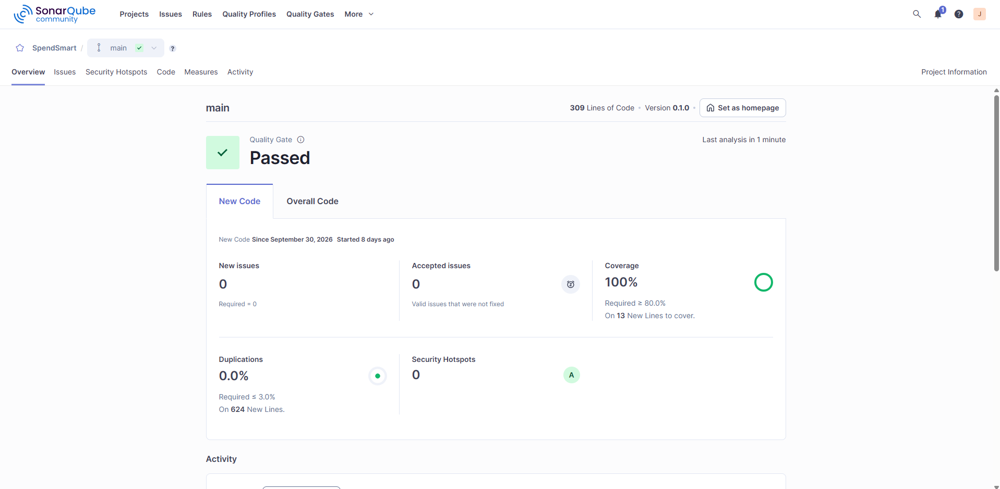
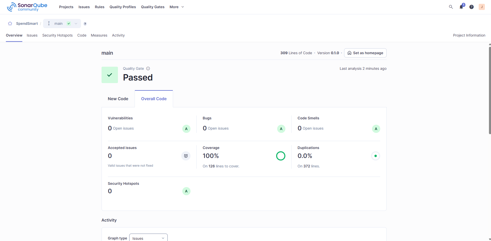

# Tarefa 03 - Implementação do User Story da Iteração 2 e Atuação como QA

**Nome:** José Samuel Lima
**GitHub:** [Jose-Samuel-Lima](https://github.com/Jose-Samuel-Lima)
**E-mail:** jose.lima.146@ufrn.edu.br
**Grupo:** G4 — SpendSmart
**Issue:** [#502](https://github.com/tacianosilva/bsi-tasks/issues/502)

## Links de entrega

- **Pull Request no projeto (SpendSmart):** https://github.com/MViniciusCoffe/SpendSmart/pull/46
- **Relatório de Testes de Aceitação (QA) — US-013:**
  https://github.com/MViniciusCoffe/SpendSmart/blob/task/502/docs/acceptance-test-report-us-013.md

## Resumo

- **Minha US (dev):** US-007 — Listar categorias (RF07). Especificação com cenários Gherkin em
  `docs/user-stories.md`; implementação do filtro por `user_id` da sessão no `getCategories`
  (CA-007.01) e do estado vazio na tela de categorias (CA-007.02).
- **Testes:** 76 de unidade com mocks (dependências externas isoladas) + 20 de integração,
  cobertura **100%** em `services/`.
- **SonarQube (LABENS):** Quality Gate **Passed**; zerados os 12 code smells `S2223` (`try/catch`
  redundante) e os 2 `S7786` (`Error` → `TypeError` após verificação de tipo).
- **QA (US-013 do colega):** os 5 casos CT13.01–CT13.05 foram executados sobre a branch `task/497`;
  parecer **Reprovado — reteste necessário** (suíte da branch vermelha e mensagens com encoding
  corrompido), com bugs e evidências no relatório.

## Evidências SonarQube

**New Code — Quality Gate Passed** (New issues 0, Coverage 100%, Duplications 0,0%, Security Hotspots 0):

**Overall Code — totais zerados** (Bugs 0, Vulnerabilities 0, Code Smells 0, Coverage 100%, Duplications 0,0%):

## Commits (SpendSmart, branch `task/502`)

- `docs(us-007)`: especificação e cenários Gherkin da listagem
- `feat(category)`: filtro por usuário da sessão no `getCategories`
- `feat(category)`: estado vazio na tela de categorias
- `test(category)`: unidades do filtro por usuário
- `test(category)`: integração da listagem por usuário
- `docs(qa)`: relatório de testes de aceitação da US-013
- `refactor(services)`: remove `try/catch` redundantes (`S2223`)
- `fix(transaction)`: `TypeError` após verificação de tipo (`S7786`)