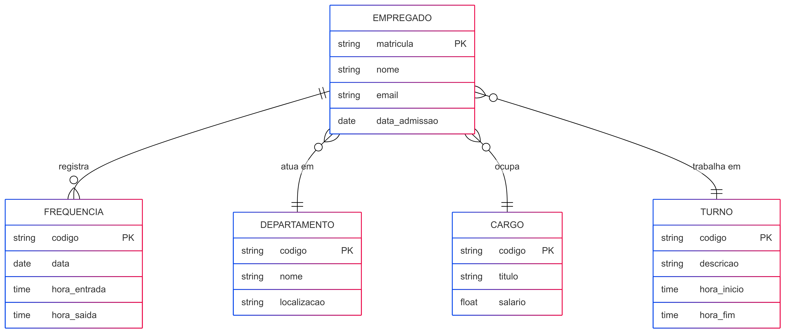

a)	Descreva o que é um Banco de Dados e o que é um Sistema Gerenciador de Banco de Dados. Cite exemplos de Bancos de Dados e seus SGBDs.
Um banco de dados pode ser classificado como um conjunto de dados estruturados, com um objetivo de ajudar um usuário no momento de pesquisa por algum dado. 
Um sistema gerenciador de banco de dados que permite ser criando, manipulando e administrando. É usado para gerenciar com que o acesso aos dados seja seguro e eficiente. O SGBD permite criar, ler, atualizar e excluir as informações do banco de dados.
Ex:
●	Oracle Database
●	MYSQL
●	Microsoft Azure - Servidor da Nuvem da Microsoft

b)	Quais os principais problemas de utilizar Sistemas de Arquivos para armazenagem de dados.
Um dos principais fatores de utilizar os sistemas de arquivos para armazenagem de dados é devido à redundância dos mesmos, visto que cada arquivo é tratado separadamente, incluindo em uma grande chance dos dados serem armazenados replicados.

c)	O modelo de dados entidade-relacionamento foi desenvolvido para facilitar o projeto de banco de dados, permitindo especificação de um esquema que representa a estrutura lógica geral de um banco de dados. Descreva os três elementos básicos de um Modelo Entidade Relacionamento (MER). 
Um modelo de entidade e relacionamento possui três componentes básicos que são:
●	Entidade: pode ser representado como uma abstração de um objeto do mundo real.
●	Atribuído: pode ser representado como uma característica ou
particularidade de uma entidade que descreve as informações sobre ela mesma.
●	Relacionamento: pode ser representado como uma junção entre mais de uma entidade que revela a forma de como elas estão se relacionando entre elas mesmas.

d)	Pesquise sobre as várias notações possíveis para Diagramas ER, cite alguns exemplos de notações diferentes para o mesmo conceito (ex: Cardinalidade, Entidade Subordinada,etc.).
●	Notação de Peter Chen: pode ser utilizada com retângulos para representar as entidades, diamentes para representar os relacionamentos e setas para representar a direção do relacionamento, sejam eles binários ou do grau n.
●	Notação de Bachmande Bachman: pode ser utilizada para representar como um gráfico que é igual a um fluxograma. Enquanto isso as entidades podem ser representadas como umas caixas retangulares, os relacionamentos são representados por linhas ligando com as caixas. 

e)	Construa um Diagrama ER para projetar uma base de dados de um Sistema  de uma organização. A base de dados não deve conter redundância de dados. O modelo ER deve ser representado com um diagrama usando Mermaid.js. O modelo deve apresentar, ao menos, entidades, relacionamentos, atributos, identificadores e restrições de cardinalidade. O modelo deve ser feito no nível conceitual, sem incluir chaves estrangeiras.

